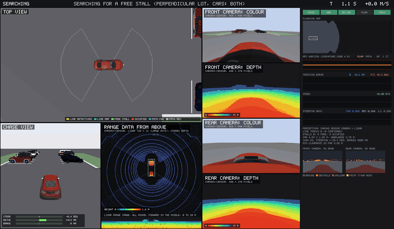
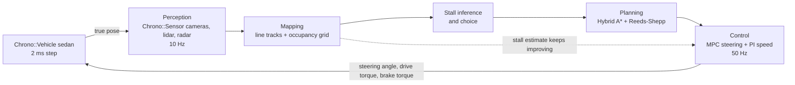

# chrono-parking

Automated parking in [Project Chrono](https://projectchrono.org), in one Python script.

A full multibody Chrono::Vehicle sedan drives down a parking aisle. From what its sensors show
it builds a map of the painted stall lines and the obstacles, decides which stall to take, plans
a forward and reverse maneuver into it, and tracks that plan with model predictive control. It
handles perpendicular, angled and parallel stalls, with cars on one side, both sides or none.

The sensors are simulated by Chrono::Sensor: a stereo camera that looks forward and one that
looks back, and optionally a lidar or two radars. There is no camera to the sides. The car parks
with the cameras alone, with cameras and lidar, or with cameras and radar. On a PyChrono without
ray-traced sensors, a stand-in computes noisy detections from the scenario instead.



The window shows four live views and a panel with the internals: which stage of the pipeline is
working, the planning map with the Hybrid A* search tree, the MPC horizon, tracking error, speed,
the steering gain the controller is identifying as it drives, and what each camera's image is
being read as.

## Run it

You need a Python that has PyChrono with its `vehicle` and `irrlicht` modules, plus NumPy. Nothing
else. See the [PyChrono installation guide](https://api.projectchrono.org/pychrono_installation.html).
If the interpreter you use has no PyChrono, the script looks for a conda environment that does and
relaunches itself there.

For the sensors, the PyChrono also needs its `sensor` module with cameras, lidar and radar. A
Chrono built with OptiX has that. A Chrono built with Metal RT (macOS) or Vulkan RT needs a small
patch to its Python bindings, which is in this repository:
[docs/sensors.md](docs/sensors.md#what-it-needs). Without them the script runs with `--sensors sim`.

```
python parking_sim.py                                   # perpendicular stalls, a car on each side
python parking_sim.py --sensors camera+lidar            # cameras and a roof lidar
python parking_sim.py --sensors camera+radar            # cameras and side radars
python parking_sim.py --sensors sim                     # no sensors: detections from the scenario
python parking_sim.py --type angled --cars none         # 60 degree stalls, empty lot, lines only
python parking_sim.py --type parallel --cars both       # parallel park between two cars
python parking_sim.py --type perpendicular --park forward
python parking_sim.py --tour                            # eight scenarios back to back
python parking_sim.py --target drag                     # place the target yourself (macOS)
python parking_sim.py --headless --seed 7 --noise 2     # no window, prints a result line
```

| Option | Values | Meaning |
| --- | --- | --- |
| `--sensors` | `camera`, `camera+lidar`, `camera+radar`, `sim` | what the car perceives with. Default: `camera` if the PyChrono has the sensors, else `sim` |
| `--type` | `perpendicular`, `angled`, `parallel` | kind of stalls |
| `--cars` | `both`, `left`, `right`, `none`, `random` | parked cars next to the free stall, seen from the lane looking into it |
| `--side` | `right`, `left` | which side of the lane the free stall is on |
| `--angle` | degrees, default 60 | stall angle for `--type angled` |
| `--park` | `auto`, `forward`, `reverse` | nose in or back in |
| `--target` | `drag` or `X,Y,DEG` | choose the spot yourself instead of letting the car choose |
| `--tire` | `tmeasy`, `pac02` | tire model of the simulated car |
| `--noise` | scale, default 1 | perception noise, 0 is perfect |
| `--seed` | integer | layout details and noise |
| `--headless` | | no window, as fast as possible |
| `--no-panel` | | hide the internals panel |
| `--snapshots DIR` | | save window frames as PNG |

`python parking_sim.py --help` lists the rest.

## How it works



| Stage | What it does | Details |
| --- | --- | --- |
| Perception | painted lines from the colour images, obstacles and free ground from stereo depth, lidar or radar. Or a stand-in without sensors | [docs/sensors.md](docs/sensors.md) |
| Mapping | weighted total least squares line tracks, occupancy grid where unseen space counts as blocked | [docs/perception-and-mapping.md](docs/perception-and-mapping.md) |
| Decision | stalls from pairs of lines, free or occupied from the map, first settled free stall wins | [docs/perception-and-mapping.md](docs/perception-and-mapping.md) |
| Planning | configuration space by FFT, Hybrid A*, Reeds-Shepp and arc-line analytic expansions | [docs/planning.md](docs/planning.md) |
| Control | linear MPC in the distance domain, constrained QP solved exactly, steering gain identified online, commands in physical units | [docs/control.md](docs/control.md) |
| Simulation | Chrono sedan, scenario generator, viewer, target placement by mouse | [docs/simulation-and-viewer.md](docs/simulation-and-viewer.md) |

Start with [docs/architecture.md](docs/architecture.md) for the overall structure and the state
machine. [docs/results.md](docs/results.md) has the verification numbers and the known limits.

## What is simulated

The car is the Chrono `Sedan` model: 20 rigid bodies, double wishbone front and multi-link rear
suspension, rack and pinion steering, a shaft-based driveline and brakes, and TMeasy or Pacejka
tires. That is a full multibody vehicle, a superset of the usual 14 degree of freedom model. The
kinematic bicycle model appears only inside the planner and the MPC.

The car is driven by physical commands, not pedal positions: a road-wheel steering angle in
radians, a drive torque at the wheels and a brake torque in newton metres. The drive torque goes
straight onto the half-shafts of the driven axle, with the gearbox in neutral.

Nothing about the car is hard-coded. Its wheelbase, body outline, mass, wheel radius, steering
stop and brake capacity are read from the Chrono model at start-up, and its steering response is
identified online while it drives.

## Results

The same 74 scenarios were run with each sensor set and with the stand-in perception: all stall
types, car layouts, both sides, forward and reverse parking, two tire models, double perception
noise and hand-placed targets. A run counts as parked when the car ends inside the lines of a
free stall without having touched anything.

| Perception | Parked | Lateral offset | Heading error | Smallest clearance |
| --- | --- | --- | --- | --- |
| cameras only | 74 of 74 | at most 5.4 cm | at most 1.3 deg | 0.20 m |
| cameras + lidar | 73 of 74 | at most 3.9 cm | at most 1.4 deg | 0.11 m |
| cameras + radar | 74 of 74 | at most 5.3 cm | at most 1.4 deg | 0.20 m |
| stand-in, no sensors | 74 of 74 | at most 2.5 cm | at most 1.5 deg | 0.23 m |

All offsets are measured against the ground-truth stall. The offsets and clearances in this table
leave out the three double-noise runs of each row, which are listed with everything else
in [docs/results.md](docs/results.md). At double noise the parallel stall is where it shows: with
cameras alone the car parked 22 cm off centre, with the radars 2.8 degrees off the kerb line, and
with the lidar it touched the kerb during a correction, which is the one run that does not count.

## Layout

```
parking_sim.py                  the whole simulator, about 3800 lines
tests/test_core.py              checks of the planner curves, the MPC solver, the sensor geometry and the map
docs/                           design documents and figures
docs/make_figures.py            regenerates the figures of the pipeline from real runs
docs/make_sensor_figures.py     regenerates the sensor figures from real runs
docs/pychrono-rt-sensors.patch  Python bindings for Chrono's ray-traced sensors with Metal RT and Vulkan RT
```
