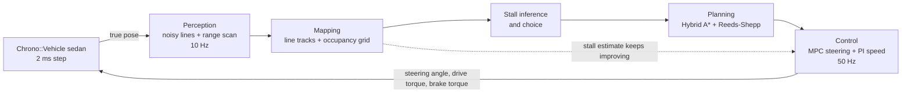

# chrono-parking

Automated parking in [Project Chrono](https://projectchrono.org), in one Python script.

A full multibody Chrono::Vehicle sedan drives down a parking aisle. From noisy, simulated
perception it builds a map of the painted stall lines and the obstacles, decides which stall to
take, plans a forward and reverse maneuver into it, and tracks that plan with model predictive
control. It handles perpendicular, angled and parallel stalls, with cars on one side, both sides
or none.


The window shows four live camera views and a panel with the internals: which stage of the
pipeline is working, the planning map with the Hybrid A* search tree, the MPC horizon, tracking
error, speed, and the steering gain the controller is identifying as it drives.

## Run it

You need a Python that has PyChrono with its `vehicle` and `irrlicht` modules, plus NumPy. Nothing
else. See the [PyChrono installation guide](https://api.projectchrono.org/pychrono_installation.html).
If the interpreter you use has no PyChrono, the script looks for a conda environment that does and
relaunches itself there.

```
python parking_sim.py                                   # perpendicular stalls, a car on each side
python parking_sim.py --type angled --cars none         # 60 degree stalls, empty lot, lines only
python parking_sim.py --type parallel --cars both       # parallel park between two cars
python parking_sim.py --type perpendicular --park forward
python parking_sim.py --tour                            # eight scenarios back to back
python parking_sim.py --target drag                     # place the target yourself (macOS)
python parking_sim.py --headless --seed 7 --noise 2     # no window, prints a result line
```

| Option | Values | Meaning |
| --- | --- | --- |
| `--type` | `perpendicular`, `angled`, `parallel` | kind of stalls |
| `--cars` | `both`, `left`, `right`, `none`, `random` | parked cars next to the free stall, seen from the lane looking into it |
| `--side` | `right`, `left` | which side of the lane the free stall is on |
| `--angle` | degrees, default 60 | stall angle for `--type angled` |
| `--park` | `auto`, `forward`, `reverse` | nose in or back in |
| `--target` | `drag` or `X,Y,DEG` | choose the spot yourself instead of letting the car choose |
| `--tire` | `tmeasy`, `pac02` | tire model of the simulated car |
| `--noise` | scale, default 1 | perception noise, 0 is perfect |
| `--seed` | integer | layout details and noise |
| `--headless` | | no window, as fast as possible |
| `--no-panel` | | hide the internals panel |
| `--snapshots DIR` | | save window frames as PNG |

`python parking_sim.py --help` lists the rest.

## How it works



| Stage | What it does | Details |
| --- | --- | --- |
| Perception | noisy stall-line segments and a noisy 360 degree range scan, simulated from the true scene | [docs/perception-and-mapping.md](docs/perception-and-mapping.md) |
| Mapping | weighted total least squares line tracks, occupancy grid where unseen space counts as blocked | [docs/perception-and-mapping.md](docs/perception-and-mapping.md) |
| Decision | stalls from pairs of lines, free or occupied from the scan, first settled free stall wins | [docs/perception-and-mapping.md](docs/perception-and-mapping.md) |
| Planning | configuration space by FFT, Hybrid A*, Reeds-Shepp and arc-line analytic expansions | [docs/planning.md](docs/planning.md) |
| Control | linear MPC in the distance domain, constrained QP solved exactly, steering gain identified online, commands in physical units | [docs/control.md](docs/control.md) |
| Simulation | Chrono sedan, scenario generator, viewer, target placement by mouse | [docs/simulation-and-viewer.md](docs/simulation-and-viewer.md) |

Start with [docs/architecture.md](docs/architecture.md) for the overall structure and the state
machine. [docs/results.md](docs/results.md) has the verification numbers and the known limits.

## What is simulated

The car is the Chrono `Sedan` model: 20 rigid bodies, double wishbone front and multi-link rear
suspension, rack and pinion steering, a shaft-based driveline and brakes, and TMeasy or Pacejka
tires. That is a full multibody vehicle, a superset of the usual 14 degree of freedom model. The
kinematic bicycle model appears only inside the planner and the MPC.

The car is driven by physical commands, not pedal positions: a road-wheel steering angle in
radians, a drive torque at the wheels and a brake torque in newton metres. The drive torque goes
straight onto the half-shafts of the driven axle, with the gearbox in neutral.

Nothing about the car is hard-coded. Its wheelbase, body outline, mass, wheel radius, steering
stop and brake capacity are read from the Chrono model at start-up, and its steering response is
identified online while it drives.

## Results

In the last verification batch, 74 of 74 headless runs ended parked inside the lines with no
contact, across all stall types, car layouts, both sides, forward and reverse parking, two tire
models, double perception noise and hand-placed targets.

| | parked | lateral offset | heading error | smallest clearance |
| --- | --- | --- | --- | --- |
| perpendicular | 25 of 25 | at most 4.4 cm | at most 0.5 deg | 0.12 m |
| angled | 24 of 24 | at most 1.2 cm | at most 1.4 deg | 0.32 m |
| parallel | 24 of 24 | at most 2.8 cm | at most 0.5 deg | 0.17 m |

All offsets are measured against the ground-truth stall. No run needed a replan or a correction.
The 0.12 m is a nose-in perpendicular plan at the planner's tightest margin. Every other
perpendicular run kept at least 0.24 m.

See [docs/results.md](docs/results.md) for the full table and for what was not tested.

## Layout

```
parking_sim.py          the whole simulator, about 3200 lines
tests/test_core.py      checks of the planner curves and the MPC solver
docs/                   design documents and figures
docs/make_figures.py    regenerates docs/img from real runs
```
