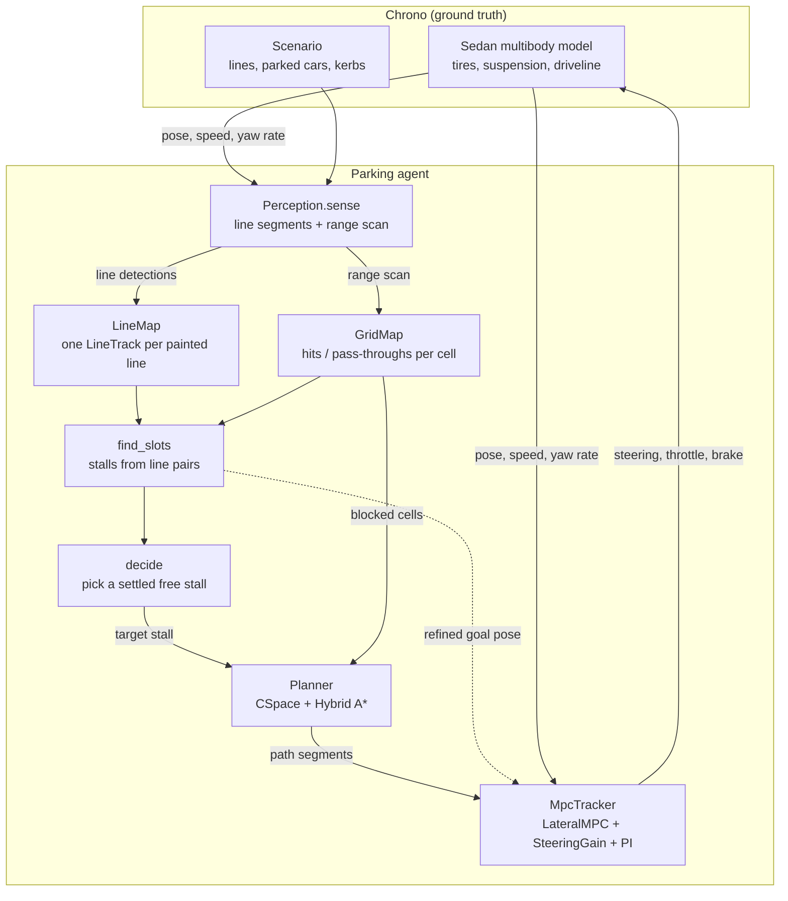
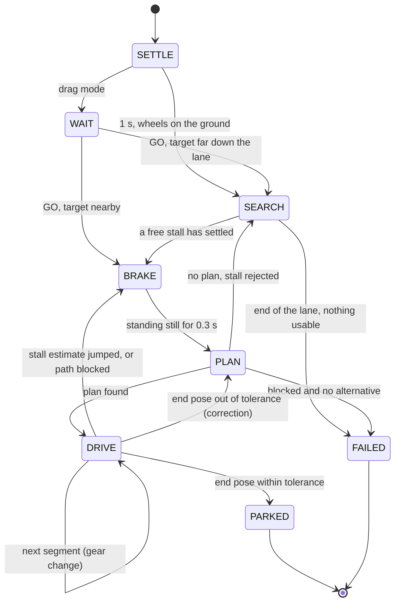

# Architecture

This document describes how `parking_sim.py` is put together: the data flow, the rates at which
things run, the state machine that sequences a parking maneuver, and where each part lives in the
file. The other documents go into each stage:

- [perception-and-mapping.md](perception-and-mapping.md): sensors, line tracks, occupancy grid, stall inference, stall choice
- [planning.md](planning.md): configuration space, Hybrid A*, Reeds-Shepp curves, docking
- [control.md](control.md): the MPC, the online steering model, speed control, plan re-anchoring
- [simulation-and-viewer.md](simulation-and-viewer.md): the Chrono model, the scenarios, the window
- [results.md](results.md): verification numbers and limits

## The problem

A car drives along a lane next to parking stalls. It knows its own pose. It does not know where the
stalls are, which ones are free, or where the obstacles are. It receives two noisy measurements:
segments of painted lines, as a camera based line detector would give, and a planar range scan, as
a lidar or a ring of ultrasonic sensors would give. From those it has to find a free stall, choose
one, and park in it, driving forward and backward as needed.

The scope is the decision, planning and control problem. Perception is simulated on purpose, and
localization is taken as given.

## Data flow

The agent never reads the scenario directly. Everything it knows about lines and obstacles comes
through `Perception.sense`. The one thing it takes from ground truth is its own pose.

## Rates

| Loop | Period | What runs |
| --- | --- | --- |
| Physics | 2 ms | Chrono vehicle and terrain, tire sub-step 1 ms |
| Control | 20 ms | error measurement, steering gain update, MPC solve, speed PI |
| Perception and mapping | 100 ms | sensing, grid and line map update, stall inference, decision, plan refinement, path monitor |
| Rendering | about 33 ms | four camera views and the internals panel |
| Planning | on demand | runs in a worker thread while simulated time is frozen |

`ParkingSim.advance` steps the physics and calls `_perceive` and `_control` on their own
periods. Planning is the only stage that takes noticeable wall time, typically 0.1 to 1 s. While
the planner thread runs, `advance` returns without stepping, so simulated time does not pass and
a run is repeatable regardless of how fast the machine is. The search is limited by a number of
node expansions, not by a wall-clock budget, for the same reason.

## State machine

| State | Behaviour |
| --- | --- |
| `SETTLE` | brake held for one second while the suspension settles |
| `SEARCH` | follow the lane at 2.2 m/s, map, look for a stall. With a manual target this state is the approach to it |
| `BRAKE` | brake to a stop. Planning always starts from standstill |
| `PLAN` | planner thread running, time frozen |
| `DRIVE` | track the plan one segment at a time. Each segment is driven in one direction and ends with a full stop |
| `PARKED`, `FAILED` | brake held, wheels straightened, result printed |
| `WAIT` | drag mode only: the car stands still, keeps mapping what it can see, and waits for a target |

Three events can interrupt `DRIVE`:

1. The estimate of the target stall moves by more than 0.5 m or 0.1 rad. The car stops and replans.
   Smaller movements do not interrupt anything. They shift the end of the plan gradually (see
   [control.md](control.md#keeping-the-plan-attached-to-the-stall)).
2. Newly seen obstacle cells lie inside the footprint along the remaining path, on two consecutive
   perception ticks. The car stops and replans. If no plan exists, the run fails instead of driving
   a blocked path.
3. After the last segment, the pose is more than 0.12 m sideways, 2.5 degrees, or 0.3 m lengthwise
   from the goal. The car plans a correction, at most twice.

## Coordinates and conventions

- World frame: x east, y north, z up. All planning is planar.
- The planner and the controller describe the car by the pose `(x, y, theta)` of the centre of
  its **rear axle**. That is the point at which the kinematic bicycle model has no sideslip, in
  both driving directions.
- Curvature `kappa` is signed in the car's frame: positive means steering left, in forward and
  in reverse. With signed speed `v`, the yaw rate is `v * kappa`.
- Direction `d` is +1 forward and -1 reverse.
- The steering input `s` is Chrono's driver input in [-1, 1].

## Where things are in the file

`parking_sim.py` is a single file on purpose, so it can be dropped next to any PyChrono
installation and run. It is organised in sections, in this order:

| Section | Main names |
| --- | --- |
| Ego vehicle | `Ego`, `EGO` (geometry read from the Chrono model) |
| Geometry helpers | `rect_poly`, `ego_poly`, `poly_distance`, `footprint_hits` |
| Scenarios | `Scenario`, `make_lot`, `make_street`, `parked_model` |
| Perception | `Perception` |
| Mapping | `GridMap`, `LineTrack`, `LineMap` |
| Stall inference | `Slot`, `find_slots`, `_classify`, `_align_with_kerb` |
| Reeds-Shepp | `_rs_words`, `rs_paths`, `rs_length_table`, `rs_sample` |
| Configuration space | `CSpace`, `holonomic_distance` |
| Planner | `Planner` (`search`, `shoot`, `_rs_shot`, `_arc_shot`), `Segment`, `split_segments` |
| Control | `LateralMPC`, `SteeringGain`, `MpcTracker` |
| Chrono world | `World` |
| Agent | `ParkingSim` (state machine, decision, planning requests, refinement, monitor) |
| Viewer | `MouseKeys`, `Viewer` |
| Entry point | `parse_args`, `main` |

## Design choices worth knowing

**Unseen space is blocked.** The planner only drives through cells that a range ray has passed
through. The far side of a parked car was never seen to be free, so it is solid, even though only
its near face produced range returns. This removes a whole class of plans that would cut through
an obstacle the car has only seen one side of.

**Plans end with a straight docking run.** The search does not aim at the parked pose. It aims at a
point on the stall axis a few metres short of it, and the last stretch is a straight line along the
axis. Whatever error is left after the turning part gets removed there, which is where the final
accuracy comes from.

**Each segment ends in a stop.** A plan is cut at every direction change. The car stops, changes
gear, turns the wheels to where the next segment needs them, and only then moves. Steering while
standing is slow on a real car, but it removes the transient at the start of every segment.

**The plan follows the stall, not the other way round.** The stall estimate keeps improving as the
car gets closer. The remaining part of the plan is moved rigidly with it, weighted so that only the
last few metres move. The car therefore ends up where the lines are, not where they were first
believed to be.

**No measured vehicle data.** The planner uses the kinematic curvature limit that follows from the
Chrono model's wheelbase and maximum steering angle. The controller starts from the same value and
identifies the real steering gain while driving (see [control.md](control.md#the-steering-gain)).
