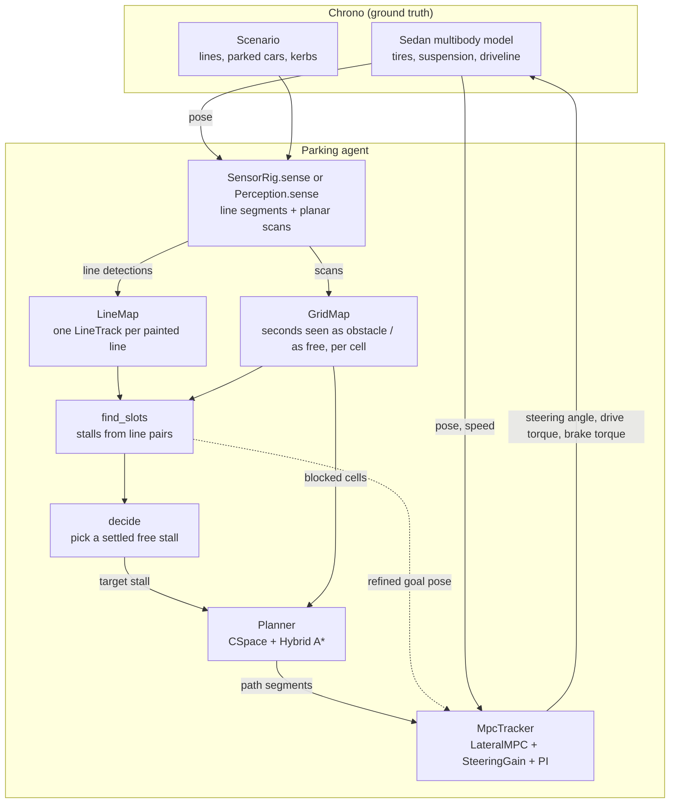
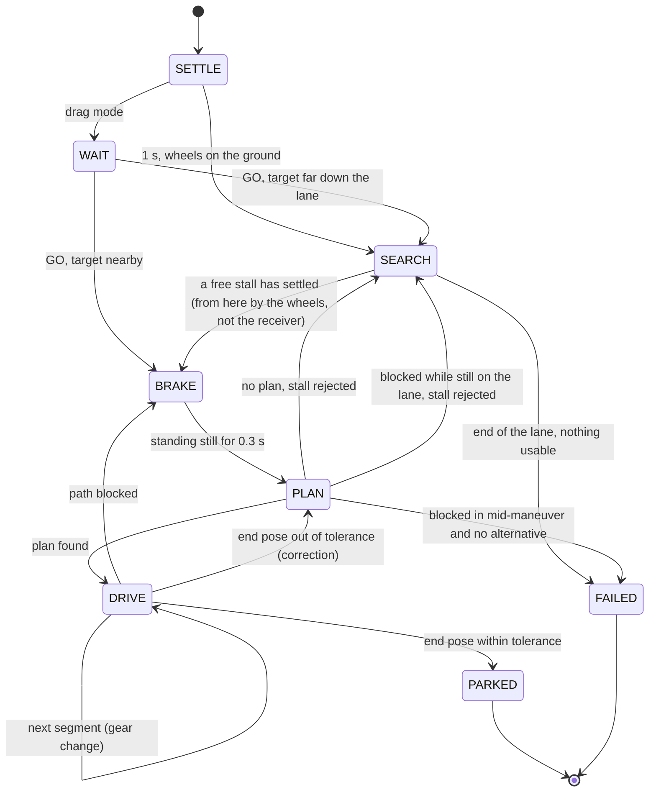

# Architecture

This document describes how the simulator is put together: the data flow, the rates at which
things run, the state machine that sequences a parking maneuver, and where each part lives in the
code. The other documents go into each stage:

- [sensors.md](sensors.md): the Chrono::Sensor cameras and lidar, the networks that compute depth from the images, and how that becomes scans and line segments
- [perception-and-mapping.md](perception-and-mapping.md): the stand-in perception, line tracks, occupancy grid, stall inference, stall choice
- [planning.md](planning.md): configuration space, Hybrid A*, Reeds-Shepp curves, docking
- [control.md](control.md): the MPC, the online steering model, speed control, plan re-anchoring
- [simulation-and-viewer.md](simulation-and-viewer.md): the Chrono model, the scenarios, the window
- [results.md](results.md): verification numbers and limits

## The problem

A car drives along a lane next to parking stalls. It knows its own pose. It does not know where the
stalls are, which ones are free, or where the obstacles are. It has to find a free stall, choose
one, and park in it, driving forward and backward as needed.

What it perceives with is selectable. With a sensor rig the car carries a stereo pair of cameras
behind the windshield, a camera at the tail and one on the front bumper, and optionally a
forward-facing lidar, all ray traced by Chrono::Sensor. Depth is computed from the camera images
by neural networks: IGEV++ for the stereo pair, a monocular network for the single cameras.
Nothing looks sideways. Without a rig, a stand-in computes noisy line segments and a noisy range
scan from the scenario. Either way the rest of the agent receives the same two things: planar
scans, and segments of painted lines.

The scope is the decision, planning and control problem, with perception from simulated sensors.
Localization is taken as given.

## Data flow

The agent never reads the scenario directly. Everything it knows about lines and obstacles comes
through `sense`. With a sensor rig that is rendered sensor data. The one thing it takes from
ground truth is its own pose.

## Rates

| Loop | Period | What runs |
| --- | --- | --- |
| Physics | 2 ms | Chrono vehicle and terrain, tire sub-step 1 ms |
| Control | 20 ms | error measurement, steering gain update, MPC solve, speed loop, torque commands |
| Perception and mapping | 100 ms | sensor rendering and processing, grid and line map update, stall inference, decision, plan refinement, path monitor |
| Depth networks | 400 ms | stereo matching of the front pair, monocular depth of the single cameras, in a process of their own |
| Rendering | about 33 ms | the views of the scene, the sensor pictures and the internals panel |
| Planning | on demand | runs in a worker thread while simulated time is frozen |

`ParkingSim.advance` steps the physics and calls `_perceive` and `_control` on their own
periods. Planning is the only stage that takes noticeable wall time, typically 0.1 to 1 s. While
the planner thread runs, `advance` returns without stepping, so simulated time does not pass and
a run is repeatable regardless of how fast the machine is. The search is limited by a number of
node expansions, not by a wall-clock budget, for the same reason.

## State machine

| State | Behaviour |
| --- | --- |
| `SETTLE` | brake held for one second while the suspension settles |
| `SEARCH` | follow the lane at 2.2 m/s, map, look for a stall. With a manual target this state is the approach to it |
| `BRAKE` | brake to a stop. Planning always starts from standstill |
| `PLAN` | planner thread running, time frozen |
| `DRIVE` | track the plan one segment at a time. Each segment is driven in one direction and ends with a full stop |
| `PARKED`, `FAILED` | brake held, wheels straightened, result printed |
| `WAIT` | drag mode only: the car stands still, keeps mapping what it can see, and waits for a target |

Two events can interrupt `DRIVE`:

1. Newly seen obstacle cells lie inside the footprint along the remaining path, on two consecutive
   perception ticks. The car stops and replans. If no plan exists, it does not drive a blocked
   path: it searches on if it has not left the lane yet, and the run fails otherwise. With a
   sensor rig the footprint is grown by a margin for this test, because a camera places an
   obstacle exactly only once it is close
   ([sensors.md](sensors.md#the-monitor-looks-for-margin)).
2. After the last segment, the pose is more than 0.20 m sideways, 3 degrees, or 0.4 m lengthwise
   from the goal. The car plans a correction, once
   ([control.md](control.md#watching-the-path)).

A better estimate of the target stall does not interrupt anything. It shifts the end of the
plan gradually, as long as it stays within 0.5 m and 0.1 rad of where the stall was when the
plan was made and the car has more than 2 m to go
([control.md](control.md#keeping-the-plan-attached-to-the-stall)).

## Coordinates and conventions

- World frame: x east, y north, z up. All planning is planar.
- The planner and the controller describe the car by the pose `(x, y, theta)` of the centre of
  its **rear axle**. That is the point at which the kinematic bicycle model has no sideslip, in
  both driving directions.
- Curvature `kappa` is signed in the car's frame: positive means steering left, in forward and
  in reverse. With signed speed `v`, the yaw rate is `v * kappa`.
- Direction `d` is +1 forward and -1 reverse.
- The three commands to the car are physical: steering angle `delta` (road-wheel angle, rad,
  positive left), drive torque at the wheels (N m, negative drives backwards) and brake torque
  (N m). Chrono's normalized pedal inputs are not used by the agent.

## Where things are

`parking_sim.py` is only the entry point. The code is the package `parking/`, one module per
concern. Nothing in it imports "upwards": the agent uses everything below it, the viewer uses the
agent, and `cli.py` starts one or both.

| Module | Lines | Main names |
| --- | --- | --- |
| `cli.py` | 192 | `parse_args`, `main` |
| `agent.py` | 477 | `ParkingSim` (state machine, search, decision, the spot the user points at, the score) |
| `agent_plan.py` | 250 | `PlanStall`: the part of `ParkingSim` that asks for a plan into the stall and takes it up |
| `agent_drive.py` | 168 | `DriveIn`: the part of `ParkingSim` that keeps the plan on its stall while it is driven (refinement, monitor) |
| `chrono_env.py` | 87 | the PyChrono imports, and the rerun in a Python that has PyChrono |
| `config.py` | 20 | `STEP`, `CONTROL_DT`, `PERCEPTION_DT`, speeds and acceleration limits |
| `vehicle.py` | 51 | `Ego`, `EGO` (geometry, mass and limits read from the Chrono model) |
| `geometry.py` | 66 | `rect_poly`, `ego_poly`, `poly_distance`, `footprint_hits` |
| `scenario.py` | 216 | `Scenario`, `make_lot`, `make_street`, `parked_model` |
| `world.py` | 352 | `World` (the model, the scene, the physical actuation in `step`), `surface_textures`, `light_scene` |
| `perception.py` | 233 | `Perception` (stand-in), `planar_scan`, `paint_segments`, the ray helpers |
| `sensors.py` | 625 | `SensorRig`, `sensor_mounts` |
| `networks.py` | 96 | `DepthWorker`: the process with the networks, as the simulation sees it. `find_depth_python` |
| `stereo_worker.py` | 279 | the process that runs IGEV++, Depth Anything V2 and the scene network |
| `scene_net.py` | 47 | `SceneNet`: Mask2Former labels for markings, kerbs and the car's own body |
| `localization.py` | 171 | `Localization`: the pose the car believes it has (satellite receiver with inertial unit, dead reckoning, or the one carried on by the other while parking) |
| `paint.py` | 90 | `paint_textures`, `lay`: worn paint for the lines |
| `ground.py` | 83 | `Ground`: the height of the road, flat or uneven |
| `mapping.py` | 310 | `GridMap`, `LineTrack`, `LineMap` |
| `stalls.py` | 255 | `find_slots`: stalls from pairs of line tracks. `join_collinear` |
| `slot.py` | 197 | `Slot`, and what the map says about one: `_classify`, `_kerb_behind`, `_align_with_kerb` |
| `one_line.py` | 118 | `one_line_stalls`: stalls of which one line was found, from the row they stand in |
| `rows.py` | 69 | `Row`, `lane_rows`: the mouth and the direction of the stalls on one side of the lane |
| `reeds_shepp.py` | 179 | `_rs_words`, `rs_paths`, `rs_length_table`, `rs_sample` |
| `planner.py` | 488 | `CSpace`, `holonomic_distance`, `Planner` (`search`, `shoot`, `_rs_shot`, `_arc_shot`), `Segment`, `split_segments` |
| `control.py` | 262 | `LateralMPC`, `SteeringGain`, `MpcTracker` |
| `viewer.py` | 511 | `Viewer`: the views, the overlays, the input handling |
| `viewer_pictures.py` | 184 | `PicturesMixin`: the sensor pictures and how they reach Irrlicht |
| `viewer_panel.py` | 224 | `PanelMixin`: the internals panel |
| `draw.py`, `inputs.py` | 137 | pixel font, colour scale, `resample`, and `MouseKeys` |

## Design choices worth knowing

**Unseen space is blocked.** The planner only drives through cells that a range ray has passed
through. The far side of a parked car was never seen to be free, so it is solid, even though only
its near face produced range returns. This removes a whole class of plans that would cut through
an obstacle the car has only seen one side of. With cameras that look only forward and back, a lot
is unseen at any moment, and the map is what carries the car past it.

**Plans end with a straight docking run.** The search does not aim at the parked pose. It aims at a
point on the stall axis a few metres short of it, and the last stretch is a straight line along the
axis. Whatever error is left after the turning part gets removed there, which is where the final
accuracy comes from.

**Each segment ends in a stop.** A plan is cut at every direction change. The car stops, changes
gear, turns the wheels to where the next segment needs them, and only then moves. Steering while
standing is slow on a real car, but it removes the transient at the start of every segment.

**The plan follows the stall, not the other way round.** The stall estimate keeps improving as the
car gets closer. The remaining part of the plan is moved rigidly with it, weighted so that only the
last few metres move. The car therefore ends up where the lines are, not where they were first
believed to be.

**No measured vehicle data.** Geometry, mass, wheel radius, steering stop and brake capacity are
read from the Chrono model at start-up. The planner uses the kinematic curvature limit that follows
from the model's wheelbase and declared maximum steering angle. The controller starts from the
ideal bicycle model and identifies the real steering gain while driving (see
[control.md](control.md#the-steering-gain)).

**Physical commands.** The controller outputs a steering angle, a drive torque and a brake torque,
and the simulation applies those to the model directly (see
[simulation-and-viewer.md](simulation-and-viewer.md#actuation)). There is no throttle map, gearbox
or steering ratio hidden between the controller and the car.
