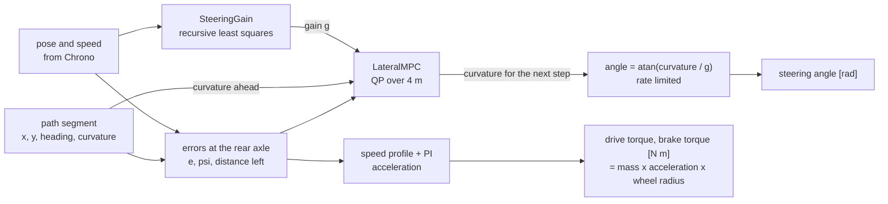
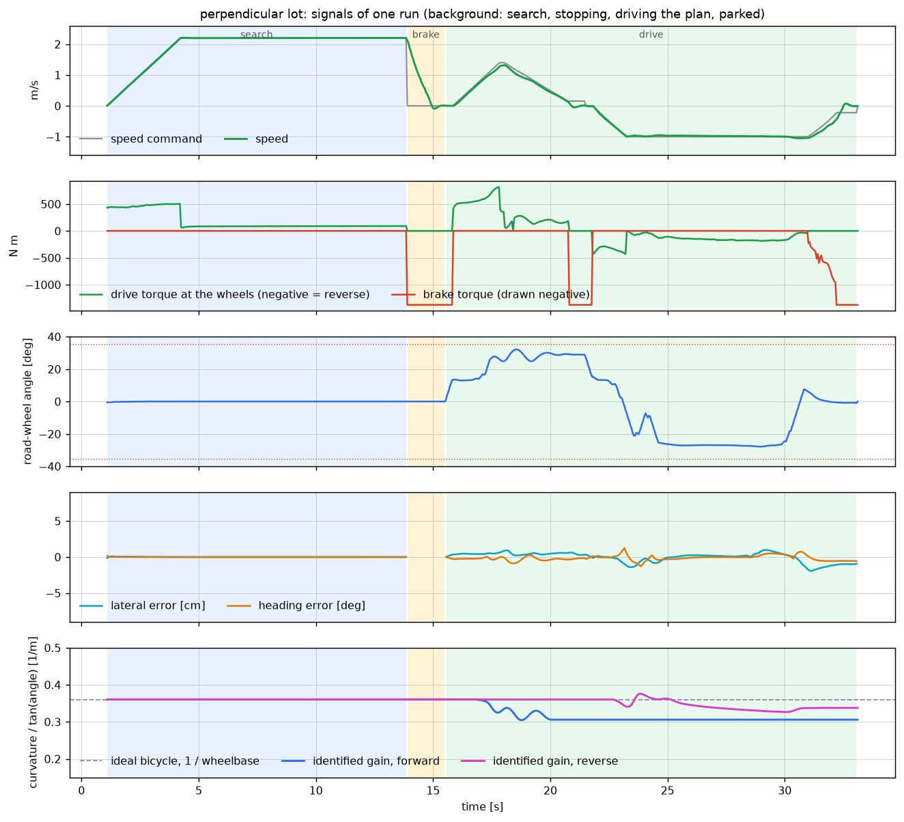
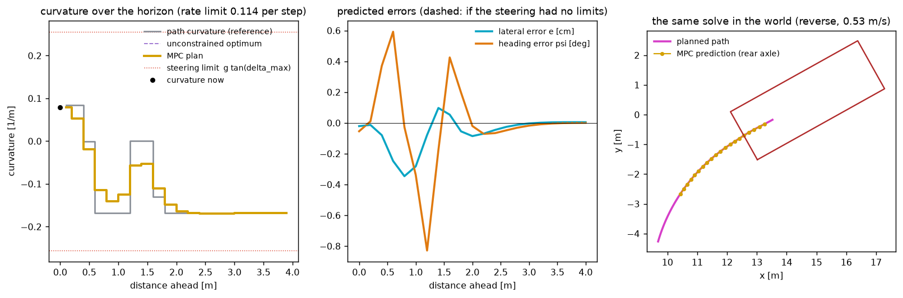
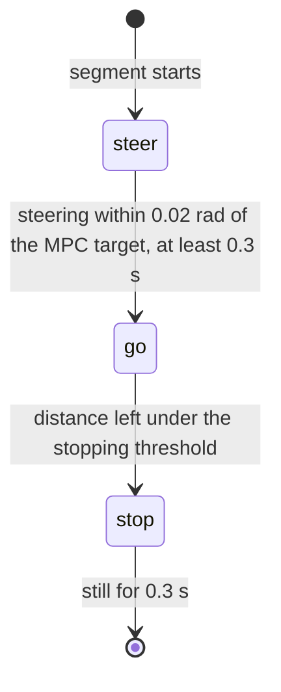

# Control

The controller turns a planned path into commands for the car at 50 Hz. The commands are physical
quantities, not pedal positions:

| Command | Unit | Meaning |
| --- | --- | --- |
| steering angle | rad | road-wheel angle of the front axle |
| drive torque | N m | total torque at the driven wheels, negative to drive backwards |
| brake torque | N m | total brake torque over all four wheels |

Steering is model predictive control. Speed is a PI loop that outputs an acceleration, which
becomes a torque through the car's mass and wheel radius. Code: `LateralMPC`, `nnls`,
`SteeringGain`, `MpcTracker`, and the plan refinement in `ParkingSim._refine` and `_monitor`. How
the commands reach the Chrono model is in
[simulation-and-viewer.md](simulation-and-viewer.md#actuation).





## Why MPC here

A planned parking path is made of straight lines and arcs, so its curvature jumps. A steering
system cannot jump: here the road wheels turn at no more than 0.8 rad/s, about 1.5 s from lock to
lock. A feedback law reacts to a curvature jump when it arrives and is then late by the time the
steering needs to move. An MPC sees the jump coming over its horizon, knows the rate limit, and
starts turning early by exactly the amount that minimises the error. It also handles the hard
steering limit explicitly instead of saturating.

## Error model in travelled distance

Let `e` be the lateral offset of the rear axle from the path (positive to the left) and `psi`
the heading error. For a kinematic bicycle driving in direction `d` (+1 forward, -1 reverse) with
curvature `kappa` along a path of curvature `kappa_ref`, the errors evolve with travelled
distance `sigma` as

```math
\frac{de}{d\sigma} = d \sin\psi, \qquad
\frac{d\psi}{d\sigma} = d \left( \kappa - \frac{\kappa_{ref} \cos\psi}{1 - \kappa_{ref}\, e} \right)
```

The errors are measured against the path interpolated between its samples, which are 10 cm apart.
Measured against the nearest sample instead, the reference heading jumps on every arc, and the
steering followed those jumps with a wiggle that was three to five times rougher.

Writing the model in distance instead of time is deliberate. At parking speeds the car creeps to a
stop at the end of every segment. A time-domain horizon of fixed duration shrinks to nothing in
distance as the speed goes to zero. A distance-domain horizon always looks 4 m ahead.

To first order in the errors, and with `kappa` held constant over a step of length `h`, the
discrete model is exact:

```math
\begin{bmatrix} e \\ \psi \end{bmatrix}_{k+1} =
\begin{bmatrix} 1 & d\,h \\ 0 & 1 \end{bmatrix}
\begin{bmatrix} e \\ \psi \end{bmatrix}_{k} +
\begin{bmatrix} h^2/2 \\ d\,h \end{bmatrix} \left( \kappa_k - \kappa_{ref,k} \right)
```

The `h^2/2` term has no sign `d` because the lateral acceleration with respect to distance is
`d^2 = 1` times the curvature mismatch. The same model therefore covers forward and reverse, with
only the sign of the heading coupling changing.

## The optimisation problem

Horizon `N = 20` steps of `h = 0.2 m`. Decision variables: the curvatures
`K = (kappa_0, ..., kappa_{N-1})`.

```math
\min_K \;\; \sum_{k=1}^{N} \gamma_k \left( q_e\, e_k^2 + q_\psi\, \psi_k^2 \right)
+ r \sum_{k=0}^{N-1} \left( \kappa_k - \kappa_{ref,k} \right)^2
+ r_\Delta \sum_{k=0}^{N-1} \left( \kappa_k - \kappa_{k-1} \right)^2
```

```math
\text{subject to} \quad |\kappa_k| \le g \tan\delta_{max}, \qquad |\kappa_k - \kappa_{k-1}| \le \Delta
```

| Symbol | Value | Meaning |
| --- | --- | --- |
| `q_e`, `q_psi` | 10, 6 | error weights |
| `gamma_N` | 3 | extra weight on the last step, 1 elsewhere |
| `r` | 1 | stay near the path's own curvature |
| `r_Delta` | 1 | smooth steering |
| `kappa_{-1}` | `g tan(delta)` | the curvature the car has right now, from its steering angle `delta` |
| `g` | identified online | curvature per unit of `tan(steering angle)`, see below |
| `delta_max` | 35.4 deg, read from the model | the steering stop |
| `Delta` | `g (1 + tan(delta)^2) * 0.8 * h / max(abs(v), 0.3)` | curvature change one step allows, from the 0.8 rad/s steering rate at the current speed |

The rate bound follows from differentiating `kappa = g tan(delta)`: the curvature changes at
`g (1 + tan^2 delta)` times the steering rate, and one horizon step lasts `h / |v|` seconds.

The reference `kappa_ref` is the raw path curvature sampled at the middle of each step. It is not
smoothed: dealing with the jumps is the MPC's job. Beyond the end of a segment the last curvature
is held, so the controller does not start to unwind the steering before a cusp.

Without constraints this is a finite-horizon LQR. Its first-move gains are about 1.3 per square
metre on `e` and 1.7 per metre on `psi`.



## Solving the QP

Stacking the model over the horizon gives `X = Phi x_0 + Gamma (K - K_ref)`, and the problem
becomes a dense QP in 20 variables with 40 two-sided constraints:

```math
\min_K \; \tfrac{1}{2} K^{\top} H K + f^{\top} K \quad \text{s.t.} \quad G K \le b,
\qquad
H = 2\left( \Gamma^{\top} Q \Gamma + r I + r_\Delta D^{\top} D \right)
```

where `D` is the first-difference matrix. `H` depends only on the weights and on the driving
direction, so it is built and factorised once, `H = L L^T`. Only `f` and `b` change from solve to
solve.

The QP is solved exactly, as a least-distance problem. With the change of variables

```math
y = L^{\top} K + L^{-1} f
```

the objective is `|y|^2 / 2` plus a constant, and the constraints become

```math
\tilde G\, y \ge \tilde b, \qquad \tilde G = -G L^{-\top}, \qquad \tilde b = -\left( b + G H^{-1} f \right)
```

"Find the point closest to the origin in a polyhedron" reduces to one non-negative least squares
problem (Lawson and Hanson):

```math
u^{\star} = \arg\min_{u \ge 0} \left\| \begin{bmatrix} \tilde G^{\top} \\ \tilde b^{\top} \end{bmatrix} u -
\begin{bmatrix} 0 \\ 1 \end{bmatrix} \right\|, \qquad
\rho = E u^{\star} - e_{n+1}, \qquad y = -\frac{\rho_{1..n}}{\rho_{n+1}}
```

which `nnls` solves with the Lawson-Hanson active-set method: add the constraint with the most
negative gradient to the active set, solve an unconstrained least squares problem on the active
columns, back off if a multiplier turns negative, repeat. It terminates in a finite number of
steps with the exact solution, and it copes with redundant constraints, which occur here whenever
a steering limit and a rate limit are active on the same step.

`tests/test_core.py` checks this on random problems: with the limits far away it matches the
closed-form solution to 1e-14, with active limits the constraints hold to 1e-12 and the cost is
never above that of a slow projected-gradient reference. A solve takes about 18 active-set
iterations from scratch and roughly 0.3 ms.

An earlier version used ADMM (operator splitting). It was dropped: the problem is small but badly
conditioned, and ADMM needed around 200 iterations from a cold start and stopped short of
convergence at the iteration cap. The receding horizon hid that in closed loop, but an exact
method is both faster and correct.

## The steering gain

The MPC plans in curvature. The car takes a steering angle `delta`. The link is one number per
driving direction:

```math
\kappa = g \tan\delta
```

**Starting value.** For an ideal bicycle `g = 1 / L`, one over the wheelbase, which is 0.360 per
metre for this car. That is where the estimate starts. No calibration data is involved.

**Online identification.** The measurement comes from the car's own track over the last half
second. Integrating the model along the distance driven gives

```math
\theta(t) - \theta(t - T) = d \; g \int \tan\delta \; ds
```

so over a window in which the car covered a distance `S`, the curvature it drove and the
regressor that explains it are

```math
\hat\kappa = \frac{\theta(t) - \theta(t - T)}{d \, S}, \qquad
x = \frac{1}{S} \int \tan\delta \; ds
```

This relation holds while the steering is moving, which during a maneuver it nearly always is.
`g` is then updated by recursive least squares with a forgetting factor:

```math
k = \frac{P x}{\lambda + P x^2}, \qquad
g \leftarrow g + k \left( \hat\kappa - g x \right), \qquad
P \leftarrow \frac{P - k x P}{\lambda}
```

with `lambda = 0.98` per control tick, so the estimate follows a change within about a second. A
window is used only if the car covered at least 0.25 m in it, in one direction, and the average
`tan(delta)` is at least 0.05. `g` is kept within 0.4 to 1.5 times `1 / L`.

Two simpler versions were tried first and did not work:

- **Yaw rate over speed** as the curvature measurement. In this simulation the ratio scatters by
  50 percent at a gentle curvature and its average was off by up to 40 percent from the circle the
  car was driving. The estimate wandered, the MPC's idea of its own steering limit wandered with
  it, and forward arcs tracked worse.
- **Heading change over distance, but only when the steering is held still.** Clean on a test
  circle and useless in practice: during a real maneuver the steering is almost never still for
  half a second, so the estimate never moved from its starting value.

**What it finds.** Driving steady circles at a fixed steering angle, 1.1 m/s:

| Direction | Steering angle | Curvature driven | Bicycle model `tan(delta) / L` | True gain | Identified gain |
| --- | --- | --- | --- | --- | --- |
| forward | 8.6 deg | 0.034 | 0.054 | 0.223 | 0.223 |
| forward | 20.1 deg | 0.101 | 0.132 | 0.276 | 0.275 |
| forward | 35.4 deg (stop) | 0.194 | 0.256 | 0.273 | 0.273 |
| reverse | 8.6 deg | 0.054 | 0.054 | 0.358 | 0.358 |
| reverse | 20.1 deg | 0.128 | 0.132 | 0.350 | 0.349 |
| reverse | 35.4 deg (stop) | 0.216 | 0.256 | 0.304 | 0.303 |

The identified value is within 1 percent of the true one three seconds after pulling away, except
at the smallest forward angle, where it took much longer.

In reverse the car is close to an ideal bicycle. Going forward on a steady circle it turns a
quarter to a third less than the bicycle model says for the same wheel angle, and the gain changes
with the angle. A single gain per direction cannot represent that curve exactly. It works as gain
scheduling by adaptation, with the MPC feedback covering the transient.

During an actual parking maneuver the forward gain comes out higher than on the steady circles,
around 0.33 to 0.36. The arcs are short and driven with little torque. A plausible reason for the
difference is that a steady full-lock circle needs sustained drive torque on the steered front
wheels, which makes a front-driven car push wide. That explanation was not tested.

The bottom panel of the figure at the top of this page shows it in a run: both gains start at
`1 / L` and move when the car first turns in that direction.

Two things were tried and are not in the code:

- A curvature disturbance observer on top of the gain, to make the MPC offset-free. In the batch
  it made things worse (one failure, larger final heading errors), most likely because the two
  estimators compete for the same residual.
- Using the identified gain in the planner. The first plan is made before the car has turned at
  all, so it would not help where it matters. The planner uses a fixed, conservative limit (see
  [planning.md](planning.md#the-planning-problem)).

## From MPC output to steering angle

`delta_target = atan(kappa_0 / g)`. The commanded angle then moves toward the target at no more
than 0.8 rad/s. Because the MPC already respects that rate, this limiter rarely binds. It is there
because the rate limit is a property of the actuator, not of the controller.

## Speed and torque

**Speed limit from the steering.** Where the path curvature changes by `d kappa / d s` per metre,
driving at `v` requires the steering angle to change at about `1.3 L v d kappa / d s`: the real
car needs 1.3 times the wheel angle that the bicycle model gives for a curvature (see
[the steering gain](#the-steering-gain)). Half of the steering rate is allowed for that. The
other half is for correcting:

```math
v_{ref}(s) = \min\left( v_{max},\; \mathrm{clamp}\!\left( \frac{0.5 \cdot 0.8}{1.3\,L\,|d\kappa/ds|},\; 0.25,\; v_{max} \right) \right)
```

The curvature is smoothed over a metre for this, so the entry into an arc at the curvature
limit comes out at 0.7 m/s and a change from full lock one way to full lock the other at
0.36 m/s. The limit is also carried backwards along the path with 0.5 m/s^2, so that the car
is down to a speed where it has to be, not from there on.

The limit used to take all of the steering rate for the path, with the bicycle model's wheel
angle and no less than 0.5 m/s. One plan began with an arc of 1 m at full curvature one way
and went on at full curvature the other way. The car started 9 cm beside it, with the wheels
at the stop to correct that, and met the change at 0.9 m/s. Five metres on it was 0.5 m and 16
degrees off the path with the wheels at the other stop, and its front corner touched the car
parked beside the stall. A path that takes all the steering rate there is cannot be followed
by a car that is not exactly on it. With the limit as it is now the car follows the same plan
and passes that car at 0.45 m.

`v_max` is 2.2 m/s while searching, 1.4 m/s forward and 1.0 m/s in reverse while maneuvering. The
target speed also ramps down toward the end of the segment, so the car arrives at a creep, and it
is ramped up at no more than 0.7 m/s^2:

```math
v_{cmd} = \max\left( \min\left( v_{ref},\; \sqrt{2 \cdot 0.5 \cdot s_{rem}} \right),\; 0.15 \right)
```

**Acceleration.** The speed loop works in acceleration, so its gains are plain physical rates:

```math
a = \dot v_{cmd} + 4\,(v_{cmd} - v) + 2 \int (v_{cmd} - v)\, dt
```

The first term is the slope of the speed profile, as feedforward. Without it the car lags the
decelerating profile and arrives at the end of a segment too fast, which showed up as stopping
10 cm late.

**Torque.** The acceleration becomes a torque through the mass and wheel radius read from the
model:

```math
T = m\, a\, r_w
```

If `a` is positive it is a drive torque, signed by the driving direction and capped at
2.5 m/s^2 worth. If `a` is below -0.1 m/s^2 it is a brake torque, capped the same way. In
between the car coasts. There is no gearbox in this loop: reversing is a negative drive torque.

In open loop the model delivers 86 percent of `T / (m r_w)` as acceleration (800 N m gives
1.25 m/s^2 against 1.46 ideal). The rest goes to rolling resistance and to spinning up the wheels
and driveline. The integrator absorbs that. Brake torque is closer: 550 N m gives 1.00 m/s^2.

**Stopping.** When the distance left drops below `0.015 m + 0.06 s * v`, a brake torque worth
2.5 m/s^2 (1375 N m) is applied and held until the car has been still for 0.3 s. That torque
holds the car to within 0.2 mm over 3 s. Near the end, the distance left is measured along the
final heading, which is more accurate than arc length along the path.

## Sequencing a segment



In the `steer` phase the brake is held and the wheels turn to where the MPC wants them for the
start of the segment. This removes the transient that would otherwise occur at every cusp, where
the path curvature typically flips sign.

## Keeping the plan attached to the stall

The plan was made for the stall as it was estimated when the car stopped to plan. The estimate
keeps improving during the maneuver, mostly in the last few metres when the lines are close. Each
perception tick, `_refine` compares the goal pose the current estimate implies with the one the
plan was made for.

- **Small change.** The remaining path is moved by the rigid transform that takes the old goal to
  the new one, applied gradually (30 percent of the difference per tick) and weighted by how much
  path is left to drive:

  ```math
  w(\ell) = \mathrm{clamp}\!\left( \frac{9 - \ell}{5},\; 0,\; 1 \right)
  ```

  where `l` is the path length from a point to the goal. Points within 4 m of the goal move fully,
  points more than 9 m away stay put, and the weight is continuous across cusps. The far part of
  the plan, which was checked against obstacles, is not disturbed.
- **Large change.** An estimate more than 0.5 m across the stall or 0.1 rad from where the stall
  was when the plan was made is not followed (`ParkingSim.FOLLOW`). The plan keeps the stall it
  was made for. Such an estimate is another reading of the paint, not a better one of the
  same. The car used to stop and plan again for it. Of the jumps that were looked at, each
  was wrong: a line that had grown 0.7 m into the lane, and a stall rebuilt 0.7 m deeper from
  a line found late.
- **A stall that is taken.** An estimate that the map shows as taken is not followed either.
  The stall the car is driving into was free when it was chosen, and no car has come since.
  One stall was estimated to 3 cm until the car was half-way in. Then one of its lines was
  paired with a stub of something beside the next car, 0.7 m further on. That made a stall
  3.4 m wide, 0.33 m to the side, with the next car in it. For that moment it was the only
  estimate of its kind there. The car followed it, and from then on it was the nearest to the
  last one. The car parked 0.30 m off the centre, and with this rule 1 cm off.
- **Along the stall, one way only: towards the lane.** Paint that is seen is there. Paint that
  is not seen may be worn, in a shadow or behind something. So a stall may turn out to begin
  nearer to the lane than it was taken to, and that is followed, a third of the way per look.
  It may not turn out to begin further in. In 21 runs the estimate of where the stall begins
  moved by up to 30 cm either way while the car drove in. The car that followed it wherever
  it went ended 12 cm off in depth on average and 34 cm at worst, over the line in one run.
  Following it towards the lane only would have left it 7 cm off on average and 18 cm at
  worst. Not following it at all, 9 cm and 21 cm, and that was tried: in one more run the
  stall had been taken 0.9 m too deep when the plan was made, because the first 0.9 m of one
  of its lines had not been found yet, and the car backed into the kerb.
- **On the last 2 m of the way in**, nothing is changed any more. What the cameras show of a
  stall from inside it is little, and an estimate that moves there moves for the worse as often
  as not.

**Back to the centre.** The planner may have put the goal off the stall centre, to stay clear of
something the map showed there (see [planning.md](planning.md#goal-pose-and-docking-run)). With
cameras that something is often not real: from 6 m away the side of a parked car is placed to a
decimetre or two, and seen closer it turns out to be further off. So on every tick with at
least 3 m left to drive, `_recentre` checks whether the goal could stand 30 percent nearer to the
stall centre without the car's outline, grown by 12 cm, touching an obstacle cell. If so, the end
of the path is moved there with the same weighting. In the verification runs this took five final
positions from 10 to 20 cm off centre to under 1 cm.

The move is made only if nothing of what is left of the path comes within 12 cm of an obstacle
cell by it, or nearer than the monitor below allows. Only the goal used to be looked at. But a
goal can have been put off centre for the sake of the run up to it, and moved back, the path
then passed an obstacle nearer than the monitor allows. The car stopped, planned again with
the goal off centre, moved it back, and stopped again.

## Watching the path

Each perception tick, `_monitor` places the footprint at every third remaining path sample and
tests it against the occupied cells. Two consecutive hits make the car stop and replan. It does
not drive a path it knows to be blocked.

With a sensor rig the test is made twice. The footprint as it is decides whether the path is
blocked, as above. The footprint grown by `min(0.10, plan margin - 0.03)` m decides whether an
obstacle has turned out to be nearer to the path than the plan allowed for, which with cameras
happens when a far obstacle comes close and is placed properly. That also makes the car stop and
look for a better plan, once per plan. If there is none, it carries on with the plan it has, which
is still drivable.

That distance is never more than the plan had when it was made. The collision table knows a
pose to a grid cell and 3 degrees, so a fresh plan can pass an obstacle cell nearer than its
margin says. Held to the full distance, such a plan was sent back the moment it was made, and
so was the next: one run planned six times in three seconds, standing still.

If the car has not left the lane yet when its path is blocked and no other plan exists, the run
does not fail: the stall goes on the rejected list and the car searches on. In one run a single
map cell at the mouth of the chosen stall turned into an obstacle while the car stood and
planned ([sensors.md](sensors.md#limits)), in a lot with 13 more free stalls.

After the last segment the pose is compared with the goal. More than 20 cm sideways, 3 degrees
or 40 cm lengthwise triggers a correction plan, once.

Those tolerances were 8 cm, 1.5 degrees and 30 cm, with two corrections. With a sensor rig that
asks for more than the car knows. Its own pose is good to about 10 cm, and the stall is placed
no better. A car that stood 9 cm off a goal that was itself 10 cm off set out again, came to
rest where the estimate had been a moment before, and set out once more. In four runs of 45 on
seeds nobody had looked at, the car had parked well and then shuffled its way out of the stall:
up to nine gear changes, and an end position 0.6 m too far out. A driver who is within a hand's
width of the middle of a stall stays there.

## Limits

- The MPC model is linear in the errors. That is accurate for the few centimetres and degrees seen
  here, not for recovering from a large disturbance.
- Only the steering is predictive. Speed is a separate loop, so the MPC cannot trade speed against
  tracking. It does not need to at parking speeds.
- One gain per direction is a coarse model of the forward steering response, which is weakest
  near straight-ahead. Docking runs driven forward therefore end with a larger heading error than
  those driven in reverse.

## References

- C. L. Lawson and R. J. Hanson, "Solving Least Squares Problems", 1974, chapter 23 (non-negative least squares and least-distance programming).
- J. B. Rawlings, D. Q. Mayne and M. Diehl, "Model Predictive Control: Theory, Computation, and Design", 2nd edition, 2017.
