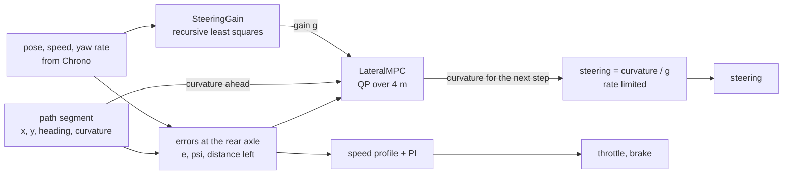
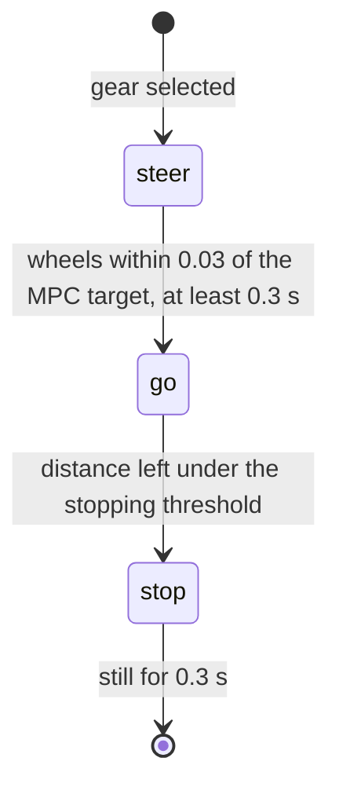

# Control

The controller turns a planned path into steering, throttle and brake commands at 50 Hz. Steering
is model predictive control. Speed is a PI loop on a speed profile. Code: `LateralMPC`, `nnls`,
`SteeringGain`, `MpcTracker`, and the plan refinement in `ParkingSim._refine` and `_monitor`.




## Why MPC here

A planned parking path is made of straight lines and arcs, so its curvature jumps. A real
steering system cannot jump: this simulator limits the steering input rate to 1.3 per second, about
1.5 s from lock to lock. A feedback law reacts to a curvature jump when it arrives and is then late
by the time the steering needs to move. An MPC sees the jump coming over its horizon, knows the
rate limit, and starts turning early by exactly the amount that minimises the error. It also
handles the hard steering limit explicitly instead of saturating.

## Error model in travelled distance

Let `e` be the lateral offset of the rear axle from the path (positive to the left) and `psi`
the heading error. For a kinematic bicycle driving in direction `d` (+1 forward, -1 reverse) with
curvature `kappa` along a path of curvature `kappa_ref`, the errors evolve with travelled
distance `sigma` as

```math
\frac{de}{d\sigma} = d \sin\psi, \qquad
\frac{d\psi}{d\sigma} = d \left( \kappa - \frac{\kappa_{ref} \cos\psi}{1 - \kappa_{ref}\, e} \right)
```

Writing the model in distance instead of time is deliberate. At parking speeds the car creeps to a
stop at the end of every segment. A time-domain horizon of fixed duration shrinks to nothing in
distance as the speed goes to zero. A distance-domain horizon always looks 4 m ahead.

To first order in the errors, and with `kappa` held constant over a step of length `h`, the
discrete model is exact:

```math
\begin{bmatrix} e \\ \psi \end{bmatrix}_{k+1} =
\begin{bmatrix} 1 & d\,h \\ 0 & 1 \end{bmatrix}
\begin{bmatrix} e \\ \psi \end{bmatrix}_{k} +
\begin{bmatrix} h^2/2 \\ d\,h \end{bmatrix} \left( \kappa_k - \kappa_{ref,k} \right)
```

The `h^2/2` term has no sign `d` because the lateral acceleration with respect to distance is
`d^2 = 1` times the curvature mismatch. The same model therefore covers forward and reverse, with
only the sign of the heading coupling changing.

## The optimisation problem

Horizon `N = 20` steps of `h = 0.2 m`. Decision variables: the curvatures
`K = (kappa_0, ..., kappa_{N-1})`.

```math
\min_K \;\; \sum_{k=1}^{N} \gamma_k \left( q_e\, e_k^2 + q_\psi\, \psi_k^2 \right)
+ r \sum_{k=0}^{N-1} \left( \kappa_k - \kappa_{ref,k} \right)^2
+ r_\Delta \sum_{k=0}^{N-1} \left( \kappa_k - \kappa_{k-1} \right)^2
```

```math
\text{subject to} \quad |\kappa_k| \le g, \qquad |\kappa_k - \kappa_{k-1}| \le \Delta
```

| Symbol | Value | Meaning |
| --- | --- | --- |
| `q_e`, `q_psi` | 10, 6 | error weights |
| `gamma_N` | 3 | extra weight on the last step, 1 elsewhere |
| `r` | 1 | stay near the path's own curvature |
| `r_Delta` | 1 | smooth steering |
| `kappa_{-1}` | `g * s_now` | the curvature the car has right now |
| `g` | identified online | curvature per unit of steering input, so `abs(kappa) <= g` is the steering limit |
| `Delta` | `min(1.3 g h / max(abs(v), 0.3), 2 g)` | curvature change allowed per step by the steering rate at the current speed |

The reference `kappa_ref` is the raw path curvature sampled at the middle of each step. It is not
smoothed: dealing with the jumps is the MPC's job. Beyond the end of a segment the last curvature
is held, so the controller does not start to unwind the steering before a cusp.

Without constraints this is a finite-horizon LQR. Its first-move gains are about 1.3 per square
metre on `e` and 1.7 per metre on `psi`.


## Solving the QP

Stacking the model over the horizon gives `X = Phi x_0 + Gamma (K - K_ref)`, and the problem
becomes a dense QP in 20 variables with 40 two-sided constraints:

```math
\min_K \; \tfrac{1}{2} K^{\top} H K + f^{\top} K \quad \text{s.t.} \quad G K \le b,
\qquad
H = 2\left( \Gamma^{\top} Q \Gamma + r I + r_\Delta D^{\top} D \right)
```

where `D` is the first-difference matrix. `H` depends only on the weights and on the driving
direction, so it is built and factorised once, `H = L L^T`. Only `f` and `b` change from solve to
solve.

The QP is solved exactly, as a least-distance problem. With the change of variables

```math
y = L^{\top} K + L^{-1} f
```

the objective is `|y|^2 / 2` plus a constant, and the constraints become

```math
\tilde G\, y \ge \tilde b, \qquad \tilde G = -G L^{-\top}, \qquad \tilde b = -\left( b + G H^{-1} f \right)
```

"Find the point closest to the origin in a polyhedron" reduces to one non-negative least squares
problem (Lawson and Hanson):

```math
u^{\star} = \arg\min_{u \ge 0} \left\| \begin{bmatrix} \tilde G^{\top} \\ \tilde b^{\top} \end{bmatrix} u -
\begin{bmatrix} 0 \\ 1 \end{bmatrix} \right\|, \qquad
\rho = E u^{\star} - e_{n+1}, \qquad y = -\frac{\rho_{1..n}}{\rho_{n+1}}
```

which `nnls` solves with the Lawson-Hanson active-set method: add the constraint with the most
negative gradient to the active set, solve an unconstrained least squares problem on the active
columns, back off if a multiplier turns negative, repeat. It terminates in a finite number of
steps with the exact solution, and it copes with redundant constraints, which occur here whenever
a steering limit and a rate limit are active on the same step.

`tests/test_core.py` checks this on random problems: with the limits far away it matches the
closed-form solution to 1e-14, with active limits the constraints hold to 1e-12 and the cost is
never above that of a slow projected-gradient reference. A solve takes about 18 active-set
iterations from scratch and roughly 0.3 ms.

An earlier version used ADMM (operator splitting). It was dropped: the problem is small but badly
conditioned, and ADMM needed around 200 iterations from a cold start and stopped short of
convergence at the iteration cap. The receding horizon hid that in closed loop, but an exact
method is both faster and correct.

## The steering gain

The MPC plans in curvature. The car takes a steering input `s` in [-1, 1]. The link is one number
per driving direction:

```math
\kappa = g\, s
```

**Starting value.** The kinematic bicycle with the Chrono model's wheelbase and maximum steering
angle: `g_0 = tan(delta_max) / L = 0.168`.

**Online identification.** The curvature the car is actually driving is measured as yaw rate over
speed, and `g` is updated by recursive least squares with a forgetting factor:

```math
\hat\kappa = \frac{\omega}{v}, \qquad
k = \frac{P s}{\lambda + P s^2}, \qquad
g \leftarrow g + k \left( \hat\kappa - g s \right), \qquad
P \leftarrow \frac{P - k s P}{\lambda}
```

with `lambda = 0.995` and `P` capped at 0.5. Samples are used only when they carry information
and are not transients: speed above 0.5 m/s, `|s|` above 0.15, and the steering not moving faster
than 0.5 per second (the yaw response lags a moving wheel). `g` is kept within 0.4 to 2.5 times
the starting value.

**What it finds.** Driving steady circles and comparing the identified `g * s` with the curvature
of the circle actually driven:

| Direction | Steering input | Curvature of the driven circle | Identified `g * s` |
| --- | --- | --- | --- |
| forward | 0.3 | 0.042 | 0.036 |
| forward | 0.7 | 0.125 | 0.125 |
| forward | 1.0 | 0.193 | 0.203 |
| reverse | 0.7 | 0.150 | 0.149 |
| reverse | 1.0 | 0.216 | 0.217 |

So the real car turns tighter than the kinematic value suggests, 15 percent going forward at full
lock and 29 percent in reverse, and the forward response is not linear: the gain is 0.12 at a
steering input of 0.3 and 0.20 at full lock. A single gain cannot represent that curve. It works
as gain scheduling by adaptation: on an arc the estimate converges to the local gain within a few
tenths of a second, and the MPC feedback covers the transient.

The bottom panel of the figure at the top of this page shows it happening in a run: both gains
start at the model value and move when the car first turns in that direction.

Two things were tried and are not in the code:

- A curvature disturbance observer on top of the gain, to make the MPC offset-free. In the batch
  it made things worse (one failure, larger final heading errors), most likely because the two
  estimators compete for the same residual.
- Using the identified gain in the planner. The first plan is made before the car has turned at
  all, so it would not help where it matters. The planner uses the model value throughout, which is
  conservative: the real car can always turn tighter than planned.

## From MPC output to steering

`s_target = kappa_0 / g`, clipped to [-1, 1]. The steering input then moves toward the target at
no more than 1.3 per second. Because the MPC already respects that rate, this limiter rarely binds.
It is there because the rate limit is a property of the actuator, not of the controller.

## Speed

Each segment gets a speed limit from the steering actuator. Where the path curvature changes by
`d kappa / d s` per metre, driving at `v` requires the steering to move at `v * d kappa / d s`,
which must not exceed what the rate limit allows:

```math
v_{ref}(s) = \min\left( v_{max},\; \mathrm{clamp}\!\left( \frac{1.3\, g_0}{|d\kappa/ds|},\; 0.5,\; v_{max} \right) \right)
```

`v_max` is 2.2 m/s while searching, 1.4 m/s forward and 1.0 m/s in reverse while maneuvering. The
target speed also ramps down toward the end of the segment:

```math
v = \max\left( \min\left( v_{ref},\; \sqrt{2 \cdot 0.5 \cdot s_{rem}} \right),\; 0.15 \right)
```

so the car arrives at a creep. It is ramped up at no more than 0.7 m/s^2. A PI loop on the speed
error drives the throttle (gains 0.5 and 0.5 per second, integrator limited). The brake comes on in
proportion when the car is more than 0.08 m/s too fast.

**Stopping.** When the distance left drops below `0.015 m + 0.06 s * v`, the brake is applied and
held until the car has been still for 0.3 s. Near the end, the distance left is measured along the
final heading, which is more accurate than arc length along the path.

## Sequencing a segment



In the `steer` phase the brake is held and the wheels turn to where the MPC wants them for the
start of the segment. This removes the transient that would otherwise occur at every cusp, where
the path curvature typically flips sign.

## Keeping the plan attached to the stall

The plan was made for the stall as it was estimated when the car stopped to plan. The estimate
keeps improving during the maneuver, mostly in the last few metres when the lines are close. Each
perception tick, `_refine` compares the goal pose the current estimate implies with the one the
plan was made for.

- **Small change.** The remaining path is moved by the rigid transform that takes the old goal to
  the new one, applied gradually (30 percent of the difference per tick) and weighted by how much
  path is left to drive:

  ```math
  w(\ell) = \mathrm{clamp}\!\left( \frac{9 - \ell}{5},\; 0,\; 1 \right)
  ```

  where `l` is the path length from a point to the goal. Points within 4 m of the goal move fully,
  points more than 9 m away stay put, and the weight is continuous across cusps. The far part of
  the plan, which was checked against obstacles, is not disturbed.
- **Large change** (over 0.5 m or 0.1 rad). The car stops and replans.

## Watching the path

Each perception tick, `_monitor` places the footprint at every third remaining path sample and
tests it against the occupied cells. Two consecutive hits make the car stop and replan. If no plan
exists the run fails. It does not drive a path it knows to be blocked.

After the last segment the pose is compared with the goal. More than 12 cm sideways, 2.5 degrees
or 30 cm lengthwise triggers a correction plan, at most twice.

## Limits

- The MPC model is linear in the errors. That is accurate for the few centimetres and degrees seen
  here, not for recovering from a large disturbance.
- Only the steering is predictive. Speed is a separate loop, so the MPC cannot trade speed against
  tracking. It does not need to at parking speeds.
- The forward steering response has slack near straight-ahead that a single gain cannot describe.
  Docking runs driven forward therefore end with a larger heading error than those driven in
  reverse. The worst case in the verification batch was 2.0 degrees.

## References

- C. L. Lawson and R. J. Hanson, "Solving Least Squares Problems", 1974, chapter 23 (non-negative least squares and least-distance programming).
- J. B. Rawlings, D. Q. Mayne and M. Diehl, "Model Predictive Control: Theory, Computation, and Design", 2nd edition, 2017.
