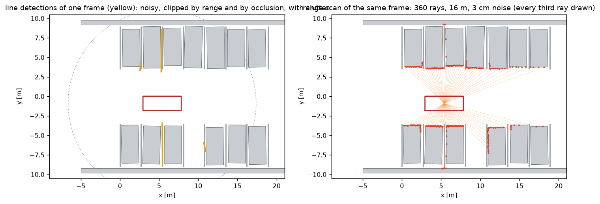
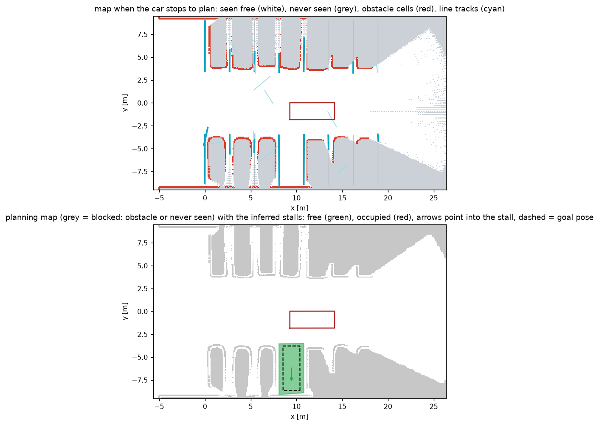

# Perception, mapping and stall choice

This covers everything between the true scene and the decision "park in that stall":
`Perception`, `GridMap`, `LineTrack`, `LineMap`, `find_slots` and `ParkingSim._decide`.

There are two sources of perception, and they feed the same mapping code. Every 0.1 s either one
returns a list of planar scans (per bearing: the range of the nearest obstacle, and how far the
ray is known to be free) and a list of line segments.

| Source | `--sensors` | What it is |
| --- | --- | --- |
| `SensorRig` | `camera`, `camera+lidar` | cameras and a lidar ray traced by Chrono::Sensor, with depth computed from the images by neural networks. See [sensors.md](sensors.md) |
| `Perception` | `sim` | detections computed from the scenario and corrupted. Described here |

This document describes the stand-in and the mapping. Where the mapping does something only
because a real sensor has a limited view, it says so and points to [sensors.md](sensors.md).

## Simulated perception

The stand-in computes its detections from the ground truth scene. It runs on any PyChrono, with
no sensor module. The noise model is still meant to be unkind in the ways a real detector is:
range dependent noise, partial observations, occlusion, dropouts and false positives. Every 0.1 s
`Perception.sense(pose)` returns one scan and the line detections. The sensor origin is the
middle of the car body.



### Range scan

360 rays, one per degree, 16 m range. Each ray is intersected with every edge of every obstacle
rectangle (parked cars and kerbs). For a ray from origin `o` in direction `d` and an edge from
`a` to `a + e`:

```math
t = \frac{(a - o) \times e}{d \times e}, \qquad
s = \frac{(a - o) \times d}{d \times e}, \qquad
\text{hit if } t > 0,\; 0 \le s \le 1
```

The true range is the smallest `t` over all edges. The measured range adds Gaussian noise with a
3 cm standard deviation, and 2 percent of the rays are dropped. A ray that hits nothing within
16 m reports no return. All rays against all edges is one vectorised NumPy expression.

### Line detections

Each painted line is sampled every 0.25 m. A sample is visible if it is within 12 m and nearer
than the true range of the ray pointing at it, minus 15 cm. Lines hidden behind a parked car are
therefore not detected, and in a full row only the stub of each line near the lane is visible until
the car is level with the gap. Each contiguous run of at least four visible samples becomes one
detection, and then:

| Effect | Model |
| --- | --- |
| sideways endpoint noise | Gaussian, sigma = 0.03 m + 0.012 x range |
| lengthwise endpoint noise | Gaussian, sigma = 0.08 m + 0.03 x range |
| common sideways bias per detection | Gaussian, sigma = 0.02 m |
| dropout | 12 percent of detections vanish |
| fragmentation | 20 percent of long detections are cut to a random part |
| clutter | Poisson(0.25) random segments per frame, 0.8 to 2.5 m long |

`--noise` scales all of these. At 12 m the endpoints are off by about 17 cm sideways and 44 cm
lengthwise, so a single detection is not good enough to park by. The map has to do the work.

## Occupancy grid

`GridMap` covers the scenario with 10 cm cells and keeps two numbers per cell. Both are times in
seconds, not counts of scans.

- `hits`: for how long a range return ended in the cell.
- `free`: for how long a ray passed through the cell. Rays are sampled every 20 cm up to
  the range the scan reports as free.

A scan adds the time it stands for, which is the time since the scan before it from the same
sensor: 0.1 s for a sensor that delivers ten times per second, 0.4 s for one that delivers every
0.4 s. What the map believes then depends on how long something was in view, not on how many
scans that was, so nothing has to be retuned when a sensor runs faster or slower. A scan never
stands for more than 0.4 s, so one scan alone is not enough to believe anything. A scan counts
once per cell, however many of its rays touch the cell. The cells under the car's
own outline are counted as free on every tick: the ground the car stands on is free, whether a
sensor looks at it or not. With a sensor rig there are two more layers, for ground that a
camera sees from too far away to be sure of it (see
[sensors.md](sensors.md#far-ground-in-the-grid)).

Two derived maps are used.

```math
\text{occupied} = (\text{hits} \ge 0.5\ \text{s}) \;\wedge\; (\text{hits} > 0.3 \cdot \text{free})
```

The second condition matters. Range noise puts an occasional return into the free cell just in
front of a surface. Without it, obstacles slowly grow outward by one cell and start to block plans
that were made with a small margin. A real surface stops the rays, so its cells have many hits and
few pass-throughs. A cell that rays mostly pass through only caught noise.

```math
\text{blocked} = \text{occupied} \;\vee\; \neg\,\mathrm{dilate}_{2}(\text{free} > 0)
```

The planner uses `blocked`: a cell is drivable only if it was seen to be free. The dilation by two
cells closes the gaps between neighbouring rays at long range, where rays are 28 cm apart. The
interior of a parked car and everything behind it are never seen to be free, so they are solid.



## Line tracks

`LineMap` keeps one `LineTrack` per painted line. A track stores up to 160 detections and is
re-fitted whenever one is added.

**Association.** A detection joins a track if all of these hold, and the track with the smallest
perpendicular distance wins:

- direction: `|sin(angle between them)| < 0.21`, about 12 degrees. This is skipped if the
  detection or the track is shorter than 1 m: a short piece has no direction worth comparing
- offset: both endpoints within `0.35 m + 0.03 x range` of the track's line
- overlap: the gap between the detection and the track's extent along the line is under 0.8 m

The last rule keeps two collinear but separate lines apart. In a perpendicular lot the lines of the
two rows are exact extensions of each other across a 7 m aisle.

**Fit.** With detection endpoints `p_i` and weights `w_i = 1 / (0.05 + 0.02 r_i)^2` that favour
close detections, the line passes through the weighted centroid `c` and its direction is the
principal axis of the weighted scatter matrix:

```math
c = \frac{\sum w_i p_i}{\sum w_i}, \qquad
S = \sum w_i (p_i - c)(p_i - c)^{\top}, \qquad
\theta = \tfrac{1}{2}\,\mathrm{atan2}\!\left(2 S_{xy},\; S_{xx} - S_{yy}\right)
```

This is total least squares: it minimises perpendicular distances, so it has no preferred axis.

**Extent.** Where the line starts and ends matters as much as where it lies, because the line ends
define the stall entrance. Each detection covers an interval along the line. A weighted coverage
histogram with 20 cm bins is built, and the extent is first taken as the bins with at least a
quarter of the peak coverage. That estimate overshoots, because it follows the longest detections
and lengthwise noise is large. Each end is then replaced by the weighted median of the detection
endpoints that lie within 0.6 m of it, which is unbiased for a line end that was actually seen.

**Housekeeping.** A track keeps the time it has been watched for: the time between its sightings,
summed, where a gap of more than 0.5 s counts as 0.5 s. Several detections of the line at the same
instant are one sighting. A track is confirmed once it has been watched for 0.35 s and is 1.2 m
long. Tracks watched for less than 0.15 s are dropped after 2.5 s, which removes clutter. Tracks
that turn out to be the same line (nearly parallel, within 0.25 m, extents touching) are merged.
Like the grid, this is in seconds and not in detections, so it does not depend on how often the
perception runs.

With a sensor rig, a track of 0.35 m or more also counts, as a stub, and a track remembers the
stretch along which paint was seen. Both are described in
[sensors.md](sensors.md#what-changes-because-the-car-cannot-see-sideways).

## From lines to stalls

A stall is the space between two neighbouring, parallel line tracks. `find_slots` looks at every
pair of confirmed tracks whose directions agree within about 8 degrees.

```
                  back
      a_bk +---------------+ b_bk          s: along the lines, into the stall (u_in)
           |               |               l: across the stall
    line a |     stall     | line b
           |               |
      a_in +---------------+ b_in
               entrance
              (lane side)
```

| Kind | Separation of the lines | Line length | Overlap along the lines |
| --- | --- | --- | --- |
| perpendicular or angled | 2.2 to 3.5 m | both at least 3.5 m | at least 3.0 m |
| parallel | 5.0 to 7.8 m | both 1.5 to 3.6 m, no third tick in between | at least 1.2 m |

For a parallel stall the two "lines" are the short ticks painted across the parking strip at its
front and back, so the car ends up perpendicular to them.

With a sensor rig, tracks on one straight line less than 1.5 m apart are first joined into one
line, a tick may be 1.2 m long, and a stall starts on a line along the lane even if one of its
lines was seen to start late (see [sensors.md](sensors.md#a-line-in-pieces-is-one-line)).

With a sensor rig a third kind of pair is accepted: one line of at least 2 m and a stub, which is
what a camera looking along the lane sees of a stall between two cars
([sensors.md](sensors.md#a-stall-is-one-line-and-a-stub)). And a fourth: two stubs at the mouth
of a row. Neither has a direction, so the row they stand in is worked out first, from all the
lines on that side of the lane (`parking/rows.py`,
[sensors.md](sensors.md#between-two-cars-a-stall-is-two-stubs)).

**Which end is the entrance.** The end of the line pair that is nearer to where the car has driven
(its trail of past positions) is the lane side. Only the drive along the lane counts: the trail
stops growing once the car commits to a stall. A car that is parking drives inside the stall, and
its track there says nothing about where the lane is. An earlier version kept extending the trail,
and for a parallel stall entered from behind it flipped the entrance halfway through the maneuver,
which moved the goal by 21 cm.

**Perpendicular or angled.** With `in_a` and `in_b` the positions of the two entrance ends along
the lines and `w` the separation, the skew is `|in_a - in_b| / w`. A 90 degree stall has skew
near 0. A 60 degree stall has skew `cot 60 = 0.58`. Below 0.2 the stall is called perpendicular.

**Where the car should stand.** Sideways it is centred between the lines. Lengthwise it sits in the
part of the stall that both lines cover:

```math
s_c = s_0 + \mathrm{clamp}\!\left(\tfrac{1}{2}(s_1 - s_0),\; 2.65,\; 2.95\right), \qquad
s_0 = \max(a_{in}, b_{in}), \quad s_1 = \min(a_{bk}, b_{bk})
```

The clamp guards against a far end that has not been seen well. The entrance ends are seen often
and from close up, so the estimate is anchored there. Where a camera network saw the kerb behind
the stall, the car's end stays 0.40 m short of it
([sensors.md](sensors.md#how-deep-a-stall-is)).

**Parallel stalls and the kerb.** Two 2.5 m ticks give a poor heading: a few centimetres of
endpoint error become degrees. In one test run the tick based heading was off by 2.3 degrees,
which put a corner of the goal pose on the kerb and left no feasible plan. So for parallel stalls
`_align_with_kerb` fits a line to the occupied cells just behind the stall (the kerb, seen over
the full 7 m), rejects outliers beyond 15 cm, and places the car parallel to that line with its
side 0.30 m from it. That is also what a driver does. The line is fitted to the lane-side edge of
the occupied cells: per 20 cm along the kerb, only the cells within 12 cm of the nearest one. A
sensor that looks down on the kerb, like a lidar, also returns points from its top, and a fit
through the middle of those would put the kerb further away than it is.

A kerb runs along the lane, and the fit starts from that: it takes the cells within 15 cm of a
line along the lane through the middle of the hits, and a line that comes out more than 4
degrees off the lane is not used. The window also holds a corner of the car parked next to the
stall. A fit to everything in it once came out 7 degrees off, while the car stood in the stall,
and the car set out to correct a heading that was right.

## Free, occupied or unknown

`_classify` looks at the grid cells inside the stall, shrunk by 0.35 m at the sides (0.6 m for
parallel) so that a neighbour parked close to the line does not count:

| Result | Condition |
| --- | --- |
| occupied | at least 4 occupied cells inside |
| free | at most 1 occupied cell **and** enough of the stall seen free for half a second or more: 60 percent of it, or 80 percent of its first 2.5 m and 30 percent overall. With a sensor rig also: 55 percent of its first 2.5 m, 25 percent overall, and free ground seen 2 m into it. For a stall known from its row, which is taken when the car is level with it: 75 percent of its first 1.2 m and free ground seen 2 m into it |
| unknown | anything else |

"Free" needs positive evidence. A stall the car has not looked into yet is unknown, not free. For
a stall between two parked cars the stand-in perception sees the interior when the car is roughly
level with it. A camera that looks along the lane never sees the far end of such a stall, which
lies in the shadow of the nearer car. The second way to be free is for that case: a parked car
would show at the mouth of the stall, so a mouth that is seen to be empty is enough. The third is
for a rig whose only range sensor with two cameras looks forward. It sees an empty stall as a
wedge, see [sensors.md](sensors.md#free-means-a-wedge-of-the-mouth-is-empty).

The same pass counts occupied cells just outside each line, which tells whether there is a
neighbour on each side. Beside an angled stall the band that is searched follows the stagger
of the row ([sensors.md](sensors.md#free-means-a-wedge-of-the-mouth-is-empty)).

## Choosing a stall

`ParkingSim._decide` runs every perception tick while the car is searching.

1. Candidates are stalls that are free, whose two lines have both been watched for 0.65 s, that
   have not been rejected by the planner before, and that lie between 8 m behind and 10 m ahead
   of the car. A stall that is known only from its row, by two stubs or by one line
   ([sensors.md](sensors.md#one-line-found-the-other-not)), is a candidate once the
   car is level with it, its middle at most 1 m ahead of the car's: until then more of its far
   line is still coming into view. Taken from 2 to 4 m before that, such a stall was placed
   badly enough that the car needed five to nine gear changes to get into it, where two do.
2. The candidate with the lowest score leads:

   ```math
   J = |\text{ahead}| + 0.3\,|\text{sideways}| + 1.5 \cdot (\text{number of neighbours})
   ```

   This is "take the first available stall", with a preference for one that has fewer cars next
   to it when two are similarly close.
3. The car commits only when the leader's estimate has settled: it has led for at least 0.55 s,
   and over that time its centre stayed within 12 cm and its axis within 1.2 degrees.

The settling rule exists because an estimate built from a few far detections moves a lot. Early
versions committed as soon as a stall looked free, planned to a pose that then moved by 20 cm or
more as better detections arrived, and had to replan.

**Nose in or back in.** With `--park auto` the car backs into perpendicular stalls, drives nose
first into angled stalls that lean the way it is travelling, and parallel parks by reversing in and
then pulling forward to the middle. Backing into a perpendicular stall needs less aisle width than
driving in, because the steered axle stays out in the aisle.

If the planner finds no way into the chosen stall, the stall is put on a rejected list and the
search continues down the lane.

## What this stage does not do

- It does not estimate the car's own pose. Detections are placed in the world with the pose the
  car is given, which carries the error of a satellite receiver with an inertial unit
  (`parking/localization.py`, [sensors.md](sensors.md#limits)).
- Obstacles are static. Nothing moves except the car.
- The stall size thresholds assume ordinary car stalls. They are prior knowledge about parking
  lots, not something learned from the scene.
