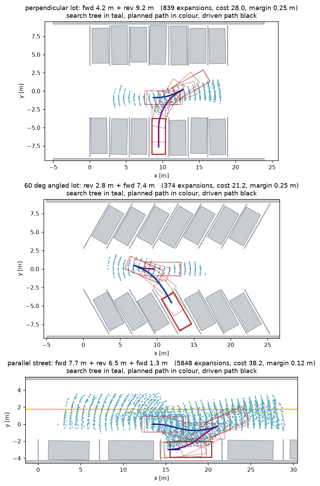
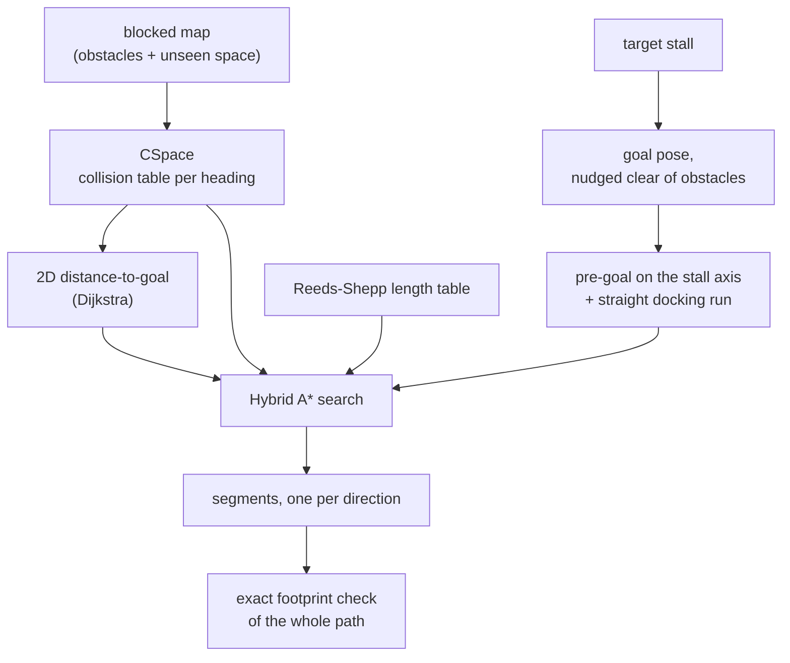
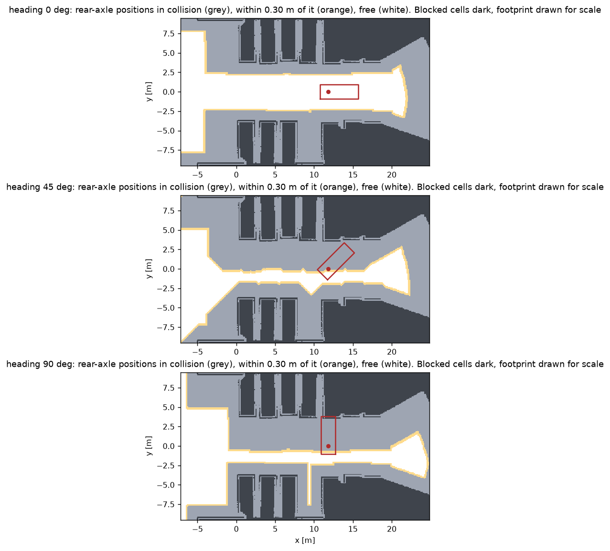
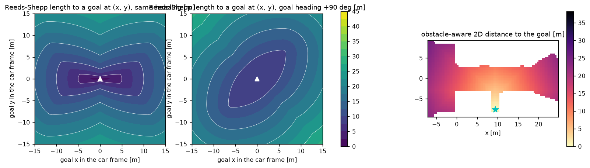
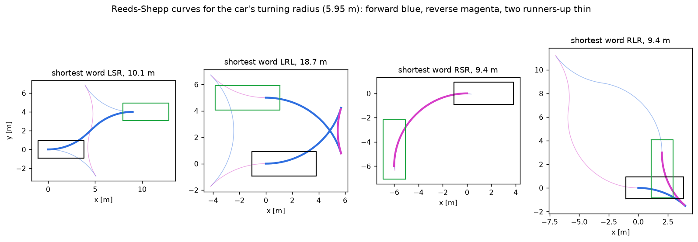
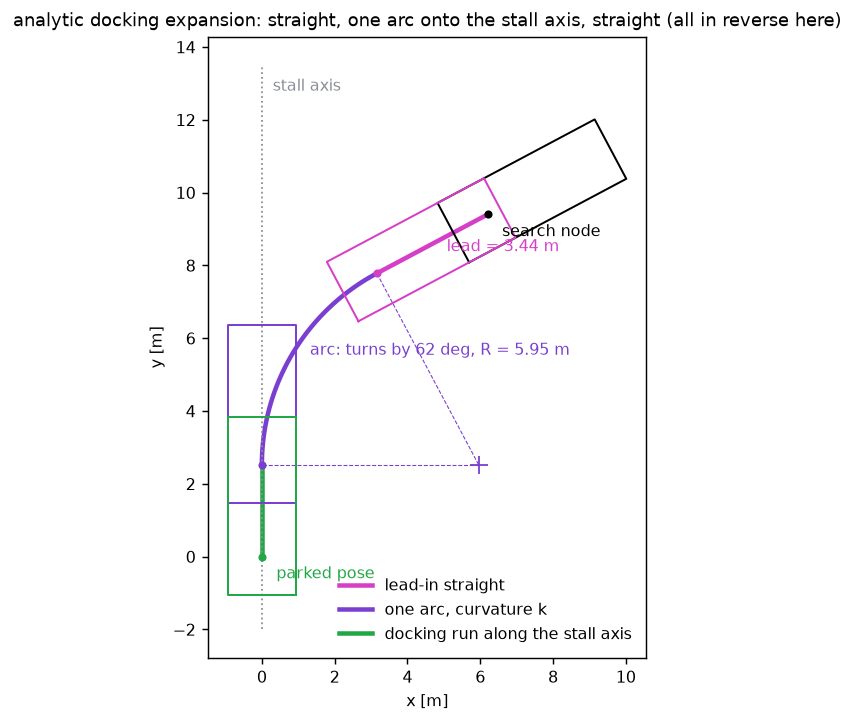

# Planning

Given the car's pose, a target stall and the map, the planner returns a path made of segments
that are each driven in one direction. It is a Hybrid A* search over `(x, y, heading)` with
forward and reverse motion primitives, closed by analytic expansions (Reeds-Shepp curves and a
straight, arc, straight docking move). Code: `CSpace`, `holonomic_distance`, `Planner`,
`Segment`, and `ParkingSim._plan_once`.



## The planning problem



The kinematic model is the bicycle model at the rear axle, with a curvature limit

```math
\kappa_{max} = \frac{\tan \delta_{max}}{L}
```

where the wheelbase `L` and the maximum steering angle `delta_max` are read from the Chrono
model. For the sedan that gives 0.168 per metre, a 5.95 m turning radius at the rear axle.

## Goal pose and docking run

The nominal goal comes from the stall estimate (see
[perception-and-mapping.md](perception-and-mapping.md#from-lines-to-stalls)). Before searching,
`_plan_once` does two things with it.

**Nudge it clear.** If the car at the nominal pose would touch a blocked cell with a small margin,
the pose is shifted. Candidate shifts are tried in order of size: up to 0.3 m sideways and up to
0.6 m back toward the lane for ordinary stalls, up to 0.6 m along the kerb and 0.3 m away from it
for parallel stalls. This is how the car ends up centred in the free space when a neighbour is
parked over the line.

**Add a docking run.** The search does not aim at the goal. It aims at a pre-goal on the stall
axis, a distance `dock` before the goal in the direction of arrival, and the stretch from there
to the goal is a straight line:

| Stall | Arrival | Docking lengths tried, longest first |
| --- | --- | --- |
| perpendicular, angled | forward if nose in, reverse if backing in | 3.5, 2.5, 1.5, 0.8 m |
| parallel | forward (after reversing in) | 1.6, 1.1, 0.6, 0 m |
| hand-placed target | both directions, cheaper plan wins | 3.0, 2.0, 1.2, 0.6, 0 m |

The longest docking run whose pre-goal is collision free is used. The reason for the docking run
is accuracy: the search and the Reeds-Shepp curves end with arcs, and tracking error at the end of
an arc is a heading error. A straight run gives the controller room to remove it.

## Configuration space by FFT

Collision checking is the inner loop of the search, so it is turned into a table lookup. For each
of 120 headings (3 degrees apart), `CSpace` computes for every cell whether the car's rear axle
can be there.

The footprint, inflated by a safety margin, is a set of cell offsets `F_theta` around the rear
axle. A rear-axle position `p` is in collision when any blocked cell `q` lies inside the
footprint placed at `p`:

```math
C_\theta(p) = \sum_{q} \mathrm{blocked}(q)\; F_\theta(q - p)
```

That is a cross-correlation of the map with the footprint, and it is computed for all `p` at
once in the frequency domain:

```math
C_\theta = \mathcal{F}^{-1}\!\left[\, \mathcal{F}(\mathrm{blocked}) \cdot \overline{\mathcal{F}(F_\theta)} \,\right]
```

Three details make it cheap and useful:

- The footprint at heading `theta + pi` is the point reflection of the one at `theta`, so its
  transform is the complex conjugate. Only 60 kernel transforms are needed for 120 headings.
- One correlation gives two answers. The kernel holds a large value (4096) inside the hard
  footprint and 1 in a 30 cm band around it. A result of at least 4096 means collision, a smaller
  positive result means "close". The search treats the first as forbidden and the second as costly.
- The map is zero-padded by the footprint size, so the circular convolution cannot wrap around.

The result is a `uint8` array `cost[heading, y, x]` with values free, soft and hard. Checking a
pose is one index operation. Building the table for a 40 m by 20 m window takes about 0.1 s.



Safety margins are tried from generous to tight, and the first that yields a plan is used:

| Stalls | Sideways, lengthwise margin [m] |
| --- | --- |
| perpendicular, angled, hand-placed | (0.25, 0.30), then (0.15, 0.20), then (0.08, 0.12) |
| parallel | (0.12, 0.22), then (0.08, 0.15), then (0.06, 0.12) |

Parallel stalls start tighter because a car parked 0.30 m from the kerb has no room for a 0.25 m
sideways margin.

## Hybrid A*

A node is a continuous pose. Nodes are merged when they fall in the same cell of a 0.35 m by
0.35 m by 6 degree grid, keeping the cheaper one.

**Expansion.** From each node, ten motion primitives: five curvatures
`{-k, -k/2, 0, k/2, k}` with `k = kappa_max`, each driven 0.7 m forward and 0.7 m in reverse. The
end pose of an arc of signed length `s` at curvature `kappa` is closed form:

```math
\Delta x = \frac{\sin(\kappa s)}{\kappa}, \qquad
\Delta y = \frac{1 - \cos(\kappa s)}{\kappa}, \qquad
\Delta\theta = \kappa s
```

in the car's frame. Each primitive is collision checked at its midpoint and at its end.

**Cost.** Everything is in metres, so the weights read as "this is worth that many metres".

| Term | Cost |
| --- | --- |
| driving forward | 1 per metre |
| driving in reverse | 1.5 per metre |
| changing direction | 5 |
| changing steering between primitives | 0.4 for a full-lock change |
| driving through the soft band around an obstacle | 1.5 per metre extra |

**Heuristic.** The larger of two lower bounds on the remaining length, plus the cost of the
docking run:

```math
h(n) = \max\big(\, h_{RS}(n),\; h_{2D}(n) \,\big) + c_{dock}
```

- `h_RS` is the length of the shortest Reeds-Shepp curve from the node to the pre-goal, ignoring
  obstacles. It knows about the turning radius and about reversing. It is tabulated once at
  start-up over relative poses within 22 m at 0.5 m and 5 degree resolution, then looked up.
- `h_2D` is the obstacle-aware shortest distance from the node's position to the goal for a
  point robot, from one Dijkstra pass on a 0.4 m grid whose obstacles are grown by 0.8 m. It knows
  about obstacles but not about heading. A coarse cell counts as blocked only if every fine cell
  in it is, which keeps the bound optimistic.

Nodes are ordered by `g + 1.1 h`. The factor 1.1 makes the search slightly greedy.



**Termination.** The first solution is not returned right away. The search continues until the
best open node cannot beat it, or for 1000 more expansions, and keeps the cheapest solution found.
The search gives up after 12,000 expansions (30,000 for the last margin setting).

## Analytic expansions

A lattice search almost never lands exactly on a goal pose. So when a node is popped, the planner
also tries to connect it to the goal in closed form. It does this for every node near the goal
(heuristic under 6 m), every third node up to 14 m, and every eighth beyond.

### Reeds-Shepp curves

The shortest path for a car that can drive forward and backward with a bounded turning radius is
one of a small set of "words" made of arcs (L, R) and straight lines (S), with up to two direction
changes. The formulas follow Reeds and Shepp (1990) in the arrangement used by the Open Motion
Planning Library: five base formulas, each used in four symmetric variants (time flip, reflection,
both), plus "backward" variants for the words that are not symmetric.



The same formulas run on scalars (`math`, for one query during the search) and on arrays
(`numpy`, to tabulate the heuristic). Every candidate is integrated and discarded unless it ends
at the goal within 3 cm and 0.01 rad, which guards against edge cases in the closed forms.

For a connection, all valid words are costed with the planner's own cost model, not just by
length, and the six cheapest are collision checked in order. A word that ends at the pre-goal is
followed by the docking run.

### The docking shot: straight, arc, straight

Reeds-Shepp curves use the minimum radius only. Parking maneuvers usually want something gentler
and more specific: one arc that brings the car onto the stall axis, then straight in.
`_arc_shot` constructs exactly that, all in the docking direction.



Express the node in the goal frame: `x_l` along the stall axis, `y_l` across it, `theta_l` the
heading difference. Let `sigma = +1` or `-1` be the docking direction. An arc of curvature `k`
that ends parallel to the axis turns by `-theta_l`, which takes a signed arc length

```math
s_{arc} = -\frac{\theta_l}{k}
```

and it shifts the car sideways by `(1 - cos(theta_l)) / k`. For the arc to end **on** the axis,
the car must start it at exactly that sideways offset. If it is further out, it first drives
straight along its current heading for a lead-in distance

```math
\ell = \frac{(1 - \cos\theta_l)/k \;-\; y_l}{\sigma \sin\theta_l}
```

and what remains along the axis after the arc is

```math
r = -\sigma \left( x_l + \sigma\,\ell\cos\theta_l - \frac{\sin\theta_l}{k} \right)
```

Four options are evaluated: the arc whose curvature needs no lead-in at all,
`k = (1 - cos(theta_l)) / y_l`, and the arcs at 100, 70 and 45 percent of the maximum curvature
with their lead-ins. An option is valid if `|k|` is within the limit, the arc runs in the
docking direction, the lead-in is not negative and the remaining run `r` is at least 1 m. The
cheapest valid, collision-free option is the candidate.

This shot is what produces the natural maneuvers: "drive past, then reverse in one sweep" for
backing in, and "one arc into the stall" for angled parking, often from the very first node.

## From nodes to segments

The winning chain of primitives plus its analytic ending is sampled every 10 cm into rows of
`(x, y, heading, direction, curvature)`. `split_segments` cuts that at every direction change into
`Segment` objects, drops fragments under 8 cm, and merges neighbours that end up with the same
direction. Each segment stores its curvature for the controller and a speed limit derived from the
steering rate (see [control.md](control.md#speed)).

## Final check

The configuration space rounds headings to 3 degrees and positions to 10 cm. So the finished path
is checked once more, exactly: the true footprint at every third sample against the rim cells of
the blocked map, with a 3 cm margin. A path that fails is discarded and the next margin setting is
tried.

## What the planner cannot do

- **Tight spaces with this car.** The sedan's kinematic turning radius is 5.95 m, which is large.
  Backing into a perpendicular stall from a 7 m aisle in one sweep only works from a good starting
  position. Otherwise the plan has an extra back and forth. Parallel stalls are 7.2 m long for the
  same reason.
- **Optimality.** The heuristic is inflated and the search stops early, so plans are good, not
  optimal. Occasionally a plan has one more direction change than a person would use.
- **Dynamics.** The plan is kinematic. It relies on the low speeds of parking (1.4 m/s forward,
  1.0 m/s in reverse) and on the controller for the rest.
- **Moving obstacles.** There is no prediction. A new obstacle on the path makes the car stop and
  replan.

## References

- J. A. Reeds and L. A. Shepp, "Optimal paths for a car that goes both forwards and backwards", Pacific Journal of Mathematics, 1990.
- D. Dolgov, S. Thrun, M. Montemerlo and J. Diebel, "Path planning for autonomous vehicles in unknown semi-structured environments", International Journal of Robotics Research, 2010.
- The Open Motion Planning Library, `ReedsSheppStateSpace`, for the arrangement of the Reeds-Shepp formulas.
