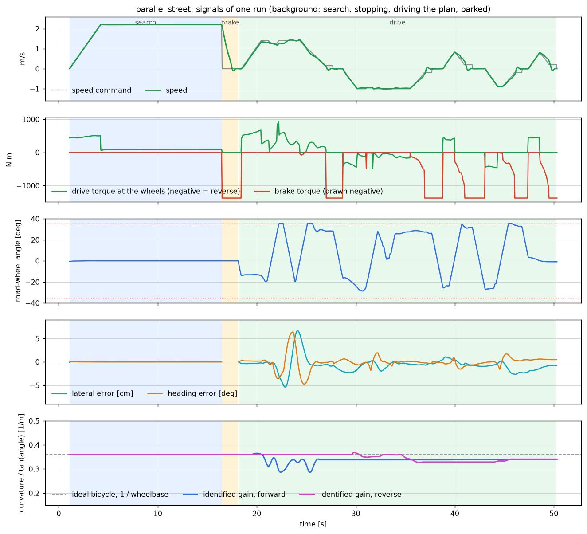

# Results and limits

## Verification batch

74 headless runs, each a complete search, plan and park. Every figure below is measured against
the **ground-truth** stall, not against the agent's own estimate of it.

- **Parked**: all four corners of the car inside the stall's lines, the stall truly free, no contact.
- **Lateral, heading, depth**: largest absolute offset from the stall centre and axis over the runs
  in the row. Depth is along the stall.
- **Clearance**: smallest distance between the car's outline and any parked car or kerb at any
  time during the runs in the row.
- **Time**: mean simulated time from start to parked.

| Stalls | Cars | Variant | Runs parked | Lateral [cm] | Heading [deg] | Depth [cm] | Clearance [m] | Gear changes | Time [s] |
| --- | --- | --- | --- | --- | --- | --- | --- | --- | --- |
| perpendicular | both | default | 4 of 4 | 1.1 | 0.35 | 5.1 | 0.44 | 1 to 3 | 38 |
| perpendicular | left | default | 4 of 4 | 1.7 | 0.51 | 25.4 | 0.24 | 1 | 30 |
| perpendicular | none | default | 4 of 4 | 0.7 | 0.17 | 7.7 | 0.41 | 1 | 30 |
| perpendicular | random | default | 4 of 4 | 2.0 | 0.27 | 2.7 | 0.36 | 1 | 32 |
| perpendicular | right | default | 4 of 4 | 3.1 | 0.44 | 3.0 | 0.46 | 1 | 37 |
| perpendicular | both | noise 2 | 1 of 1 | 4.4 | 0.48 | 9.9 | 0.39 | 1 | 33 |
| perpendicular | both | park forward | 1 of 1 | 0.8 | 0.31 | 3.2 | 0.12 | 4 | 44 |
| perpendicular | both | side left | 1 of 1 | 0.0 | 0.15 | 4.8 | 0.44 | 3 | 42 |
| perpendicular | random | target 17.6,-6.3,90 | 1 of 1 | 1.4 | 0.43 | 1.0 | 0.47 | 1 | 37 |
| perpendicular | none | target 6.0,0.5,25, no-snap | 1 of 1 | 0.3 | 0.00 | 0.5 | n/a | 1 | 25 |
| perpendicular | both | tire pac02 | 1 of 1 | 0.9 | 0.02 | 3.6 | 0.45 | 3 | 41 |
| angled | both | default | 4 of 4 | 1.0 | 0.76 | 2.5 | 0.41 | 1 to 2 | 31 |
| angled | left | default | 4 of 4 | 0.3 | 0.14 | 2.3 | 0.43 | 2 | 28 |
| angled | none | default | 4 of 4 | 1.2 | 0.64 | 4.1 | 0.65 | 0 to 1 | 19 |
| angled | random | default | 4 of 4 | 0.8 | 1.24 | 4.5 | 0.49 | 1 to 2 | 28 |
| angled | right | default | 4 of 4 | 1.2 | 1.40 | 2.6 | 0.32 | 1 | 34 |
| angled | both | angle 45 | 1 of 1 | 0.5 | 0.01 | 0.5 | 0.56 | 1 | 29 |
| angled | both | noise 2 | 1 of 1 | 0.7 | 0.08 | 4.9 | 0.47 | 1 | 31 |
| angled | both | side left | 1 of 1 | 0.4 | 0.14 | 3.7 | 0.51 | 2 | 33 |
| angled | both | tire pac02 | 1 of 1 | 0.1 | 0.32 | 2.3 | 0.60 | 1 | 34 |
| parallel | both | default | 4 of 4 | 2.8 | 0.47 | 1.0 | 0.17 | 2 to 4 | 45 |
| parallel | left | default | 4 of 4 | 2.5 | 0.16 | 2.2 | 0.26 | 1 to 2 | 35 |
| parallel | none | default | 4 of 4 | 2.5 | 0.02 | 0.8 | 0.27 | 2 | 35 |
| parallel | random | default | 4 of 4 | 2.5 | 0.16 | 2.1 | 0.26 | 1 to 4 | 41 |
| parallel | right | default | 4 of 4 | 2.4 | 0.04 | 1.3 | 0.27 | 2 | 48 |
| parallel | both | noise 2 | 1 of 1 | 1.9 | 0.32 | 4.2 | 0.23 | 2 | 41 |
| parallel | both | side left | 1 of 1 | 2.3 | 0.12 | 0.5 | 0.29 | 2 | 43 |
| parallel | both | target 18.0,-3.0,0 | 1 of 1 | 2.6 | 0.09 | 0.7 | 0.28 | 4 | 50 |
| parallel | both | tire pac02 | 1 of 1 | 2.4 | 0.08 | 3.3 | 0.28 | 2 | 44 |

The default rows are seeds 1 to 4. `noise 2` doubles every perception noise term. The `target`
rows give the car a parking pose instead of letting it choose, and `no-snap` parks at exactly that
pose in open space, so stall-relative clearance does not apply.

**Totals**

| | Parked | Lateral | Heading | Clearance | Gear changes |
| --- | --- | --- | --- | --- | --- |
| perpendicular | 25 of 25 | at most 4.4 cm | at most 0.51 deg | at least 0.12 m | 1 to 4 |
| angled | 24 of 24 | at most 1.2 cm | at most 1.40 deg | at least 0.32 m | 0 to 2 |
| parallel | 24 of 24 | at most 2.8 cm | at most 0.47 deg | at least 0.17 m | 1 to 4 |

No run needed a replan or a correction maneuver. The longest took 50 s of simulated time.

Two of those numbers need a comment:

- **0.12 m clearance.** That is the nose-in perpendicular run between two cars. The planner only
  found a way in at its tightest margin setting (8 cm), so the small clearance is the plan being
  followed, not the controller straying. Every other perpendicular run kept at least 0.24 m.
- **25 cm of depth** in one perpendicular run: the car stood 25 cm short of the middle of the stall,
  still inside the lines. The far end of a stall line is the least well observed part of it.

These runs use the physical command interface (steering angle, drive torque, brake torque). An
earlier batch of the same 74 runs with Chrono's normalized pedal inputs gave similar accuracy, and
larger earlier batches (116 runs including left-hand stalls for every type and zero noise) also
all parked. Those are not counted here because the control interface has changed since.

## How to reproduce

```
python parking_sim.py --headless --type perpendicular --cars both --seed 3
python tests/test_core.py
```

A run prints one `[result]` line and exits with code 0 if the car ended parked. The same options
give the same result every time, with or without the window.

`tests/test_core.py` checks the numerical core without running a simulation: every Reeds-Shepp
candidate must end at its goal, the scalar and array implementations must agree, and the MPC's QP
solution is compared with the closed form and with a slow reference solver.

## What the plots look like



The lateral error stays within a few centimetres on the arcs and returns to zero on the docking
run. The steering gains move away from the model value the first time the car turns in each
direction.

## Not tested

- **Dragging with a real mouse.** The drag mode was exercised with a scripted cursor: pixel to
  ground mapping, snapping to a stall, the approach and the park all work. Nobody has yet moved an
  actual mouse over it.
- **Other platforms.** Everything ran on macOS on Apple silicon. Headless runs were checked on
  three PyChrono 10 builds (two conda builds and one from source). The window was only run on one
  of them. Drag mode cannot work off macOS as written.
- **Other vehicles.** Only the Chrono sedan. The geometry is read from the model, so another
  Chrono vehicle with a hull collision shape should work, but none was tried. One was ruled out
  early: the BMW E90 model's front wheel flips over-centre at full lock in reverse.

## Limits

- **Localization is given.** The car knows its true pose. A real system would have odometry drift
  and would need to localise against the map it builds.
- **Perception is simulated.** The noise is designed to be awkward, but it is a model. There is no
  camera image and no detector.
- **The world is static.** No moving cars or pedestrians. A new obstacle on the path makes the car
  stop and replan, nothing more.
- **The lane is known.** While searching, the car follows a straight lane it is given. It does
  not explore.
- **This car turns wide.** The sedan's kinematic turning radius is 5.95 m at the rear axle. Tight
  maneuvers need an extra back and forth, and the parallel stalls are 7.2 m long to make a single
  reverse sweep possible. A car with a 4.5 m radius would do visibly better with the same code.
- **Planning is conservative about steering.** The planner uses the bicycle model at the declared
  25 degree steering angle. At its 35 degree stop the car turns 15 percent tighter than that
  going forward and 29 percent tighter in reverse, which the controller learns but the planner
  does not use.
- **Forward docking is less precise than reverse.** Going forward on a steady circle the car turns
  a quarter to a third less than a bicycle model at the same wheel angle, and least of all near
  straight-ahead, which one gain per direction cannot capture. The largest final heading errors,
  up to 1.4 degrees, were nose-in angled stalls.
- **Nose-in perpendicular parking is at the edge of what this car can do** in a 7 m aisle. It
  works, with four gear changes and the tightest planning margin.
- **Early commitment.** The car can commit to a stall on an estimate that is still poor. The
  planner then refuses it, the car drives on and tries again a few metres later, which costs an
  extra gear change or two.
- **Brake torque, not pressure.** Chrono's brake has no hydraulics, so the brake command is a
  torque. The drive torque acts on the half-shafts with the engine bypassed, which is closer to an
  electric drive unit than to a combustion powertrain.
- **Stall geometry is assumed.** The thresholds that turn line pairs into stalls encode ordinary
  car stalls. Motorcycle bays, double-length stalls or unmarked spaces are not recognised.
