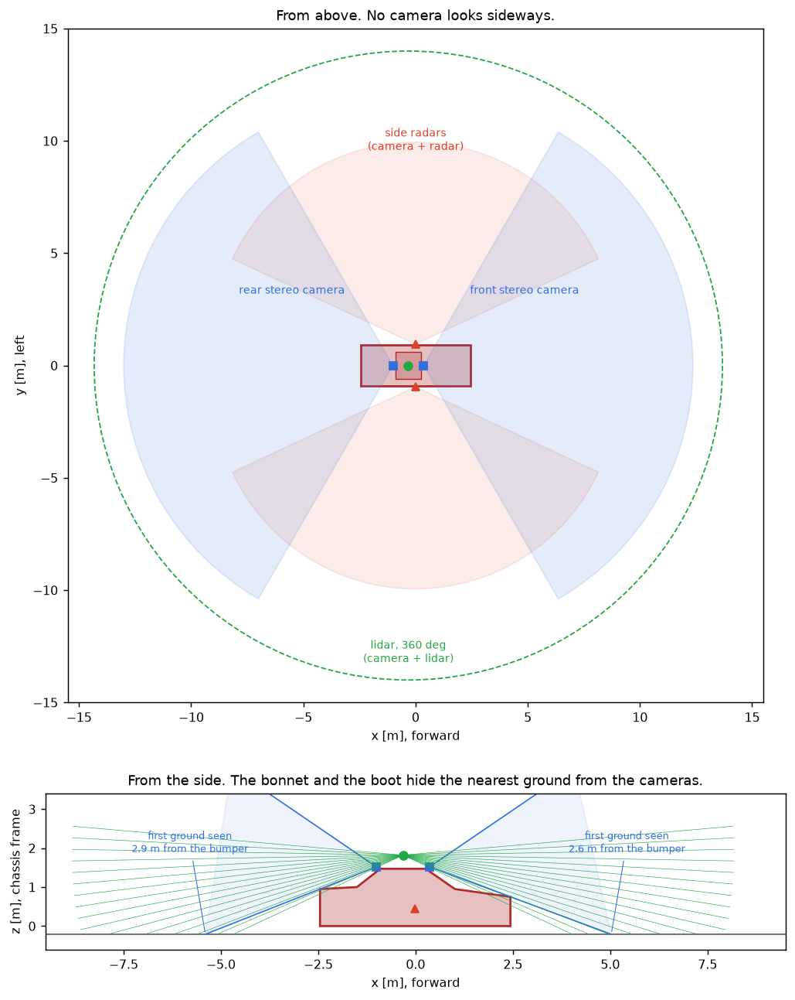
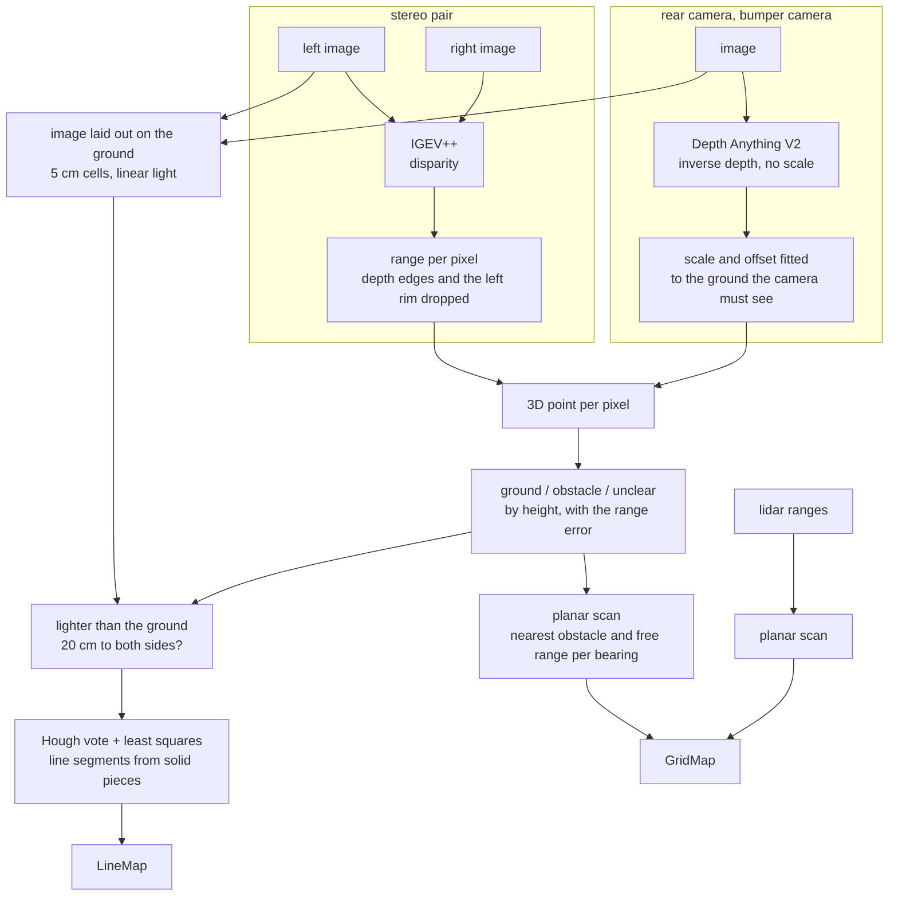
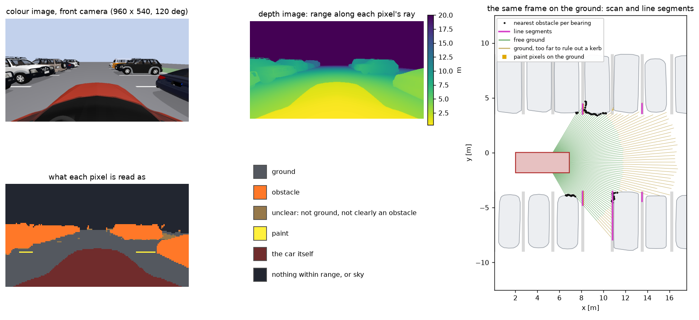
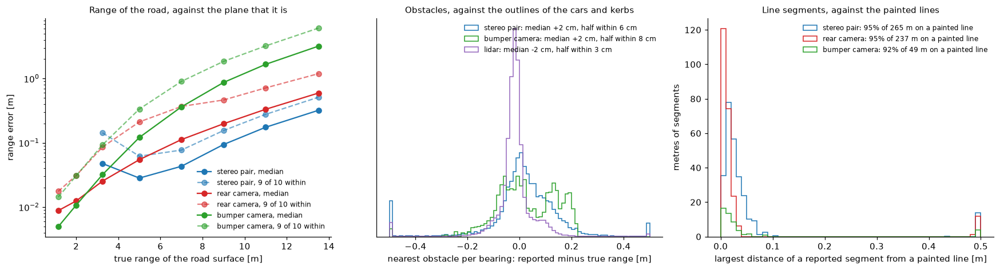
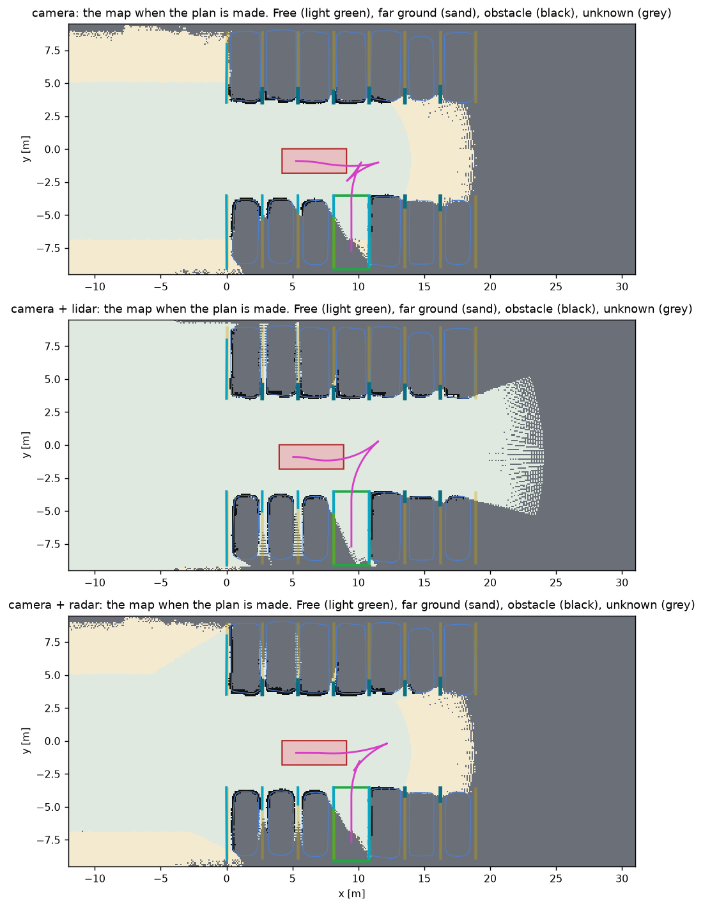

# Sensors: perception from camera images

With `--sensors camera` or `camera+lidar` the car perceives through sensors that Chrono::Sensor
ray traces in the scene. Nothing is read from the scenario, and nothing is read from the renderer
except what a real sensor would deliver: colour images, and lidar returns. In particular there is
no depth camera. Range is computed from the images by neural networks. Code: `SensorRig`,
`DepthWorker`, `parking/stereo_worker.py`, `planar_scan`, `paint_segments`, and the parts of `GridMap`,
`LineTrack` and `find_slots` that exist because a camera does not see everything.

| `--sensors` | The car has | Lines from | Obstacles and free ground from |
| --- | --- | --- | --- |
| `camera` | a stereo pair behind the windshield, a camera at the tail, a camera on the front bumper | the images | depth computed from the images |
| `camera+lidar` | the same, plus a forward-facing lidar on the roof | the images | the same, and the lidar |
| `sim` | no sensor | computed from the scenario | computed from the scenario |

`sim` is the stand-in described in [perception-and-mapping.md](perception-and-mapping.md). The
default is `camera` when the PyChrono in use has the ray-traced sensors and the depth networks
are set up, and `sim` otherwise.

Nothing looks sideways, and only the front has two cameras. What is beside the car is known from
what the stereo pair saw before the car got there. Most of this document is about what follows
from that.



## What it needs

**A PyChrono with ray-traced sensors.** Chrono::Sensor renders cameras and lidar with one of
three backends: OptiX (NVIDIA), Vulkan RT, or Metal RT (Apple). At the time of writing (Chrono
main at `c6acd4e`), the Python bindings wrap these sensors only when Chrono is built with OptiX.
With Vulkan RT or Metal RT the C++ library has them, but `pychrono.sensor` contains only the GPS
and IMU sensors. The conda package for macOS is built without the sensor module.

[pychrono-rt-sensors.patch](pychrono-rt-sensors.patch) changes the bindings so that the same
classes are wrapped for Vulkan RT and Metal RT. It touches only the SWIG interface files and
their CMake flags and applies to Chrono main at `c6acd4e`:

```
cd chrono && git apply /path/to/chrono-parking/docs/pychrono-rt-sensors.patch
cmake -S . -B build -DCH_ENABLE_MODULE_VEHICLE=ON -DCH_ENABLE_MODULE_IRRLICHT=ON \
      -DCH_ENABLE_MODULE_SENSOR=ON -DCH_ENABLE_MODULE_PYTHON=ON ...
cmake --build build
```

`parking_sim.py` has to run with that PyChrono. Either start it with the build's Python and
`PYTHONPATH=<build>/bin`, or tell it once where the build is: link the build's `bin` directory
(the one that holds the `pychrono` package) as `third_party/pychrono`, or name it in
`PARKING_PYCHRONO`. Any `python parking_sim.py` then starts again with that build and the Python
it was made for, which is read from the build's `CMakeCache.txt`.

**On Linux with OptiX.** The same build with OptiX in place of Metal RT, as it was made on a
machine with an RTX 5070 Ti, OptiX 9.0 and CUDA 13. It has no Irrlicht, so no window: runs there
are `--headless`.

```
cmake -S chrono -B build -G Ninja -DCMAKE_BUILD_TYPE=Release -DBUILD_DEMOS=OFF \
      -DCH_ENABLE_MODULE_VEHICLE=ON -DCH_ENABLE_MODULE_SENSOR=ON -DCH_ENABLE_MODULE_PYTHON=ON \
      -DCH_USE_SENSOR_OPTIX=ON -DCH_USE_SENSOR_VULKAN_RT=OFF \
      -DOptiX_INSTALL_DIR=/path/to/NVIDIA-OptiX-SDK-9.0.0-linux64-x86_64 \
      -DCHRONO_CUDA_ARCHITECTURES=120 -DCH_ENABLE_VEHICLE_SCM_GPU=OFF \
      -DPython3_EXECUTABLE=/path/to/python
cmake --build build
```

`CHRONO_CUDA_ARCHITECTURES` names the architecture of the card (120 is the RTX 50 series).
Without it Chrono compiles for a list of older ones that CUDA 13 no longer knows, and the build
stops with `Unsupported gpu architecture 'compute_60'`. The patch was applied for this build as
well, although OptiX is the backend the bindings already cover.

**In WSL2 on Windows** the same build works, with two differences. A Windows driver supports an
older CUDA than the newest toolkit (driver 576.88: CUDA 12.9), and nvcc 12.9 wants gcc 14 or
older. And OptiX does not start: `optixInit` fails with `OPTIX_ERROR_ENTRY_SYMBOL_NOT_FOUND`,
because the `libnvoptix.so.1` that WSL provides in `/usr/lib/wsl/lib` is a loader for a library
the Windows driver does not ship. That library is in NVIDIA's Linux driver of the same branch
(the version `nvidia-smi` reports inside WSL: 575.64 there). Unpack the driver without
installing it and put four of its files in a directory of their own, first on the library path:

```bash
sh NVIDIA-Linux-x86_64-575.64.run --extract-only --target extracted
mkdir ~/optix-wsl
cp extracted/libnvoptix.so.575.64 ~/optix-wsl/libnvoptix.so.1
cp extracted/libnvidia-rtcore.so.575.64 extracted/libnvidia-gpucomp.so.575.64 extracted/nvoptix.bin ~/optix-wsl/
export LD_LIBRARY_PATH=~/optix-wsl:/usr/lib/wsl/lib:$LD_LIBRARY_PATH
```

NVIDIA calls OptiX in WSL unsupported, and the files have to match the Windows driver's branch,
so this is done again after a driver update. On an RTX 5060 Ti a run takes as long there as on
the same card under Linux. WSL stops a distribution half a minute after its last session ends,
and a run with it: keep the session that started the run open.

**What differs between the two.** Everything on this page was developed with Metal RT. The same
scenes rendered with OptiX look alike: over three scenes the rear and bumper cameras are within
3 percent in brightness. What is not the same:

- OptiX has no exposure and no vignette setting, so with it both are put on the image after it
  is rendered. An area that is burnt out keeps the value the renderer cut it off at, so away
  from the middle of the image it can come out a little darker than white.
- Its windshield takes more light: the stereo pair behind it sees 5 to 8 percent less.
- The parked SUV has its colours with OptiX. With Metal RT it is plain grey, windows included
  (the other car models look the same with both).

Vulkan RT has not been tried.

**The depth networks.** They run in a process of their own, `parking/stereo_worker.py`, with a Python
that has PyTorch:

```
conda create -n parking-stereo python=3.12
conda run -n parking-stereo pip install torch timm transformers scipy gdown

git clone https://github.com/gangweiX/IGEV-plusplus third_party/IGEV-plusplus
cd third_party/IGEV-plusplus
gdown --folder https://drive.google.com/drive/folders/1eubNsu03MlhUfTtrbtN7bfAsl39s2ywJ -O pretrained_models

python parking/stereo_worker.py --check    # with that Python: runs both networks once and prints the time
```

`parking_sim.py` finds a Python that has `torch`, `timm` and `transformers` among the conda
environments by itself, or takes the one named with `--depth-python`. `--igev DIR` points at an
IGEV++ checkout somewhere else. The monocular model is fetched from the Hugging Face hub the
first time it is used.

It is a separate process for two reasons. The Python that has PyChrono usually has no PyTorch.
And on macOS the two bring their own OpenMP runtimes, which abort when loaded into one process.

**The scene network.** A third network runs in the same process and says what each pixel shows:
a painted marking, a kerb, the car's own body, or none of these (`parking/scene_net.py`). It is
Mask2Former with the weights its authors trained on Mapillary Vistas, 25 000 street photographs
labelled in 65 classes, fetched from the Hugging Face hub the first time it is used (0.9 GB).
Nothing was trained on the simulated cameras. Mapillary Vistas is licensed for non-commercial
use (CC BY-NC-SA), and that goes for these weights. `--scene net` turns it on and `--scene none`
off. The default, `auto`, turns it on where the networks run on a CUDA GPU: an image takes
0.06 s there and 0.4 s on Apple silicon. What it is used for is in
[Painted lines](#painted-lines), [Kerbs](#kerbs) and [The car's own bonnet](#the-cars-own-bonnet).

**The networks on another machine.** Because they are a process that talks over a pipe, they can
run somewhere else:

```
python parking_sim.py --depth-host HOST --depth-dir chrono-parking --depth-python PYTHON
```

starts `parking/stereo_worker.py` on `HOST` through ssh. That machine needs a copy of this
repository at `--depth-dir` (relative to the home directory there) with `third_party/IGEV-plusplus`,
and `--depth-python` names its Python with PyTorch. The link is what takes the time then: a
stereo request is 3.5 MB of images and its answer 1.2 MB. So images and answers travel packed
(each value less the one to its left, then zlib), which loses nothing and brings a camera image
to 0.6 of its size, and the answers are 16 bit floats. Measured with an RTX 5070 Ti reached
through a link that carries 17 MB/s:

| | On the M4 Pro | On the RTX 5070 Ti |
| --- | --- | --- |
| IGEV++, one pair | 0.9 s | 0.16 s |
| Depth Anything V2, two images | 0.11 s | 0.03 s |
| one run, per simulated second | 5.7 s | 2.7 s |
| batch of runs, four at a time | | 1.1 per minute |

Over a 2 MB/s link the transfer alone takes longer than computing here.

**A run can be repeated.** The simulation, the camera noise and the planner give the same
numbers every time. The stereo network on a CUDA GPU does not, left to itself: cuDNN picks
convolution routines whose answer differs from one call to the next. On the RTX 5070 Ti the
disparity of one and the same pair came out more than 0.1 pixels different on 13 percent of the
pixels nearer than 14 m, and more than 1 pixel different on 0.5 percent. The worker therefore
asks cuDNN for its repeatable routines, which are no slower here. With that, three runs of one
scenario gave the same messages at the same times and the same result line to the last digit.
A run with the networks on another kind of device (the Mac's GPU) is a different run.

The OptiX renderer has the same habit. It spreads the rays of a pixel at random and takes the
seed for that from the clock: two renders of one scene differed in 40 to 80 percent of their
pixels, by one count on average and by far more along edges. The rig therefore gives the sensor
manager a seed that follows from the scenario's. With it two renders are equal pixel for pixel,
and a run rendered with OptiX repeats to the last digit as well. Metal RT renders the same
with and without the seed. A run rendered with the other backend is a different run.

**Memory and time.** Measured on an Apple M4 Pro with 48 GB:

| | Value |
| --- | --- |
| simulation process | 4.1 GB with the four cameras, 4.8 GB with the lidar |
| network process | 1.1 GB, and 3.4 GB on the GPU |
| rendering four cameras at 960 x 600, 4 rays per pixel | 160 ms, five times per simulated second |
| IGEV++ on one pair | 0.9 s, run every second tick |
| RT-IGEV++ on one pair (`--stereo rt`) | 0.28 s |
| Depth Anything V2 Small on two images | 0.11 s, run every second tick |
| a run that simulates 40 s | 4 minutes, or 2 with the networks on the RTX 5070 Ti |

And with everything on the machine with the RTX 5070 Ti (a Ryzen 9 9950X, rendering with OptiX):

| | Value |
| --- | --- |
| simulation process | 0.8 GB, and 1.0 GB on the GPU for the scene |
| network process | 2.6 GB on the GPU, 3.5 GB with the scene network |
| rendering four cameras at 960 x 600, 4 rays per pixel | 40 ms |
| the scene network on one image | 0.06 s, and 0.04 s on the rows of a stereo image that go to it |
| a run that simulates 40 s | 1 minute alone. Three at a time: 2 minutes, and 3 with the scene network |
| the 60 runs of [results.md](results.md), three at a time | 47 minutes, and 59 with the scene network |

Three runs at a time keep that GPU busy 99 percent of the time, so a fourth would not help,
and with the scene network three fill 14 of its 16 GB. `tests/run_set.py` runs a set that way.
On the Mac alone the scene network takes 0.4 s per image, and a run then takes 9 s per
simulated second.

The stand-in perception needs 0.2 GB and runs four times faster than real time. The sensor rig
runs at about a sixth of real time on the Mac alone: 5.7 s per simulated second. The networks set
that. Their ten requests take 5.7 s, and rendering (0.8 s) and everything else fit in beside
them. With the networks on the other machine it is 2.7 s. NumPy is held to one BLAS thread (`parking/__init__.py`): left alone,
its OpenBLAS keeps a thread per core spinning, and four runs side by side then each took seven
times as long as one alone.

**Faster stereo.** Two options trade time for something:

- `--stereo-rows 160,544` gives the network only those rows of an image. Above them is sky and
  below them the car's own bonnet, and the network spends as long on those as on the road. The
  full network takes 0.50 s instead of 0.91 s for rows 176 to 496. Two runs with the full network
  came out the same with rows 160 to 544 as with all rows (clearance 0.281 against 0.282 m in a
  parallel stall, 0.531 against 0.532 m in a perpendicular one). It is off by default because
  it was not run on the whole set.
- `--stereo rt` is the real-time version of the network, at 0.28 s per pair. Its disparity
  differs from that of the full network by 0.36 pixels in the median, which at 6.5 m is 14 cm
  of range. That is where the pair has to place the kerb of a parallel stall. In the one
  parallel stall it was tried on, the car ended 17 cm from the kerb instead of 28 cm, and 0.4 cm
  from it in a second run with other rows. Use it to watch, not to measure.

With both, a run on the Mac alone takes 2.1 s per simulated second instead of 5.7 s.

## The scene the cameras see

A stereo matcher has nothing to match on a road of one flat colour, and a line detector that only
ever sees white paint on clean grey under shadowless light has an easy job. So the scene is not
clean:

- **Road.** Asphalt with grain, blotches, light stones, sealed cracks and oil stains, from
  band-limited noise generated once into a 1024 x 1024 image that repeats every 6 m. Its
  reflectance is 0.16 on average. Kerbs are concrete and the ground beside the lot is grass, both
  textured the same way.
- **Paint.** No line is as it was painted (`parking/paint.py`). Every line is laid down in
  half-metre pieces, and each piece carries an image of worn paint: patches flaked off with the
  road showing through, ragged edges, a duller white than new. Two lines in three are worn like
  that (reflectance 0.42 to 0.65, an eighth of the paint gone, one piece in twenty missing). One
  in four is faded (0.32 to 0.48, a fifth gone) and one in twelve is nearly gone (0.22 to 0.32
  against 0.16 for the road, half of it gone, one piece in five missing). A line also wanders by
  up to a centimetre and is laid 80 to 100 percent wide. `--wear 0` gives the clean bars of flat
  grey that the measurements on this page and in results.md were made with.
- **Light.** A directional sun and a much weaker ambient term, so parked cars cast hard shadows
  across the stall lines. The sky is one of the HDR images that ship with Chrono, and the sun
  stands where that image has it. `--sky` picks one of three, and without it the seed does:

| `--sky` | Sun | Shade against sun, on the road |
| --- | --- | --- |
| `clear` | 41 degrees up | about 1 to 5 |
| `low` | 32 degrees up, longer shadows | about 1 to 4 |
| `overcast` | weak, most light from the sky | about 1 to 1.4 |

- **Exposure.** One fixed exposure per run, set so that sunlit asphalt comes out at 120 of 255,
  as a camera's auto-exposure would settle on a road. The backend has no auto-exposure, so shade
  is dark and a white car in a low sun burns out. The corners of the image are a quarter darker
  than the middle.

What the scene does not have: reflections on paint and glass, wet road, motion blur, lens flare,
or anything moving.

## The rig

Every mounting point is read from the car model, like the rest of the car's geometry. The body
mesh says where the glass is (the materials that are see-through), where the tail ends and where
the nose is.

| Sensor | Where | Above the road | What |
| --- | --- | --- | --- |
| stereo pair | behind the windshield, 20 cm below its top edge and 4.5 cm inside the glass, 30 cm apart | 1.45 m | two cameras, level, looking forward |
| rear camera | at the top of the tail | 1.11 m | one camera, pitched 25 degrees down, looking back |
| bumper camera | on the nose | 0.72 m | one camera, pitched 5 degrees down, looking forward |
| lidar (optional) | on the roof above the windshield | 1.67 m | 480 x 32 beams over 120 degrees, 20 degrees down to 5 up |

**The cameras** are all the same: a Stereolabs ZED X One GS with the 2.2 mm lens, in its binned
960 x 600 mode. The sensor has 1920 x 1200 pixels of 3 micron, so a binned pixel is 6 micron and
the focal length is 2.2 mm / 6 micron = 367 pixels. Rendered as a pinhole camera, that is a field
of view of 105 x 79 degrees. The data sheet says 110 x 80 for the lens, which includes its
distortion. What is rendered here is the image after rectification. Each pixel is the average of
four rays, like the four sensor pixels that are binned.

At the full resolution the focal length in pixels is twice as large, so the same disparity error
is half the depth error. A stereo pair then costs 4.7 s and 12 GB instead of 0.9 s.

**What each camera adds to the rendered frame**, differently in every camera and every frame:

| | Model | At `--noise 1` |
| --- | --- | --- |
| sensor noise | shot noise and read noise in linear light, then the gamma curve | signal to noise 40 at mid grey: 1.2 to 1.8 counts of 255 |
| exposure | each camera has its own gain | 3 percent apart |
| stereo calibration | the right camera is turned by an angle the processing does not know | 0.015 degrees in yaw and in pitch |

The yaw error is the one that matters: 0.015 degrees is a tenth of a pixel of disparity, which at
10 m is 9 cm of depth.

**What the windshield and the bonnet do.** The pair looks through the glass, which the renderer
treats as a tinted pane: 80 percent of the light passes per layer of glass. The bonnet hides everything more than
16 degrees below level, so the first road the pair sees is 3.2 m ahead of the bumper. That strip
is what the bumper camera is for: it sees the road from 0.7 m. The rear camera sees it from
0.5 m. The lidar's lowest beam reaches the road 2.4 m ahead of the bumper.

**Timing.** The cameras can deliver a frame per perception tick (10 Hz). Every frame carries the
time it was rendered at, and the chassis frame of that instant is kept, with its roll and pitch.
The networks do not have to run on every frame: `--stereo-hz` and `--mono-hz` set how often each
one does, 5 times per second by default. Rendering is most of the work of a run, so the cameras
are only rendered on the ticks at which a network takes their frame (on every tick with a lidar,
which is read ten times per second). An answer is not there at once either: a stereo
result is used two ticks (0.2 s) after its images were taken, a monocular one after one tick,
both with the pose the car had when the images were taken. The simulation waits for a result
when it is due, so a run does not depend on how fast the machine is. What the rates change and
what they do not is in [How often the networks run](#how-often-the-networks-run).

## From images to the map



Both kinds of output are what the stand-in perception also produces: planar scans and line
segments. Everything after `SensorRig.sense` is shared.



### Range from the stereo pair

The two images go to IGEV++ (Xu et al., 2024), a stereo network that builds cost volumes over
several disparity ranges and refines the disparity iteratively. It runs with the weights its
authors trained for the Middlebury benchmark on a mix of data sets, and with 8 refinement
iterations. No weights were trained on this scene, but that checkpoint was picked because it did
best on it among the published ones, and the error model and the thresholds further down were
set against it. From the disparity `d` of a pixel of the left image,

```math
Z = \frac{f B}{d}, \qquad r = \frac{Z}{\hat{d}_x}, \qquad
\sigma_r \approx \frac{r^2}{f B}\,\sigma_d
```

with `f` = 367 pixels, `B` = 0.30 m, `Z` the depth along the optical axis, `r` the range along
the pixel's ray with unit direction `d_hat`, and `sigma_d` the disparity error. The processing
works at half the image size, on the mean disparity of each 2 x 2 block.

Two kinds of pixel are dropped, because a matcher's answer there is not a measurement:

- **Depth edges.** Where the disparity jumps by more than 1 pixel plus 10 percent between
  neighbours. A network puts pixels between the near and the far surface there.
- **The left rim.** A pixel `u` columns from the left edge with a disparity above `u` is not in
  the right image at all.

Anything further than 30 m, and the sky, is reported at 30 m and plays no part.

### Range from a single camera

The rear and the bumper camera have no partner. Their images go to Depth Anything V2 Small, a
network that estimates depth from one image. What it returns is relative inverse depth: right in
its ordering and its proportions, but without scale and without offset. Both are fixed with the
one thing the car knows for certain about the view, which is where the ground is:

```math
\frac{1}{Z_g(u, v)} \approx a\,q(u, v) + b
```

`q` is the network's output and `Z_g` the depth at which the pixel's ray meets the road, from the
camera's height and attitude. `a` and `b` are fitted by least squares, first on the bottom
quarter of the image, then three more times on the pixels that the previous fit put within 6
percent of the ground. If fewer than 1500 pixels agree, or the slope comes out negative, the
frame is not used.

This gives the range of a parked car to a few centimetres at 1 to 2 m and to 10 to 20 cm at 3 m
(see the measurements below). It does not see a kerb. A 15 cm step in the ground is far below
what a network resolves from one image, and the anchoring to the ground pulls it flat. So a
single camera is used for less than the pair:

| | Stereo pair | Single camera |
| --- | --- | --- |
| range error assumed | `0.25 px` of disparity: 2.3 mm at 1 m, growing with the square of the range | 2 cm plus 7 percent of the range |
| obstacles into the map up to | 8.1 m | 1.9 m |
| ground counted as seen free up to | 8.1 m | never |
| ground counted as probably free up to | 12 m | 3 m |
| painted lines up to | 11 m | 5 m (rear), 3.5 m (bumper) |
| shortest line segment | 0.35 m | 0.6 m |

The limits follow from one rule, the same for both: an obstacle goes into the map only from as
far as it can be placed to 15 cm, and ground counts as free only from as far as it can be told
from a kerb, which needs the height of a point to 4 cm. A single camera never meets the second.

A single camera's obstacles are also taken from the middle of its image only: not from the
fifth of the width at either side (`SensorRig.MONO_SIDES`). Out there the network had put
whole things a metre or two from where they stand, and ground in the air. Every obstacle point
of the two single cameras within 1.9 m was compared with the real cars and kerbs in eight runs:

| Where in the image | Points | More than 0.6 m from anything real |
| --- | --- | --- |
| the fifth of the width at either side | 52 000 | 13 percent, in six of the eight runs, mostly a whole blob at a time |
| the middle three fifths | 41 000 | 9 points |

In one run the rear camera put the corner of the van parked beside the stall 1.1 m into the
stall, two to three thousand pixels of it in frame after frame, and the car gave up half-way in. What a single
camera sees at the sides still stops free ground there. It only makes no obstacle.

### Ground, obstacle, or unclear

Each pixel with a range gives a point in the world. The points on the car's own body are dropped:
any point inside the car's outline plus 15 cm. The height `z` of the others decides:

```math
\text{ground: } |z| < 0.05 + 1.25\,\sigma_z, \qquad
\text{obstacle: } 0.08 + 2.5\,\sigma_z < z < 2.3, \qquad
\sigma_z = \sigma_r \,|\hat{d}_z|
```

`sigma_z` is the height error that the range error causes, small for a ray that looks nearly
level. A point that is neither is **unclear**: it is not ground, and it is not certain that it
stands up. A kerb is 15 cm high. Up close the pair sees it as an obstacle. From 8 m it is unclear.

| A point that is | ends the free part of its ray | puts an obstacle into the map |
| --- | --- | --- |
| ground | no | no |
| unclear | yes | no |
| obstacle | yes | yes |

### The planar scan

The classified points are collapsed into a scan around the camera, with bearings half a degree
apart. Per bearing,

- `r_hit` is the range of the nearest obstacle point that has company: at least three points
  within the next 0.3 m. A stray pixel does not make an obstacle.
- `r_stop` is the same for points that are not ground.
- `r_free` is the range of the farthest ground point, cut 15 cm before `r_stop`.

A line of sight proves more than the ground where it ends: everything it passes over is free of
things as tall as the ray is high there. The scan treats the whole ray as free, as a 2D lidar scan
would. For the stereo pair that includes the road under the bonnet line that it cannot see.

### Painted lines

Paint is found in the image and placed with geometry: the pixel's ray is intersected with the
road plane. The depth is used only to confirm that a pixel is on the road.

The image is laid out on the ground first, as a picture from above with 5 cm cells, converted
from the 8 bit values back to linear light. In that picture a stripe has the same width at every
range, and a ratio of brightness is a ratio of reflectance times light. A cell is paint if

1. it is **1.8 times lighter than the ground 20 cm to both sides** of it, in one of four
   directions, and
2. the depth image says that **both of those are ground**, and
3. the cell itself is ground, at the range the road plane gives, and
4. it is not past the first thing on its bearing that stands up.

The first rule is what makes it work in shade. Paint reflects three to five times more than
asphalt, under the sun and out of it, so the ratio to the ground right beside it holds in both. A
fixed threshold does not: paint in the shade is darker than asphalt in the sun.

| What it is | Lighter than both sides? | Why |
| --- | --- | --- |
| a stripe, in sun or shade | yes | |
| the edge of a shadow | no | lighter than one side only |
| a kerb top, a white car, the sky | no | wider than 40 cm |
| the light sill of a parked car | yes, but dropped by rule 2 | the car is on one side |
| a spot of sun between two shadows | yes | see below |

The last one cannot be told from paint in shade by brightness: both are a light patch with dark
ground on either side, and the numbers are the same. What differs is the shape. A spot of sun
where two shadows nearly meet is a spot. So the segments that the Hough vote and the least
squares fit produce are built only from **solid pieces of at least 0.25 m**, and pieces may be
bridged over gaps of 0.45 m. A spot does not start a line, end one, or extend one.

**Faint paint.** The factor of 1.8 keeps shadows, stones and cracks out, and it is also what
loses worn paint: a line that is nearly gone is 1.4 to 2 times lighter than the road where any
paint is left, and less on average. With the scene network there is a second opinion. Where it
sees a marking, and 10 cm around that, a cell is paint if it is **1.2 times** lighter than the
ground on both sides.

The network is not used alone, although it finds a worn line better than the rule does. Far away
it smears a line over the cells beside it. Counted on 1080 frames of six drives, as the share
of the true paint cells that were found, among those in view that the depth calls ground:

| Front camera, at 4 to 7 m / 7 to 11 m | Rule | Network | Rule, and 1.2 where the network sees a marking |
| --- | --- | --- | --- |
| worn paint | 94 / 90 % | 95 / 78 % | 98 / 93 % |
| faded | 78 / 67 % | 92 / 60 % | 92 / 77 % |
| nearly gone | 11 / 10 % | 53 / 26 % | 56 / 35 % |
| cells called paint more than 15 cm from any, per frame | 11 | 56 | 15 |

In the rear camera, nearly gone paint at 4 to 7 m goes from 19 to 87 percent. The six drives
are scenarios of the regression set, and the 1.2 and the 10 cm were chosen on them.

### Kerbs

A kerb is 15 cm high. The stereo pair can tell that from the road up to about 8 m, and the depth
of a single camera cannot tell it at all, because it is anchored to the ground. The kerb at the
back of a perpendicular stall is 9 m or more from the lane, and behind the car while it backs
in. No depth image shows it as an obstacle.

The scene network knows a kerb by its looks. The pixels it labels as kerb are placed with the
range of the depth image, up to 13 m for the pair and 4 m for a single camera, and go into a
layer of their own in the grid, in seconds like everything else there. They are not obstacles
for the planner: they are placed to a few tens of centimetres only. They are used for one
thing, how deep a stall can be ([below](#how-deep-a-stall-is)), and they tell a row of parallel
stalls from other rows.

### The car's own bonnet

Along the edge of the bonnet in the image, a depth network puts pixels somewhere between the
bonnet and the road behind it. They come out as points in the air 20 to 30 cm off the car's
wing, outside the outline that takes the car's own body out of a depth image. The scene network
labels the car itself. Within 3 pixels of that label, a point less than 0.6 m from the car is
taken only if it is ground: no obstacle there, and nothing unclear.

The 0.6 m matter. In the image, the band along the bonnet also holds the road 4 to 5 m ahead,
and that is the only range at which the pair sees a kerb as an obstacle. A first version took
only ground from the whole band, and in two runs the car then drove its nose onto a kerb that
the path monitor would have caught. An earlier try, before the network, left out the band
altogether, which hid the nearest strip of road, and a nose-in run parked too deep.

The single cameras' images go to the scene network at half the rate of the monocular network.
What they add, a kerb behind the car and faint paint beside it, is used at walking pace.

### Lidar

The lidar is processed like before: a point per beam, the same three classes, the same scan.
Returns from below 0.30 m end the free part of a ray but are not placed as obstacles. Its beams
are 0.8 degrees apart, so a kerb is hit somewhere on its top, not at its face. Range noise is
2 cm and 1 percent of the returns are dropped, both times `--noise`.

## How often the networks run

The cameras deliver ten frames per second. How many of them the networks get through is a matter
of computing power, not of the method, and it is set with `--stereo-hz` and `--mono-hz`. The
default is 5 per second for both, which is what IGEV++ reaches in real time on a desktop GPU
(0.16 s per pair on an RTX 5070 Ti). A faster matcher can be given every frame.

So nothing in the processing counts frames. Wherever the maps have to decide whether they have
seen enough, they add up time. An answer of a network stands for the time since the answer before
it: 0.2 s at 5 per second, 0.1 s at 10. It never stands for more than 0.4 s, so one answer alone
is never enough, however slow the network. The lidar and the stand-in perception go by the same
rule, with 0.1 s per scan.

| What | Believed once |
| --- | --- |
| an obstacle in a cell, or free ground | seen for 0.5 s |
| ground too far away to tell from a kerb | seen for 1 s |
| a painted line | watched for 0.35 s |
| a stretch of a line, to be remembered | weight x time of 60: 1.4 s in view for a line 5 m away, 3.2 s at 9 m |
| a stall, before the car commits to it | both lines watched for 0.65 s, and its estimate steady for 0.55 s |

**The check.** `docs/rate_check.py` records one drive along the lane with both networks on every
frame. Keeping every second or every fourth answer turns the recording into the same drive at 5
and at 2.5 answers per second, in two and in four ways (which answer is kept first). The maps
are rebuilt for each of them and the agent's own stall choice runs on them. The table gives the
time at which the car commits to the free stall, in seconds, for 15 recorded drives. The right
half is the same recordings with the rules of an earlier version, in which every answer counted
as one whatever time it stood for.

| Drive | 10 per second | 5 per second | 2.5 per second | counted: 10 | counted: 5 | counted: 2.5 |
| --- | --- | --- | --- | --- | --- | --- |
| angled, cars both, seed 2 | 12.8 | 12.8 to 12.9 | 12.9 to 13.2 | 11.6 | 12.2 to 12.3 | 13.3 to 13.6 |
| angled, cars left, seed 4 | 8.1 | 8.1 to 8.3 | 8.2 to 8.8 | 7.0 | 8.3 to 8.4 | 8.4 to 8.7 |
| angled, cars right, seed 6 | 17.2 | 17.2 to 17.3 | 17.3 to 17.6 | 16.2 | 16.5 to 16.6 | 17.6 to 21.0 |
| parallel, cars both, seed 4 | 16.3 | 16.4 to 16.5 | 16.4 to 16.7 | 16.1 | 16.7 to 16.8 | 17.7 to 18.2 |
| parallel, cars left, seed 2 | 9.9 | 10.3 to 10.4 | 10.3 to 11.0 | 10.3 | 11.1 to 11.4 | 12.1, never in 3 of 4 |
| parallel, cars none, seed 5 | 9.6 | 9.7 to 9.8 | 9.7 to 10.3 | 9.4 | 9.7 to 10.3 | 10.6 to 12.1 |
| parallel, cars right, seed 3 | 22.9 | 23.0 to 23.1 | 23.0 to 23.3 | 22.8 | 23.4 to 23.7 | 24.4 to 25.1 |
| perpendicular, cars both, seed 1 | 11.9 | 11.9 to 12.0 | 11.9 to 12.2 | 10.9 | 11.3 to 11.4 | 11.9 to 12.9 |
| perpendicular, cars both, seed 6 | 12.4 | 12.5 to 12.6 | never | 12.0 | 16.0 to 16.1 | never |
| perpendicular, cars left, seed 2 | 7.3 | 7.2 to 7.3 | 7.5 to 7.8 | 7.4 | 7.2 to 7.5 | 8.2 to 9.2 |
| perpendicular, cars none, seed 3 | 7.4 | 7.3 to 7.4 | 7.5 to 7.8 | 7.1 | 7.4 to 7.5 | 8.1 to 9.2 |
| perpendicular, cars right, seed 5 | 15.4 | 15.4 to 15.5 | 15.5 to 15.8 | 14.4 | 14.8 to 14.9 | never |
| angled, cars random, seed 3, with lidar | 10.1 | 10.2 to 10.5 | 10.1 to 10.7 | 9.9 | 10.8 to 12.5 | 11.8 to 12.4 |
| parallel, cars random, seed 5, with lidar | 9.6 | 9.7 to 9.8 | 9.9 to 10.3 | 9.6 | 9.7 to 10.3 | 10.8 to 12.1 |
| perpendicular, cars random, seed 1, with lidar | 8.9 | 8.9 | 8.8 to 9.3 | 8.4 | 8.8 to 8.9 | 9.8 to 12.6 |

| | Time added up | Answers counted |
| --- | --- | --- |
| the free stall chosen at 10 per second | 15 of 15 | 15 of 15 |
| at 5 per second | 30 of 30 | 30 of 30 |
| at 2.5 per second | 56 of 60 | 49 of 60 |
| from the earliest to the latest choice of a drive, on average | 0.53 s | 2.56 s |
| the same, worst drive | 1.0 s | 4.9 s |
| between 10 and 5 per second, on average | 0.11 s | 0.63 s |

No replay chose anything but the free stall. The car searches at 2.2 m/s, so the 2.6 s that the
choice used to move by are 5.6 m of road, and the 0.5 s that are left are 1.2 m.

**What a slow network still costs.** At 2.5 answers per second the car commits 0.3 s later on
average than at 10, and in one of the 15 drives it never does. That is sampling, not a rule
tuned to a rate. The car moves 0.9 m between two answers. A cell at the inner end of the mouth of
a stall between two cars is in view of the forward pair for about that stretch of road, and it
takes two answers to believe anything. At 5 and at 10 per second the same cell is seen three and
five times while it is in view. In that one drive at most 52 percent of the mouth of the stall came
out as seen empty at 2.5 per second, 59 percent at 5 and 61 percent at 10, and 55 are asked for.

Two things still go by a number of items and not by time. A line keeps its 160 best detections
for the fit, which is a limit on memory and not a test of anything. The path monitor reacts when
the path is blocked on two ticks in a row of the agent's own 10 Hz cycle, whatever the cameras do.

## How good it is

The reference is the scenario itself, not anything rendered. The road is a plane, so the true
range of every pixel that shows the road follows from where the camera is. The true range to the
nearest obstacle on a bearing follows from the outlines of the parked cars and the kerbs. The
true lines are the painted ones. `docs/make_sensor_figures.py` measures all three over a whole
run, from the first metre of the search to the parked car:



The numbers of that run (`--type perpendicular --cars both`, clear sky, `--noise 1`):

**Range of the road.** Median error, and in brackets the error that 9 of 10 pixels stay within.

| True range | Stereo pair | Rear camera | Bumper camera |
| --- | --- | --- | --- |
| 0.8 to 2 m | hidden by the bonnet | 1.0 cm (2.3) | 0.6 cm (2.0) |
| 2 to 4 m | hidden by the bonnet | 2.1 cm (6.5) | 2.2 cm (7.2) |
| 4 to 7 m | 3.1 cm (6.2) | 6.3 cm (24) | 14 cm (43) |
| 7 to 10 m | 7.0 cm (14) | 17 cm (43) | 65 cm (156) |
| 10 to 15 m | 22 cm (43) | 43 cm (102) | 222 cm (485) |

The stereo error includes the calibration error of this run, which alone is about 4 cm at 7 m.
The single cameras do well on the road because the road is what their depth is anchored to. Their
real test is the next table.

**Obstacles.** For every bearing on which a scan reported an obstacle: reported range minus the
true range to the nearest outline.

| Source | Median | Half within | 9 of 10 within | Bearings |
| --- | --- | --- | --- | --- |
| stereo pair, up to 8.1 m | +1.7 cm | 5.6 cm | 20 cm | 9705 |
| bumper camera, up to 1.9 m | +1.6 cm | 8.2 cm | 19 cm | 1416 |
| lidar, up to 20 m | -1.8 cm | 2.8 cm | 10 cm | 64671 |

The rear camera reported an obstacle on fewer than 100 bearings in this run, too few to count: it
only places what is within 1.9 m, and the car stopped before anything was. The outlines are those
of the car bodies at bumper height, and a camera sees the whole front of a car, so a part of the
spread is the reference.

**Lines.**

| Source | Segments | On a painted line | Median offset |
| --- | --- | --- | --- |
| stereo pair | 286, 265 m in all | 94.7 percent of the length | 2.8 cm |
| rear camera | 117, 237 m | 94.6 percent | 1.2 cm |
| bumper camera | 43, 49 m | 92.4 percent | 1.7 cm |

A segment counts as on a line if no point of it is more than 12 cm from one. The rest are spots
of sun between shadows that were long enough to pass, and real lines placed too far off from a
long way away.

## What changes because the car sees so little



### A stall is one line and a stub

Looking along the lane, a camera cannot see the line between two parked cars. The cars are 70 cm
apart and the line runs down the middle of that gap, so only the end at the lane shows, half a
metre of it. Of an empty stall the camera sees the far line through the empty space, and the near
line only as such a stub. (The stand-in perception looks in all directions and sees a line down
the gap when the car is level with it.)

So with a sensor rig, `find_slots` also accepts a pair that is less than two long lines side by
side:

| | Requirement |
| --- | --- |
| the longer line | at least 2.0 m |
| the shorter one | at least 0.35 m, and 2.2 to 3.5 m to the side of the longer one |
| where the shorter one is | one of its ends matches the same end of the longer one. The ends of the lines of a row lie on a line along the lane, and the car's own track gives the lane, so the two ends have to be within 0.75 m of that. This holds for any stall angle: at 60 degrees the ends are 1.56 m apart lengthwise. Before the car has driven 2 m there is no track, and the test is: up to 1.5 m inside the longer line, or up to `1.2 w + 0.5` m outside it, with `w` the separation |
| direction | from the longer line alone if the shorter is under 1.2 m |
| depth | if the lines end sooner than a car length plus 0.7 m, that depth is assumed |

This also covers an angled stall at the end of a row, of which the pair sees only the halves of
both lines that are near the lane: far parts of a line 6 to 8 m to the side come into the 105
degree view only beyond the 11 m to which paint is looked for.

### Between two cars a stall is two stubs

The longer line of such a pair has to be 2 m long, because it gives the stall its direction.
Between two parked cars neither line is: both show as half a metre at the lane. Worn paint
shortens what is seen of a line in the open as well. In one run a line 5.5 m long with one faded
piece was found over 1.9 m, and the car drove past the stall.

The published stall detectors do not ask for more than the entrance. Their cameras look down
on the lane side of the stalls, and a stall is the two points where its lines meet the lane and
the direction of the lines. Its depth is not measured but assumed for the kind of stall
(DMPR-PS, Huang et al. 2019, and Suhr and Jung 2021, among others). The same works here with
one more step, because a stub has no direction either: the row is worked out first
(`parking/rows.py`).

| Of the row on one side of the lane | From |
| --- | --- |
| its mouth: how far off the car's path the stalls open | the lane-side ends of all lines on that side that cross the lane's direction: the middle one |
| its direction | the lines of at least 1.5 m, weighted by length. If there are none, the direction of the row across the lane, mirrored |

Two stubs that start at the mouth of a row of three lines or more are a stall if they are 2.2
to 3.5 m apart across the row's direction. Each line is taken from where it meets the mouth, and
the stall is as deep as the car and 0.7 m.

Two pieces 5.0 to 7.8 m apart along the lane with no line between them, at least one of them
shorter than a tick has to be, are a parallel stall, if no line of the row is longer than a tick
(3.6 m) and something stands 1.8 to 3.8 m behind the mouth over at least 1.5 m: the kerb, as an
obstacle in the map or as the scene network saw it. Without the kerb, two such stubs could as
well be two perpendicular stalls with the line between them hidden.

A stall known from stubs alone is placed less well than one with a line of its own. The car
takes it only once it is level with it
([perception-and-mapping.md](perception-and-mapping.md#choosing-a-stall)).

### One line found, the other not

Sometimes one of the two lines is not found at all: worn away, or under the side of the car
parked next to it. On seeds nobody had looked at, the car drove past the free stall for that
reason in three runs of 45.

| Run | What was found of the free stall |
| --- | --- |
| angled stalls, a car before it | the line next to the car, over 2.2 m. The line at the open end of the stall was not found |
| parallel stalls, a van before it | the tick at the open end, whole. The tick beside the van was not found |
| perpendicular stalls, a car on each side | the far line, over 3.0 m. Nothing of the near one |

The row says where the missing line has to be: one stall's width along the lane from the one
that was found. The width is that of the stalls already made out on that side, or else the
spacing that fits the most lines of the row. Such a stall counts if

- the line that was found starts at the mouth of the row and is long enough to be a line of that
  row (1.5 m, or a tick for parallel stalls), and
- no line was found where the other one belongs, and no stall is known there, and
- its ground was seen to be free, and
- there is a reason to take the place for a stall: a parked car beyond the line that was not
  found, or a parked car beyond the one that was while the row across the lane reaches that far.
  Beyond the last line of a row there is free ground too, and no stall.

A parallel stall of this kind also needs the kerb behind it, as above. Any other kind is dropped
if a kerb was seen less than 4 m in: whatever that place is, it does not hold the car.

Which kind of stall a row is made of is read from its lines, not from the stalls found so far.
The ticks of parallel stalls are short (no line of the row longer than 3.6 m) and a car's length
apart (the middle one of the gaps between neighbouring lines is at least 4.5 m). In the run with
the van, a tick and a bit of something else beside it had passed for a narrow stall, and one
such stall had made the whole row count as perpendicular.

A found line that is too short to count by itself counts if it is one of the two lines of a
stall already made out in that row. Then it is a stall's line, whatever its length. That is
the last stall of a row with open ground beyond it: the line between the last car and the stall
shows as a stub, and the row's last line has no car behind it to say that a stall is there. In
one run that last line was nearly gone and the car drove past. The row across the lane went on
that far, which is what says that the free place is a stall and not the end of the lot.

Like a stall from two stubs, a stall from one line is taken only once the car is level with it.

### A line in pieces is one line

A camera often sees a stripe in pieces. Paint wears off. And where the edge of a shadow runs
along a stripe, the stripe is not lighter than the ground on both sides of it, so the detector
does not see it there. A tick line of a parallel stall came out as a 0.95 m piece and a 0.45 m
piece with a metre missing between them, under the shadow of the car parked next to it. Neither
piece is a tick, and the car drove past a free stall.

So before stalls are inferred, line tracks that lie on one straight line are joined
(`join_collinear`): within 15 cm of the same line, within 5 degrees if the shorter is long enough
to have a direction, and less than 1.5 m apart. The lines of two rows across the aisle are on one
line too, but 7 m apart, and stay separate.

### A tick next to a parked car is short

Of the tick between a parallel stall and a parked car, the car hides the part beside it. What
shows from the lane is 1.4 to 1.8 m of its 2.5 m. With a rig a tick may therefore be 1.2 m long.
The stand-in keeps 1.5 m.

### A stall starts on a line along the lane

The mouth of a stall was taken where the later of its two lines starts, which is the safe choice
if a line can only be seen too long. With worn paint it is seen too short: the first half-metre
piece of one line was gone in one run, the stall came out half a metre short, and the car parked
40 cm too deep.

The two lines of a stall start on one line along the lane, whatever the angle of the stall. So
if one was seen to start between 0.1 and 0.75 m further in than the other, measured across the
lane, the stall starts where the other one does. The lane direction is the way the car has come.

With three lines or more on a side, the mouth of the row takes the place of the other line: a
line seen to start 0.25 to 2 m further in than the mouth is taken from the mouth. Two lines by
themselves can differ by 0.75 m at most before it is unclear which of them is right. A row can
say so for 2 m.

The same holds for a line that was seen to start further out than its row. In one run a line
grew 0.7 m into the lane while the car turned in, carried on by something that looked like
paint. The stall moved out with it, and the car set out to correct a position that was right.

And 2 m is the limit only for a piece of paint too short to say which way it runs. A line of
1.5 m or more that runs the way its row does is a line of that row wherever in the stall it
begins. That is what the cameras find once the car is driving in: the far half of a line whose
first half is worn away or was hidden by the car next to it. In one run such a line was found
from 2.5 m in, the stall was rebuilt from there, 0.7 m deeper than it is, and the car followed.

While the car backs in, the rear camera sees both lines of the stall at close range. The
estimate then rests on those, and the plan follows it (see
[control.md](control.md#keeping-the-plan-attached-to-the-stall)).

### How deep a stall is

The car's middle is put 2.65 to 2.95 m in from the mouth, wherever the far ends of the lines
were seen. That is right if the mouth is. If the mouth is taken too far in, the car ends too
deep, and behind a stall there is a kerb: in four runs the car ended 0.9 m too deep and against
it.

Where the scene network saw the kerb behind a stall ([Kerbs](#kerbs)), the car's end stays
0.40 m short of it, whatever the lines say. The kerb is looked for between the two lines, 2.5
to 9.5 m in from the mouth. Seen from far away a kerb is smeared over half a metre in range,
most of it beyond its face, so it is put where the nearest fifth of what was seen begins.

The kerb behind a row runs along the lane. Behind an angled stall it therefore lies at a slant
to the stall, and the distance that counts is the one at the side of the car that the kerb is
nearer to. That slant is taken from the direction of the lane, which the car knows from the way
it has come. It used to be read from the kerb itself, by a line fitted to what was seen of it,
and that went wrong behind a stall the kerb is square to. The kerb there had been seen only
from 11 to 14 m away, 443 points of it, and from the side. Range error smears a point along
the line of sight, which crossed the stall at an angle, so the points lay deeper the further
along the lane they were. The fitted line came out slanted, the kerb was taken to be 0.39 m
nearer than it is, and the car stopped 0.53 m short of the middle of the stall, sticking out
into the lane. With the slant of the lane, which is none there, it stops 0.13 m short.

### Lines remember

A `LineTrack` keeps its 160 best detections and derives its extent from what they cover. With a
camera that drops the wrong ones: once the car is close, it sees only the far part of the lines,
and the detections of the mouth, made from further away, are the first to be forgotten. With a
rig, a track therefore keeps a record of where along the line paint was seen, in 10 cm bins. Each
detection adds its weight times the time its frame stands for, so the record does not depend on
how often the networks run. A stretch stays part of the line once that sum has passed a
threshold, which a line 5 m away reaches after 1.4 s in view.

### Free means a wedge of the mouth is empty

A camera that looks forward sees into a stall only at a slant, past the corner of the car parked
before it. Of an empty stall it sees a wedge: most of the mouth, and less and less further in.
Once the car is level with the stall, nothing looks at it any more.

In the run shown above, 71 percent of the first 2.5 m of the free stall was seen empty, 35 percent of
the whole stall, and the empty ground was seen 3.0 m deep. Requiring 60 percent of the stall, or
80 percent of its mouth, would never be met. A parked car would stand in that wedge. So with a
rig a stall is free if

- no obstacle was seen in it, and
- at least 55 percent of its mouth and 25 percent of the whole was seen empty, and
- the empty ground was seen at least 2 m into it.

Behind a wide car the wedge is narrower than that. In one run 51 percent of the mouth and 24
percent of the stall were seen empty, and the car drove past. A stall that is known from its row
is taken when the car is level with it, and by then the cameras have seen all of it that they
are going to. What is left to ask is whether a car could be standing in it. Its front would be
in the first 1.2 m of the stall, across most of the width. So such a stall is also free if

- no obstacle was seen in it, and
- at least 75 percent of its first 1.2 m was seen empty (84 percent in that run), and
- the empty ground was seen at least 2 m into it.

Whether there is a car in the stall next to this one is asked in the same way: by obstacles
where that car would stand. In an angled row the stalls are staggered, 1.55 m from one to the
next at 60 degrees. The car in the stall before starts that much further out, and of it the
cameras see the front and little else. The band that is searched follows the stagger. A band
straight across found the car on one side by its front and on the other side nothing, and a
free stall with a car before it then looked like free ground with no car anywhere.

The planner then needs room that nobody has looked at. The region assumed free is extended to
hold the parked car, and what is really there comes into view of the rear camera while backing
in. That camera places obstacles only within 1.9 m, which is late, and is why the plan keeps a
wider margin with a rig.

### Far ground in the grid

The grid has a second, tentative layer for ground that was seen from too far to rule out a kerb,
or by a single camera at all:

| Layer | Written by | Counts as |
| --- | --- | --- |
| free | the stereo pair within 8.1 m, the lidar | seen free |
| far | the stereo pair from 8.1 to 12 m, a single camera within 3 m | probably free: drivable for the planner once seen for a second, with a larger margin |
| stop | anything that is not ground | not free, whatever the far layer says |

### The monitor looks for margin, and the goal moves back

Unchanged from before: while driving, the path is checked against the map with the margin it was
planned with, and a goal that was shifted off centre to stay clear of something is moved back as
the map sharpens. See [planning.md](planning.md).

### Parallel stalls

A parallel stall is aligned with the kerb behind it, which only the stereo pair can see as a
kerb. It does so while the car drives up, from 5 to 8 m. During the reverse the rear camera sees
the two tick lines and the road, not the kerb, so the alignment rests on what was mapped before.
The plan itself never takes the car nearer to the kerb than it will stand when parked
([planning.md](planning.md#parallel-parking-the-room-is-on-the-street)).

Between two parked cars, the ticks of a parallel stall show as stubs too: 0.6 and 0.8 m of
their 2.5 m in one run. Such a stall is taken from its row
([above](#between-two-cars-a-stall-is-two-stubs)).

## In the viewer

With a sensor rig the window shows what the cameras deliver next to the scene: the left image of
the stereo pair, the range that IGEV++ computed from the pair, the rear and the bumper image, and
every range from above, with the lidar's range image underneath.
[simulation-and-viewer.md](simulation-and-viewer.md#the-window) describes each picture. What is
made of that data shows up in three more places:

- The top view outlines what each sensor is looking at.
- Line stubs are drawn in a darker colour than confirmed lines.
- The panel shows, for each camera, what its pixels are read as: ground, obstacle, unclear,
  paint, the car itself.

## Limits

- **What the car is told, and what it is not.** An audit of the code found that the car was
  given a good deal that a real car would not know. Most of that is gone:
  - *Where it is.* It goes by a pose estimate (`parking/localization.py`): by default a
    satellite receiver with an inertial unit, off by a slowly wandering 10 cm and 0.3 degrees.
    From the moment it has chosen a stall it carries its position on by its wheels, along the
    heading the receiver gives, and leaves the receiver's position aside
    (`Localization.hold`). The rolling radius is known to 0.5 percent, which over the 20 m of
    a maneuver is a few centimetres. The receiver's 10 cm change over half a minute, which is
    how long a maneuver takes, and the stall and the kerb are where the map of a few seconds
    ago has them. In two runs on one seed the receiver's error moved 25 cm towards the kerb
    between choosing a parallel stall and arriving in it. The plan had 15 cm of room there,
    and the car touched the kerb. Held, the same two runs end 1 cm off the middle of the
    stall. The heading stays the receiver's, which is good to 0.3 degrees however far the car
    turns. Carried on by a gyro with a scale error of 1 percent it was 0.9 degrees off after
    the turn into a stall, and 5 degrees off in one run in which the plan took the car three
    quarters of the way round.
  - *How it leans and how high it rides.* From a plane fitted to the road the stereo pair sees
    (`SensorRig._road_plane`), with nothing else. In one run the true pitch went from -1.2 to
    +1.1 degrees under braking and acceleration, and the estimate was within 0.16 degrees of it
    half the time and within 0.5 degrees nine times in ten. The height was within 1 cm half the
    time.
  - *Its speed.* From a wheel encoder on the rear axle: a count every 2.2 cm, the speed from
    the time between counts.
  - *The lane.* It assumes it starts on a lane and aligned with it, with stalls on either side.
    It searches straight ahead for 70 m and stops if something is in the way.
  - *The lot.* It maps a fixed area around where it started, not the extent of the scenario.
  - *The road and the paint.* The road rises and falls by 1.5 cm (`parking/ground.py`) and no
    line is as it was painted (`parking/paint.py`).
  `--give pose,attitude,speed,lane,map` hands any of these back, to tell causes apart.
  What it is still told: its cameras are mounted exactly as designed (only the right camera of
  the pair is off, by 0.015 degrees), image and pose carry the same time stamp, a network's
  answer always takes 0.2 s, the exposure is set once from the known brightness of the road,
  and its own mass, geometry and brakes are exactly as modelled. The pose error is that of a
  good receiver, and smooth.
- **One exposure, no auto-exposure.** See above. A camera would adapt when it drives into shade.
- **The rear camera does not see kerbs**, and places cars only within 1.9 m. Backing into a
  stall relies on what the stereo pair mapped while driving past.
- **A sliver of sun can pass for paint.** A sunlit strip between two shadows that is 10 to 20 cm
  wide and longer than 25 cm is taken for a line. Nothing in a grey image tells the two apart.
- **A stripe along a shadow edge goes unseen.** Paint has to be lighter than the ground on both
  sides. With the edge of a shadow within 20 cm of a stripe, it is not. The pieces on either side
  are joined, which covers gaps up to 1.5 m.
- **The lines are found by a rule.** The scene network points out where faint paint may be, but
  a cell still has to be lighter than the ground on both sides of it. A scene with other bright,
  narrow things on the ground would produce false lines.
- **One row a side.** The mouth and the direction of a row come from all the lines on one side
  of the lane. Two lots at different distances from the lane on the same side would be read as
  one row.
- **Chosen on a few scenarios.** How much lighter faint paint has to be where the network sees a
  marking, how a row is read, when the car is content with where it stands, how near to a kerb
  a plan may go and how far a stall's estimate is followed were settled on the scenarios of
  seeds 1 to 3 and 10 to 27. Of 45 on seeds never run, 42 park, against 41 with the version
  before, and all 42 that committed to a stall completed it
  ([results.md](results.md#verification)).
- **A stall of which no line was found is not a stall.** One stub is enough if it belongs to
  a stall already made out and the row across the lane goes on
  ([One line found, the other not](#one-line-found-the-other-not)). With no paint at all, or at
  the end of a row with nothing across the lane, the car drives past.
- **A single camera does not map what is at the sides of its image**
  ([Range from a single camera](#range-from-a-single-camera)). The cars beside a stall are
  known from the stereo pair, from before the car turned in. The rear camera no longer
  corrects where they are.
- **A stall is not corrected by more than half a metre.** Once a plan is made, an estimate of
  the stall more than 0.5 m or 0.1 rad from the one it was made for is taken for a wrong
  reading and not followed ([control.md](control.md#keeping-the-plan-attached-to-the-stall)).
  If the first estimate was the wrong one, the car parks there.
- **The planner does not know the kerbs the network sees.** They limit how deep a stall is and
  nothing else. Next to a parallel stall the planner keeps the car on the street side of where
  it will stand, whatever was seen ([planning.md](planning.md#parallel-parking-the-room-is-on-the-street)).
  Elsewhere a plan can still swing the nose towards a kerb that the stereo pair has not yet
  seen as an obstacle, which it does from 4 m. In the two runs where a kerb was touched the
  network had labelled none of that kerb, so giving its kerbs to the planner would not have
  helped there.
- **The networks were not trained for this.** They run with published weights. IGEV++ does well
  on the textured road and badly on a road of one flat colour, where it has nothing to match.
- **Points in the air next to the car.** Along the edge of the car's own bonnet in the image, a
  depth network puts pixels somewhere between the bonnet and whatever lies behind it, and they
  come out as points 20 to 30 cm off the car's own wing. While the car drives they fall into a
  different cell in every frame. While it stands they pile up in one, and in one of 150 runs that
  cell became an obstacle the car could not get away from ([results.md](results.md#verification)).
  With the scene network they are left out ([The car's own bonnet](#the-cars-own-bonnet)).
  Without it (`--scene none`, and by default on Apple silicon) they are still there. The one run
  that showed the fault was not repeated with the network.
- **The ground just over the edge of the bonnet reads too high.** The same pull towards the
  bonnet reaches further than those points. In the rows of the image right above the bonnet,
  the road 3.4 to 4 m from the camera comes out raised: by 17 cm at the edge, 10 cm four rows
  of the range image up, 7 cm at eight rows, 4 cm at twelve to twenty, and level from 36 rows
  on (one frame, one column, measured with the car standing). An obstacle is anything above
  11 cm at that range. Again it takes a standing car for one cell to collect half a second of
  it. In one run on a seed nobody had looked at, a single cell at the mouth of the chosen stall
  became an obstacle in the 2 s the car stood and planned. The car now gives such a stall up
  and takes the next one ([control.md](control.md#watching-the-path)). The cause is still
  there. Leaving those rows out is not the answer by itself: it is also where the pair sees a
  kerb at its nearest.
- **Stray obstacle cells with the lidar.** The map of the lidar run above has a handful of
  obstacle cells in the open lane, and one false line along the side of a parked car. Where the
  cells come from was not tracked down. They did not change a run.
- **A slow network sees less of a stall.** The method does not count frames, but two answers are
  the least it takes to believe anything, and at 2.5 answers per second some ground is in view
  for less than that. See [How often the networks run](#how-often-the-networks-run).
- **Static scene.** Nothing moves but the car.
- **Other backends.** Vulkan RT was not run with this scene. OptiX was
  ([What it needs](#what-it-needs)).
