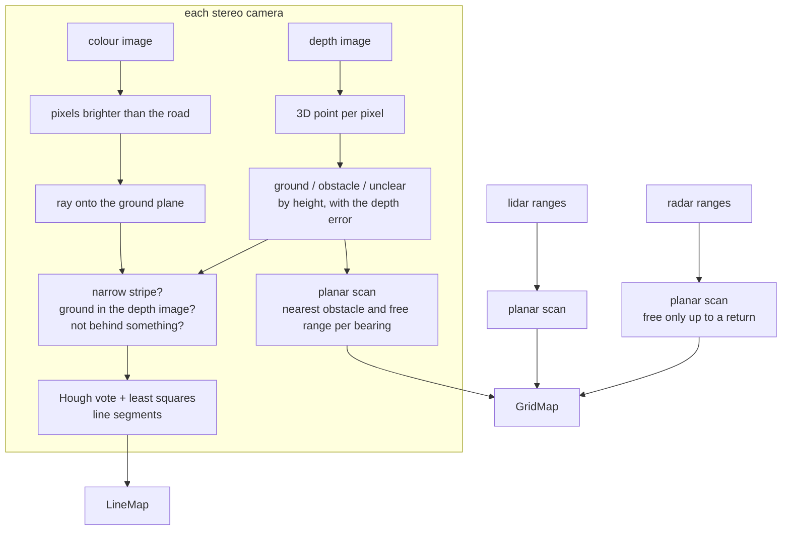

# Sensors: perception from Chrono::Sensor

With `--sensors camera`, `camera+lidar` or `camera+radar` the car perceives through sensors that
Chrono::Sensor ray traces in the scene. Nothing is read from the scenario: the painted lines come
out of a colour image, the obstacles and the free ground out of a depth image, a lidar scan or
radar returns. Code: `SensorRig`, `planar_scan`, `paint_segments`, and the parts of `GridMap`,
`LineTrack` and `find_slots` that exist because a camera does not see everything.

| `--sensors` | The car has | Lines from | Obstacles and free ground from |
| --- | --- | --- | --- |
| `camera` | a stereo camera looking forward and one looking back | colour images | depth images |
| `camera+lidar` | the same, plus a 16 channel lidar above the roof | colour images | depth images and the lidar |
| `camera+radar` | the same, plus a radar on each side | colour images | depth images and the radars |
| `sim` | no sensor | computed from the scenario | computed from the scenario |

`sim` is the stand-in described in [perception-and-mapping.md](perception-and-mapping.md). The
default is `camera` when the PyChrono in use has the ray-traced sensors, and `sim` otherwise.

There is no camera to the sides. What is beside the car is known from what a camera saw before
the car got there, or from the lidar or the radars. Most of this document is about what follows
from that.


## What it needs

**A PyChrono with ray-traced sensors.** Chrono::Sensor renders cameras, lidar and radar with one
of three backends: OptiX (NVIDIA), Vulkan RT, or Metal RT (Apple). At the time of writing
(Chrono main at `c6acd4e`), the Python bindings wrap these sensors only when Chrono is built with
OptiX. With Vulkan RT or Metal RT the C++ library has them, but `pychrono.sensor` contains only
the GPS and IMU sensors. The conda package for macOS is built without the sensor module.

[pychrono-rt-sensors.patch](pychrono-rt-sensors.patch) changes the bindings so that the same
classes are wrapped for Vulkan RT and Metal RT. It touches only the SWIG interface files and
their CMake flags, applies to Chrono main at `c6acd4e`, and was tested with Metal RT, and with
Vulkan RT in its CPU fallback:

```
cd chrono && git apply /path/to/chrono-parking/docs/pychrono-rt-sensors.patch
cmake -S . -B build -DCH_ENABLE_MODULE_VEHICLE=ON -DCH_ENABLE_MODULE_IRRLICHT=ON \
      -DCH_ENABLE_MODULE_SENSOR=ON -DCH_ENABLE_MODULE_PYTHON=ON ...
cmake --build build
PYTHONPATH=build/bin python parking_sim.py --sensors camera
```

On Linux with an NVIDIA card, a Chrono built with OptiX needs no patch.

**Memory and time.** With the ray-traced scene of the perpendicular lot (14 parked cars, 665,000
triangles) the process holds 3.5 GB with the four camera streams, 4.1 GB with the lidar, 4.7 GB
with the radars. That is allocated once and does not grow. Rendering all streams takes about
20 ms per perception tick and processing them 25 ms, so a run takes about as long as the time it
simulates. The stand-in perception needs 0.2 GB and runs four times faster than real time.

## The rig

Every mounting point is derived from the car model, like the rest of the car's geometry. The
roof is taken from the convex hull the chassis collides with: its height, and where it starts and
ends.

| Sensor | Where | What |
| --- | --- | --- |
| front stereo camera | 10 cm ahead of the roof, 5 cm above it, pitched 10 degrees down | 960 x 540 colour, 480 x 270 depth, 120 degrees wide |
| rear stereo camera | 10 cm behind the roof, same height and pitch, looking back | the same |
| lidar | on a mast 35 cm above the middle of the roof | 720 x 16 beams, 360 degrees, 25 degrees down to 5 up |
| radars | on each side of the body, mid length, 0.45 m up, looking sideways | 96 x 6 beams over 130 x 9 degrees each |

A stereo camera is modelled as a colour camera and a depth camera in the same place. Chrono's
depth camera returns the exact range along each pixel's ray. The error of real stereo depth is
added in processing (see below). Running a stereo matcher on two rendered images would be the
alternative. On the untextured road surface of this scene it would return mostly holes.

The cameras sit on the roof, so the bonnet and the boot are in the picture. The first ground the
front camera sees is 2.6 m ahead of the bumper, the rear one 2.9 m behind it. The lidar is on a
mast because from roof height its lower beams would hit the roof.

**Timing.** The sensors are rendered once per perception tick (10 Hz), with no lag and no motion
blur. Every buffer carries the time it was rendered at. The chassis frame of that instant is
kept, with its roll and pitch, and all geometry below uses that frame. Braking pitches the car by
about a degree, which moves the ground intersection of a pixel 10 m away by more than a metre.

## From sensor data to the map



Both kinds of output are what the stand-in perception also produces: planar scans and line
segments. Everything after `SensorRig.sense` is shared.


### Pixel rays

The cameras are pinhole cameras. For an image `W` pixels wide with horizontal field of view
`alpha`, the focal length in pixels and the ray of pixel `(u, v)` in the camera frame (x forward,
y left, z up) are

```math
f = \frac{W/2}{\tan(\alpha/2)}, \qquad
d(u, v) \propto \begin{pmatrix} f \\ -(u + \tfrac12 - \tfrac{W}{2}) \\ \;\;v + \tfrac12 - \tfrac{H}{2} \end{pmatrix}
```

Chrono image buffers start at the bottom-left pixel, so `v` counts upward. The depth image holds
the range along that ray, not the distance along the optical axis. Both facts were checked
against the depth image itself: with this model the ground plane is reproduced to the last digit
that the buffer holds.

### Stereo depth error

Stereo depth comes from a disparity, and a fixed disparity error is a range error that grows with
the square of the range. The measured range of a pixel is

```math
\hat r = r\,(1 + s) + n(u, v)\,\sigma_r(r), \qquad \sigma_r(r) = 0.003\,k\,r^2, \qquad s \sim \mathcal N(0,\; 0.004\,k)
```

That is 7.5 cm at 5 m and 30 cm at 10 m, which is what a wide stereo camera with a 12 cm baseline
delivers. `k` is `--noise`. `n` is unit noise that is smooth over the image (independent values
on a grid of 8 pixels, interpolated in between), because the error of a stereo matcher is. Noise
that is independent per pixel could simply be averaged away, and the processing would look better
than it is. `s` is a scale error common to the whole frame.

### Ground, obstacle, or unclear

Each depth pixel gives a point in the world. The points on the car's own body are dropped: any
point inside the car's outline plus 15 cm. The height `z` of the others decides:

```math
\text{ground: } |z| < 0.05 + 1.25\,\sigma_z, \qquad
\text{obstacle: } 0.08 + 2.5\,\sigma_z < z < 2.3, \qquad
\sigma_z = \sigma_r \,|d_z|
```

`sigma_z` is the height error that the range error causes, small for a ray that looks nearly
level. A point that is neither is **unclear**: it is not ground, and it is not certain that it
stands up. A kerb is 15 cm high. Up close it is an obstacle. From 8 m, where the height of a
point is known to 4 cm, it is unclear.

The three classes have different consequences, and this is the centre of the design:

| A point that is | ends the free part of its ray | puts an obstacle into the map |
| --- | --- | --- |
| ground | no | no |
| unclear | yes | no |
| obstacle | yes | yes |

### The planar scan

The classified points are collapsed into a scan around the camera: 240 bearings, half a degree
apart. Per bearing,

- `r_hit` is the range of the nearest obstacle point that has company: at least three points
  within the next 0.3 m. A stray pixel does not make an obstacle. The value is the range of that
  first point itself. An earlier version took a quantile of all obstacle points on the bearing.
  On a kerb with a pavement behind it, that lands somewhere on the pavement, and the car parked
  10 to 15 cm too close to the kerb.
- `r_stop` is the same for points that are not ground.
- `r_free` is the range of the farthest ground point, cut 15 cm before `r_stop`.

A line of sight proves more than the ground where it ends: everything it passes over is free of
things as tall as the ray is high there. The scan treats the whole ray as free, as a 2D lidar scan
would. That includes the 2.6 m in front of the bumper that the camera cannot see. A low object
right in front of the car is therefore not noticed, as with any camera mounted behind a bonnet.

### How far the depth image is trusted

Two requirements limit the range from which a camera writes into the map.

```math
\sigma_r(r) \le 0.15\ \text{m} \;\Rightarrow\; r \le 7.1\ \text{m}, \qquad
\sigma_z(r) \approx \sigma_r \frac{h}{r} \le 0.04\ \text{m} \;\Rightarrow\; r \le 7.7\ \text{m}
```

The first keeps obstacles where they are. Before this limit, a parked car seen from 10 m was
smeared over 30 cm, the smear reached into the free stall next to it, and the planner shifted
the goal 20 cm off centre to stay clear of it. The second is what telling a kerb from the road
takes, with the camera at height `h`. Both scale with `--noise`.

Ground seen beyond that, up to 12 m, is not thrown away. It goes into the map as **far ground**:
good enough to plan a drive over, not good enough to count as evidence. See the grid below.

### Painted lines

A painted line is found in the colour image and placed with geometry, not with the depth image.

1. **Brightness.** The road brightness is the median over the pixels that the depth image calls
   ground. A pixel is a candidate if its brightest channel is above `max(1.3 x road, road + 35)`.
   This follows the lighting, and it keeps a line that lies in the shadow of a car. Image noise
   of 3 grey levels is added to the pixels near the threshold.
2. **Onto the ground plane.** The ray of a candidate pixel is intersected with the plane z = 0.
   From a camera at `p` with world ray `d`, the range is `t = -p_z / d_z`, and the point is
   `p + t d`. This is where the chassis frame of the image matters. Candidates beyond 11 m are
   dropped. The position does not use the noisy depth, so a line 8 m away is placed to a few
   centimetres.
3. **A stripe is narrow.** The candidates are counted in 10 cm cells. A cell lies in a wide
   bright area if 42 percent or more of the 7 x 7 cells around it hold candidates. A 12 cm stripe
   covers a quarter of that window. The top of a kerb, a pavement or a white car covers all of
   it. Candidates in a wide area are dropped, and so are those within 0.3 m of one: at a corner
   of such an area the count is as low as on a stripe, and short false lines came from there.
4. **The depth image must agree.** The pixel has to be classed as ground, and its depth has to
   match the range to the ground plane. That removes bright things that stand above the ground.
5. **Nothing behind something.** A candidate further away than `r_stop` on its bearing is
   dropped. The top of a kerb in line with a stall line is the case this catches.

What survives is fitted with line segments (`paint_segments`). The points are binned into 5 cm
cells, and cells with a single pixel are dropped as speckle. A Hough transform over 180 angles
and 5 cm offsets finds the strongest line. Its cells within 12 cm are fitted by total least
squares, the cells within 10 cm of that fit are its inliers, and gaps of more than 45 cm split
them into segments. Segments shorter than 35 cm are dropped. The inliers are removed from the
vote and the next line is searched, up to 20 per frame.

Measured over whole runs with a car on each side of the stall, at noise 0, 1 and 2: of the
segments in perpendicular lots and parallel streets, 99 percent or more lie on a true line (within
12 cm, and not more than 0.5 m past its end), and in angled lots 95 to 97 percent. Those that do
are off the line by 2 cm (median) and by 6 to 9 cm at the 95th percentile. The rest are short,
half a metre typically, and mostly do not survive the line tracking, which wants five detections
of the same line.

### Lidar

The lidar returns a range per beam, 720 bearings by 16 elevations, spaced from end to end of each
range as Chrono's lidar does. Gaussian noise of 2 cm is added and 1 percent of the beams are
dropped. The points are classified by height like the camera's and collapsed into a scan of 720
bearings out to 20 m. The lidar is accurate at any range, so it has no far ground.

Its weakness is low things. The beams are 2 degrees apart in elevation, which near the car is
40 cm on the ground. A kerb is hit somewhere on its top, not at its face. With those returns in
the map, the line fitted to the kerb was off by up to 2.8 degrees, and the car parked at that
angle. So a lidar return from below 0.30 m ends the free part of its ray, like anything that is
not ground, but is not placed in the map as an obstacle. Where the kerb is, the cameras say, as
they do without a lidar. In addition `_align_with_kerb` fits the lane-side edge of what was hit,
not its middle.

### Radar

A radar returns a range per beam too. The reported angles of Chrono's radar are half a beam
spacing off from the beams it traces, so the bearing is computed from the cell index. Noise is
8 cm and 15 percent of the beams are dropped.

A radar return says where something is and that the way to it is clear. No return says nothing:
the beams span only 9 degrees in height and pass over low things. So a radar contributes
obstacles, and free space only along the rays that came back. The two radars cover the sectors
the cameras do not, from 25 to 155 degrees on each side.

## What changes because the car cannot see sideways


### A stall is one line and a stub

Looking along the lane, a camera cannot see the line between two parked cars. The cars are 70 cm
apart and the line runs down the middle of that gap, so only the end at the lane shows, half a
metre of it. Of an empty stall the camera sees the far line through the empty space, and the near
line only as such a stub. (The stand-in perception looks in all directions and sees a line down
the gap when the car is level with it.)

So with a sensor rig, `find_slots` also accepts this pair:

| | Requirement |
| --- | --- |
| the longer line | at least 2.0 m |
| the shorter one | at least 0.35 m, and 2.2 to 3.5 m to the side of the longer one |
| where the shorter one is | one of its ends near the matching end of the longer one: up to 1.5 m inside it, or up to `1.2 w + 0.5` m outside it for angled stalls, with `w` the separation |
| direction | from the longer line alone if the shorter is under 1.2 m |
| depth | if the lines end sooner than a car length plus 0.7 m, that depth is assumed |

Once the car has passed the stall, the rear camera sees the other line through the empty stall,
and while it backs in it sees both. The estimate then rests on two full lines, and the plan
follows it (see [control.md](control.md#keeping-the-plan-attached-to-the-stall)).

### Lines remember

A `LineTrack` keeps its 160 best detections and derives its extent from what they cover. With a
camera that drops the wrong ones. Driving into an angled stall, the camera sees only the far
part of the lines once it is close, the detections of the mouth (made from further away) are the
first to be forgotten, and the stall estimate slid 2 m inward. With a rig, a track therefore
keeps a record of where along the line paint was seen, in 10 cm bins with the summed weight of
the detections. A stretch stays part of the line once that weight has passed a threshold.

### Free means the mouth is empty

Seen from along the lane, the far end of a stall between two cars is in the shadow of the nearer
car. Requiring 60 percent of the stall to be seen free would never be met. A parked car would
show at the mouth, so the rule becomes: no obstacle in the stall, and either 60 percent seen
free, or 80 percent of the first 2.5 m and 30 percent overall.

The planner already treats the unseen part of the chosen stall as free. With a rig that part
reaches as far in as the parked car will, plus the planning margin, also where the lines were not
seen that far: a stall is a place that holds a car. (Before, it ended where the seen lines ended,
10 cm short of the nose of a car driven into an angled stall, and the planner pulled the goal
back by up to 0.6 m.) What is deeper in comes into view while the car drives in, and the path
monitor stops the car if something is there.

### Far ground in the grid

`GridMap` has two more counters per cell for the far ground:

- `far`: in how many scans a ray passed the cell beyond the range where the depth is trusted
- `stop`: how often something that is not ground was seen in the cell from within that range

```math
\text{known} = \mathrm{dilate}_2(\text{free} \ge 1) \;\vee\; \mathrm{erode}_4\big(\text{free} \ge 1 \;\vee\; (\text{far} \ge 3 \wedge \text{stop} = 0)\big)
```

Far ground makes a cell drivable for the planner. It is not counted in `free`, so it is no
evidence against an obstacle, and one closer look that finds something there removes it. It is
used only 0.4 m in from where it ends. Its edge is where a ray stopped at something 10 m away,
and that is known to a few tens of centimetres.

Both alternatives were tried. Without far ground the car knows 5 m of road ahead of its bumper
and shuffles: up to nine gear changes for a parallel stall. With all ground counted as free out to
12 m, parallel runs came within 3 to 13 cm of the kerb and two touched it. From that far a kerb
passes for ground, and many far sightings outvote the few close ones that say otherwise.

### The monitor looks for margin

With cameras an obstacle is placed exactly only once it is close, which is often after the plan
was made. In one run the plan swung the nose towards a car in the opposite row that was 9.5 m
away when the plan was made, and the car came within 7.5 cm of it. The path monitor therefore
reacts when an obstacle is nearer to the remaining path than `min(0.10, plan margin - 0.03)`, not
only when it is on it. The car stops and looks for a better plan from where it stands, once per
plan. If there is none it carries on: the plan it has is still drivable, only with less room
than it was made for.

### Back to the centre

The planner shifts the goal off the stall centre when the map shows something close to where the
car would stand, and says so in the log (`goal shifted 0.20 m sideways`). With cameras that
something is often an obstacle placed a decimetre or two off from 6 m away. During the approach
the goal therefore moves back towards the centre as soon as the map allows it
([control.md](control.md#keeping-the-plan-attached-to-the-stall)).

### Parallel stalls

Two things are different with a rig. The planner's margins start wider (see
[planning.md](planning.md#configuration-space-by-fft)). And the unseen part of the chosen stall
is assumed free only within 0.5 m of ground that was seen: the far side of a parallel stall is
the kerb, which a camera cannot tell from the road until the car is next to it.

The kerb itself is only seen as an obstacle from about 5 m. At the time of the plan the car
stands beside the stall, the kerb is 4 m to the side, and no camera looks there. The stall is then
aligned with its two short tick lines. When the rear camera sees the kerb during the reverse,
`_align_with_kerb` takes over, the estimate shifts, and the plan follows.

## In the viewer

- The top view outlines what each sensor is looking at.
- Line stubs are drawn in a darker colour than confirmed lines.
- The panel shows, for each camera, the picture of what its pixels are read as: ground,
  obstacle, unclear, paint, the car itself. It is the depth image's classification with the
  paint from the colour image on top, at a third of the depth resolution.
- The planning map in the panel shows far ground as drivable, like the planner sees it.

## Limits

- **Kerbs at double noise.** At `--noise 2` the depth image is trusted to 3.9 m, and a 15 cm
  kerb is at the limit of what it resolves. Perpendicular and angled stalls are still parked in
  with every sensor set. Parallel stalls, which are aligned with the kerb, are where it shows:
  22 cm off centre with cameras alone, 2.8 degrees off the kerb line with the radars, and with
  the lidar the car touched the kerb ([results.md](results.md)). The lidar does not help with
  the kerb, which it cannot see closer than 4.4 m.
- **Low things right in front of the car** are not seen by the cameras, see above.
- **The lines are found by brightness.** There is no learned detector. A scene with bright,
  narrow things on the ground that are not lines would produce false ones.
- **The stereo depth is a model.** No stereo matcher runs. The error model has the right growth
  with range and the right smoothness, but not the failure modes of matching, such as repeated
  patterns.
- **Vulkan RT** was only run in its CPU fallback, on macOS. Depth, lidar and radar agree with
  the scene geometry there. Its camera image arrives, but plain diffuse colours come out washed
  out, and this was not looked into.
