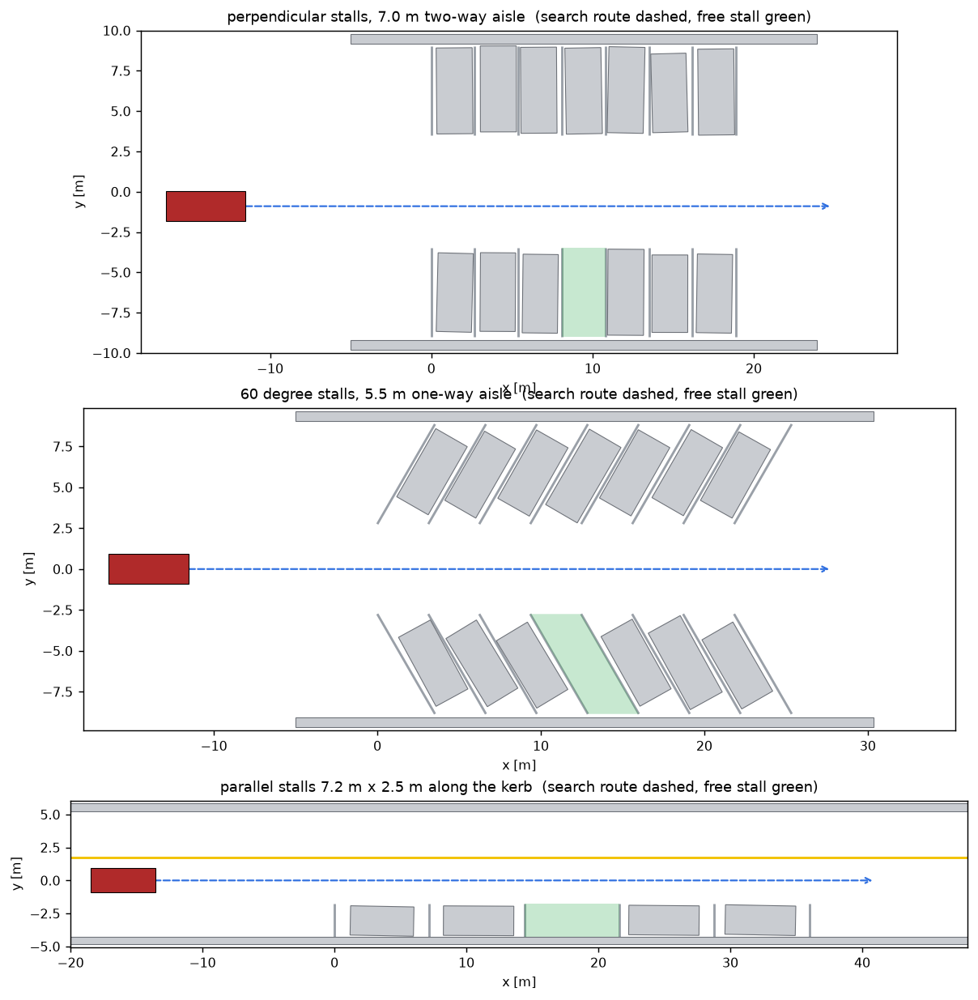
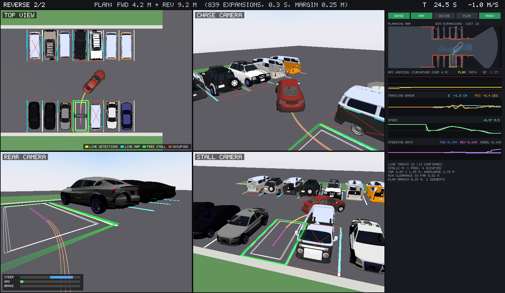
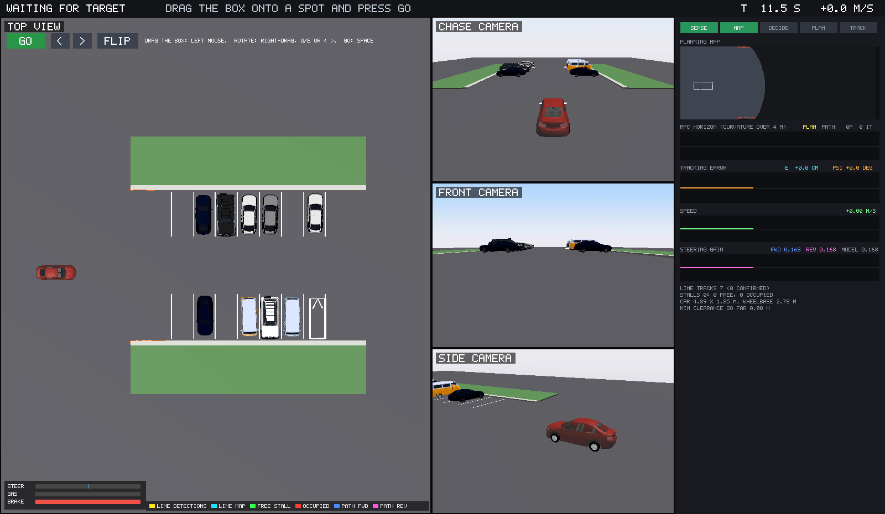

# Simulation and viewer

What is simulated, how the scenarios are built, and how the window works. Code: `Ego`, `World`,
`Scenario`, `make_lot`, `make_street`, `Viewer`, `MouseKeys`.

## The vehicle

The car is the `Sedan` from Chrono::Vehicle, a template-based multibody model:

| Subsystem | Chrono template |
| --- | --- |
| front suspension | double wishbone |
| rear suspension | multi-link |
| steering | rack and pinion |
| driveline | shaft-based, two wheel drive |
| engine and gearbox | map-based engine, automatic transmission with forward and reverse |
| brakes | shaft-based |
| tires | TMeasy (default) or Pacejka 2002 with `--tire pac02` |

That is 20 rigid bodies, 38 joints and force elements and 10 driveline shafts, integrated at 2 ms with a 1 ms tire
sub-step and penalty (SMC) contact. The agent sends the same three inputs a driver would: steering,
throttle and brake, plus the gear selection.

Three settings matter and are not the defaults:

- **Shaft brakes.** With the simple brake model the car creeps at about 0.1 m/s under braking and
  cannot hold a pose. The shaft-based brake locks the wheel.
- **Hull collision on the chassis.** The chassis collides with the parked cars through its convex
  hull, so a planning or tracking error would end in a physical contact, not in a car driving
  through another one.
- **Parked cars are fixed bodies** with a collision box and the vehicle meshes that ship with
  Chrono. They are scenery with contact, not full vehicle models.

### What is read from the model

`Ego.read` queries the Chrono vehicle once, after it is built. Nothing below is typed in.

| Quantity | Source | Sedan |
| --- | --- | --- |
| wheelbase | `GetWheelbase()` | 2.776 m |
| rear axle position | rear spindle positions in the chassis frame | 1.388 m behind the reference point |
| body outline | points of the chassis collision hull | 4.89 m long, 1.85 m wide |
| rear overhang, front reach | hull extent relative to the rear axle | 1.065 m, 3.825 m |
| curvature limit | `tan(GetMaxSteeringAngle()) / wheelbase` | 0.168 per metre, radius 5.95 m |

The footprint and ride height of the parked cars come from the bounding boxes of their meshes in
the same way.

## Scenarios

`make_scenario` builds the ground truth from four options.



| `--type` | Layout |
| --- | --- |
| `perpendicular` | two rows of 2.7 m by 5.5 m stalls, 7.0 m two-way aisle, kerb behind each row |
| `angled` | stalls at `--angle` degrees (60 by default) leaning the way the car travels, 5.5 m one-way aisle (4.8 m at 52 degrees or less) |
| `parallel` | 7.2 m by 2.5 m stalls along the kerb of a two-lane street |

| `--cars` | The free stall has |
| --- | --- |
| `both` | a parked car on each side |
| `left` | a car on its left only, seen from the lane looking into the stall |
| `right` | a car on its right only |
| `none` | no cars anywhere, only lines |
| `random` | each stall occupied with probability about 0.7 |

For `left` and `right` the free stall is the first or last of its row, which is where a stall with
one neighbour occurs in a real lot. `--side` moves the free stall to the other side of the lane.
`--seed` changes the car models, their colours, how far each is parked off-centre (up to 12 cm
sideways, 15 cm lengthwise, 2 degrees) and the perception noise.

For an angled stall, the painted lines are longer than the car. A line of a stall at angle
`alpha` with width `w` runs for `5.5 + w cot(alpha)` metres, so that the part both lines cover is
5.5 m, the same as a perpendicular stall.

Parallel stalls are 7.2 m long because of the car, not the planner: with a 5.95 m turning radius a
4.9 m car needs about 8 m between its neighbours to reverse in with one sweep, and the neighbours
are parked up to 0.3 m toward the free stall.

## The window



One Irrlicht window, drawn by the script itself in several viewports per frame.

| View | Camera |
| --- | --- |
| top view | straight down, north up. Follows the car, or shows the whole lot in drag mode |
| chase camera | behind and above the car, heading low-pass filtered |
| front or rear camera | at bumper height, switches with the gear, with the plan drawn in like a parking camera |
| stall camera | beyond the back of the chosen stall, looking at the car coming in. A side view until a stall is chosen |

Drawn into the 3D scene, on the ground:

| Colour | Meaning |
| --- | --- |
| yellow, thin | line detections of the current frame |
| cyan | line tracks of the map |
| green outline | free stall, thick for the chosen one |
| red outline with a cross | occupied stall |
| blue, magenta | planned path, forward and reverse |
| yellow, on the path | the MPC's predicted positions over its horizon |
| white rectangle | goal pose |
| orange | range scan of the current frame (top view only) |

### The internals panel

The right-hand panel shows what the agent is doing, updated at the perception rate.

1. **Pipeline.** Which stages are active: sense, map, decide, plan, track.
2. **Planning map.** The map the planner works with. Dark is space never seen to be free, mid grey
   is free, red is obstacle cells. After a plan, the Hybrid A* search tree is shown as teal dots.
   Stalls, the plan, the MPC horizon and the car are drawn on top.
3. **MPC horizon.** The curvature the MPC plans over the next 4 m (yellow) against the path's
   curvature (grey) and the steering limits (red), with the number of solver iterations.
4. **Tracking error.** Lateral error in centimetres and heading error in degrees, last 16 s.
5. **Speed.** Speed and the speed command.
6. **Steering gain.** The identified gain forward and in reverse against the model value. This is
   the trace to watch when the car first turns in a new direction.
7. Counts: line tracks, stalls by status, the car dimensions read from the model, smallest
   clearance so far, margin and segment count of the current plan.

`--no-panel` hides it.

### How it is drawn

PyChrono's Irrlicht bindings expose the scene manager and the video driver but not much else, which
shaped the implementation:

- **Split screen.** Per view: set the viewport, make that view's camera active, draw the scene, then
  draw the overlays as 3D polylines. The cameras are created through Chrono so that they share its
  right-handed convention. Cameras created directly in Irrlicht render mirrored.
- **Text.** The bindings give no usable font object, so the HUD has its own 5 by 7 pixel font drawn
  with filled rectangles.
- **Panel.** Everything in the panel is filled rectangles too. The planning map is rendered into a
  small palette image with NumPy, and each row is run-length encoded into rectangles. Charts are
  chains of small rectangles. The result is cached and rebuilt ten times per second.
- **Shutdown.** Destroying the visual system from Python crashes, so the process leaves with
  `os._exit` once the window is closed.

Real time is kept at 30 frames per second on the machine this was developed on. The simulation
itself needs about a seventh of real time.

## Placing the target by hand

```
python parking_sim.py --target drag
```



The top view shows the whole lot. A car-sized box marks where the car should park.

| Input | Effect |
| --- | --- |
| left mouse button, drag | move the box. Clicking away from the box jumps it there |
| right mouse button, drag sideways | rotate |
| `Q` / `E`, arrow keys, or the `<` `>` buttons | rotate |
| `R` or FLIP | turn the box around, which switches between nose in and back in |
| Space, Enter or GO | drive there |

The box turns red when it overlaps something the car has seen. On GO:

1. If the box sits on a stall the map knows (within 1.2 m and roughly aligned), that stall becomes
   the target and the normal pipeline takes over, including the refinement from its lines.
   `--no-snap` turns this off and parks exactly where the box is.
2. If the box is far down the lane, the car first drives up to it along the lane, mapping as it
   goes, until the spot has been seen. It only plans through space it has seen.
3. For a free-placed box the planner tries arriving forward and arriving in reverse and takes the
   cheaper plan.

A new target can be given at any time, including after the car has parked.

`--target X,Y,DEG` does the same without the mouse, and works headless.

**How the mouse is read.** The bindings cannot deliver window events to Python (the event receiver
class cannot be subclassed), so `MouseKeys` polls: the cursor position from the window through the
Objective-C runtime, and button and key state from Quartz, all via `ctypes`. That makes drag mode
macOS only. Input is ignored unless the window is in front.

## Running without a window

`--headless` skips the viewer and runs as fast as it can, about seven times real time. It prints
a log and one result line:

```
[result] ok=True  time=32.220  plan_time=0.188  gear_changes=1  replans=0  corrections=0
         min_clearance=0.401  kind=perpendicular  gt_occupied=False  inside_lines=True
         lateral=0.010  depth=-0.052  heading_deg=0.020
```

(one line in the real output, wrapped here)

`lateral`, `depth` and `heading_deg` are measured against the ground-truth stall, not against
the agent's own estimate. `ok` requires all four corners inside the stall's lines, the stall to be
truly free, and no contact (smallest clearance above zero). The exit code is 0 when `ok` is true.

A windowed run and a headless run of the same options give the same result line. Planning is
limited by node expansions, not wall time, and simulated time is frozen while the planner runs.
